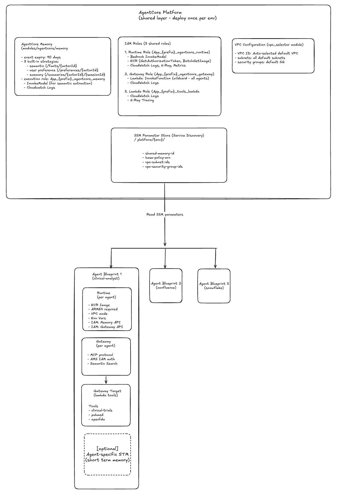
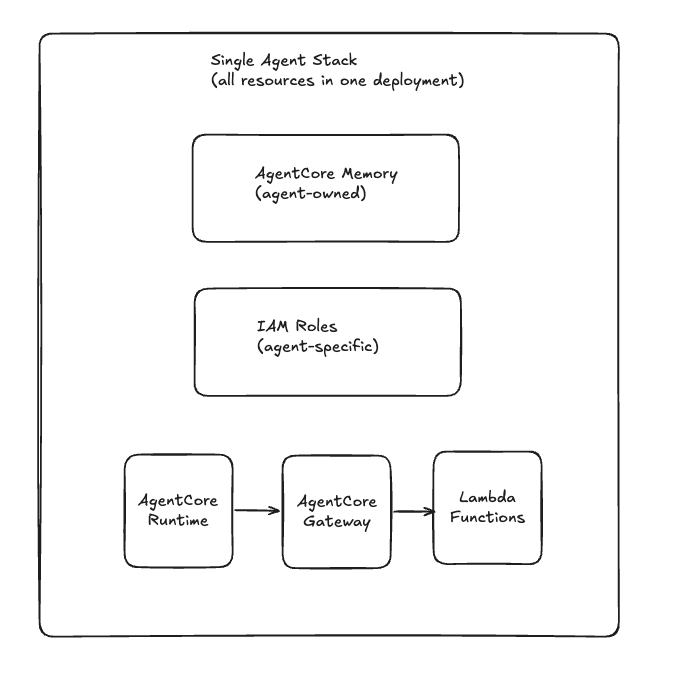

# AWS Bedrock AgentCore: Architecture Patterns for Multi-Agent Systems

A comprehensive catalog of all architectural patterns available for building AWS Bedrock AgentCore multi-agent systems, with detailed benefits, trade-offs, implementation guidance, cost comparisons, and evolution paths.

<!-- more -->

## Executive Summary

This document catalogs **all architectural patterns available** for building AWS Bedrock AgentCore multi-agent systems, with detailed benefits, trade-offs, and implementation guidance.

> **Recommended Starting Point:** **Pattern 1: Platform-as-a-Service (Shared Infrastructure + Independent Agents)**, which provides the optimal balance of flexibility, cost-efficiency, and context sharing for same-domain agents.

---

## Table of Contents

1. [Pattern Overview](#pattern-overview)
2. [Pattern 1: Platform-as-a-Service (Recommended Starting Point)](#pattern-1-platform-as-a-service-shared-infrastructure--independent-agents)
3. [Pattern 2: Monolithic Single-Agent](#pattern-2-monolithic-single-agent)
4. [Pattern 3: Independent Multi-Agent (A2A)](#pattern-3-independent-multi-agent-a2a)
5. [Pattern 4: AgentCore Supervisor (Gateway/MCP)](#pattern-4-agentcore-supervisor-gatewaymcp)
6. [Pattern 5: Bedrock Agent Supervisor](#pattern-5-bedrock-agent-supervisor)
7. [Pattern 6: Hybrid (Platform + Supervisor)](#pattern-6-hybrid-platform--supervisor)
8. [Comparison Matrix](#comparison-matrix)
9. [Evolution Paths](#evolution-paths)
10. [Decision Framework](#decision-framework)

---

## Pattern Overview

| Pattern | Memory | Coordination | Deployment | Best For |
|---------|--------|--------------|------------|----------|
| **1. Platform-as-a-Service** | Shared | None (peer agents) | Platform + agents | Same-domain agents |
| **2. Monolithic** | Integrated | N/A (single agent) | Single stack | Simple single-purpose agents |
| **3. A2A Protocol** | Independent | Peer-to-peer | Separate stacks | Cross-domain autonomous agents |
| **4. AgentCore Supervisor** | Centralized | Supervisor orchestrates | Single stack | Complex orchestration logic |
| **5. Bedrock Supervisor** | Independent | Supervisor routes | Single or multiple | Simple Bedrock-only routing |
| **6. Hybrid** | Shared + Centralized | Supervisor + platform | Platform + supervisor + agents | Future: routing layer |

---

## Pattern 1: Platform-as-a-Service (Shared Infrastructure + Independent Agents)

### Architecture Diagram

```
┌──────────────────────────────────────────────────────────┐
│         agentcore-platform (Shared Layer)                │
│  Deploy Once Per Environment                             │
│                                                          │
│  ┌────────────────┐  ┌────────────┐  ┌──────────────┐  │
│  │ AgentCore      │  │ IAM Roles  │  │ VPC Config   │  │
│  │ Memory (1)     │  │ Runtime    │  │              │  │
│  │ - Semantic     │  │ Gateway    │  │ Subnets      │  │
│  │ - Preferences  │  │ Lambda     │  │ Security Gps │  │
│  │ - Summaries    │  │            │  │              │  │
│  └────────┬───────┘  └─────┬──────┘  └──────┬───────┘  │
│           │                │                │           │
│           └────────────────┼────────────────┘           │
│                     ┌──────▼────────┐                   │
│                     │ SSM Parameters│                   │
│                     │ /platform/dev/│                   │
│                     └───────────────┘                   │
└──────────────────────────────────────────────────────────┘
                            │
         ┌──────────────────┼──────────────────┐
         │                  │                  │
    ┌────▼─────────┐   ┌────▼────────┐   ┌────▼─────────┐
    │ data-        │   │ research-   │   │ regulatory-  │
    │ analyst-v2   │   │ agent       │   │ agent        │
    │              │   │             │   │              │
    │ Runtime      │   │ Runtime     │   │ Runtime      │
    │ Gateway      │   │ Gateway     │   │ Gateway      │
    │ Lambda(s)    │   │ Lambda(s)   │   │ Lambda(s)    │
    │              │   │             │   │              │
    │ reads SSM →  │   │ reads SSM → │   │ reads SSM →  │
    └──────────────┘   └─────────────┘   └──────────────┘
```



### Characteristics

**Memory Model**: **Shared memory** with `{actorId}` namespace isolation

**Coordination**: **None** - agents are peers with no supervisor

**Deployment**:

1. Deploy platform once: `cd agentcore-platform && make deploy`
2. Deploy agents independently: `cd agentcore-agent-v2 && make deploy`

**Resource Sharing**:

- ✅ Single AgentCore Memory
- ✅ Shared IAM roles (Runtime, Gateway, Lambda)
- ✅ Shared VPC configuration
- ✅ SSM Parameter Store for discovery

### Benefits

✅ **Cost-Efficient**

- Single memory instance shared across all agents
- Shared IAM roles reduce administrative overhead
- Shared VPC configuration (no duplicate NAT gateways)

✅ **Cross-Agent Context**

- User preferences learned by Agent A available to Agent B
- Seamless user experience (no context repetition)
- Long-term memory benefits all agents

✅ **Independent Deployments**

- Deploy/destroy agents independently
- No downtime for other agents
- Different release cadences per agent

✅ **Flexible Scaling**

- Add new agents without platform changes
- Platform team manages shared infrastructure
- Agent teams focus on agent logic

✅ **Simplified Architecture**

- No coordination logic needed
- No supervisor to maintain
- Clear separation: platform vs agent concerns

### Limitations

⚠️ **Same Trust Domain Required**

- All agents must be in same security context
- Not suitable for cross-organizational agents

⚠️ **No Automatic Routing**

- User must know which agent to invoke
- No supervisor to decide which agent to use

⚠️ **Namespace Discipline Required**

- Agents must follow namespace conventions
- Potential for namespace conflicts

### When to Use

- ✅ Multiple agents in **same functional domain** (e.g., all healthcare/scientific)
- ✅ Agents benefit from **shared user context**
- ✅ Want **independent agent deployments**
- ✅ **Cost optimization** important
- ✅ Platform team can manage shared infrastructure
- ❌ NOT for cross-organizational agents
- ❌ NOT when strong isolation required

### Implementation

**Terraform structure:**

```
blueprints/
├── agentcore-platform/          # Deploy once
│   └── terraform/
│       └── main.tf              # Creates memory + IAM + VPC + SSM
└── agentcore-agent-v2/          # Deploy per agent
    └── terraform/
        └── main.tf              # Reads SSM, creates Runtime + Gateway
```

**Key code patterns:**

```hcl
# Platform: Create and publish memory
module "memory" {
  source = "../../modules/agentcore/memory"
  memory_strategies = [
    { namespace = "/facts/{actorId}" },
    { namespace = "/preferences/{actorId}" }
  ]
}

resource "aws_ssm_parameter" "memory_id" {
  name  = "/platform/dev/memory-id"
  value = module.memory.memory_id
}

# Agent: Read and use
data "aws_ssm_parameter" "memory_id" {
  name = "/platform/dev/memory-id"
}

module "runtime" {
  memory_id = data.aws_ssm_parameter.memory_id.value
}
```

---

## Pattern 2: Monolithic Single-Agent

### Architecture Diagram

```
┌───────────────────────────────────────┐
│  Single Agent Stack                   │
│  (All resources in one deployment)    │
│                                       │
│  ┌─────────────────────────────────┐  │
│  │ AgentCore Memory                │  │
│  │ (Agent-owned)                   │  │
│  └────────┬────────────────────────┘  │
│           │                           │
│  ┌────────▼────────────────────────┐  │
│  │ IAM Roles                       │  │
│  │ (Agent-specific)                │  │
│  └────────┬────────────────────────┘  │
│           │                           │
│  ┌────────▼────────────────────────┐  │
│  │ AgentCore Runtime               │  │
│  │ + Gateway                       │  │
│  │ + Lambda Functions              │  │
│  └─────────────────────────────────┘  │
└───────────────────────────────────────┘
```



### Characteristics

**Memory Model**: **Integrated** - memory created with agent

**Coordination**: **N/A** - single agent

**Deployment**: Single Terraform stack

### Benefits

✅ **Simplest Pattern**

- All resources in one place
- Single `terraform apply`
- Easy to understand

✅ **Complete Isolation**

- No dependencies on other stacks
- Full control over all resources

✅ **Quick Prototyping**

- Fast to set up
- Good for POCs and demos

### Limitations

⚠️ **No Resource Sharing**

- Every agent creates its own memory, IAM, VPC config
- Higher cost at scale

⚠️ **No Cross-Agent Context**

- Each agent has isolated memory
- User context doesn't transfer

⚠️ **Harder to Scale**

- Adding agents = duplicating infrastructure
- No platform-level standards

### When to Use

- ✅ Single-purpose agent
- ✅ POC or demo
- ✅ No plan to add more agents
- ✅ Simplicity over efficiency
- ❌ NOT for production multi-agent systems

### Implementation

See the monolithic agent blueprint in your repository.

---

## Pattern 3: Independent Multi-Agent (A2A)

### Architecture Diagram

```
┌────────────────────────────────────────┐
│   Host/Orchestrator Agent              │
│   (AgentCore Runtime - Google ADK)     │
│   Memory: Own or None                  │
└───────────┬────────────────────────────┘
            │ A2A Protocol (JSON-RPC 2.0)
            │ HTTPS + OAuth 2.0 / SigV4
    ┌───────┼───────┬────────────┐
    ↓       ↓       ↓            ↓
┌─────────┐ ┌────────┐ ┌──────────┐
│Monitor  │ │WebSrch │ │Analytics │
│Agent    │ │Agent   │ │Agent     │
│(Strands)│ │(OpenAI)│ │(Custom)  │
│         │ │        │ │          │
│Own Mem  │ │Own Mem │ │Own Mem   │
│Own IAM  │ │Own IAM │ │Own IAM   │
│A2A Srvr │ │A2A Srvr│ │A2A Srvr  │
└─────────┘ └────────┘ └──────────┘
```


### Characteristics

**Memory Model**: **Independent per runtime**

**Coordination**: **Peer-to-peer or orchestrator via A2A protocol**

**Deployment**: Separate CloudFormation/Terraform stack per agent

**Communication**:

- A2A protocol (JSON-RPC 2.0)
- Port 9000 (standard A2A port)
- Agent discovery via `/.well-known/agent-card.json`

### Benefits

✅ **Cross-Framework Support**

- Mix Strands, OpenAI Agents, Google ADK, custom agents
- Each agent uses its optimal framework

✅ **Strong Isolation**

- Separate memory, IAM, security boundaries
- Perfect for different organizational teams

✅ **Autonomous Agents**

- Each agent has independent lifecycle
- Scale agents independently
- Deploy/update without affecting others

✅ **Open Standard**

- A2A protocol is Linux Foundation project
- Interoperable across platforms

✅ **Organizational Boundaries**

- Team A owns monitoring agent
- Team B owns search agent
- No shared infrastructure coordination needed

### Limitations

⚠️ **High Complexity**

- OAuth 2.0 + Cognito setup
- Network configuration (VPC endpoints, security groups)
- IAM policies for cross-runtime invocation
- Agent discovery and resolver logic

⚠️ **No Shared Context**

- Each agent has own memory
- Must explicitly pass context via A2A messages

⚠️ **Network Overhead**

- HTTP invocation between runtimes
- Latency vs direct function calls

⚠️ **Cost**

- N memory instances
- N runtimes
- OAuth infrastructure (Cognito User Pools)

### When to Use

- ✅ Agents in **completely different domains** (monitoring, search, analytics)
- ✅ **Different teams** own agents
- ✅ Need **cross-framework** (Strands + OpenAI + ADK)
- ✅ **Strong isolation** requirements
- ✅ Organizational boundaries
- ❌ NOT for simple same-domain agents (overkill)

### Implementation

See AWS sample: [A2A Multi-Agent Incident Response](https://github.com/awslabs/amazon-bedrock-agentcore-samples)

**CloudFormation per agent:**

```yaml
AgentMemory:
  Type: AWS::BedrockAgentCore::Memory

AgentRuntime:
  Type: AWS::BedrockAgentCore::Runtime
  Properties:
    MemoryId: !Ref AgentMemory
    ProtocolConfiguration:
      Protocol: A2A
      Port: 9000
      MountPath: /
    AuthenticationMode: AWS_IAM
```

---

## Pattern 4: AgentCore Supervisor (Gateway/MCP)

### Architecture Diagram

```
┌────────────────────────────────────────┐
│   Supervisor Agent                     │
│   (AgentCore Runtime - Strands)        │
│                                        │
│  ┌──────────────────────────────────┐ │
│  │   AgentCore Memory               │ │
│  │   (Centralized - supervisor owns)│ │
│  └──────────────────────────────────┘ │
└────────────┬───────────────────────────┘
             │
        ┌────▼────┐
        │ Gateway │ (MCP Protocol)
        │ (MCP)   │
        └────┬────┘
             │
    ┌────────┼────────┬────────┐
    ↓        ↓        ↓        ↓
┌────────┐ ┌────┐ ┌─────┐ ┌─────┐
│Monitor │ │Search│ │Analyt││More│
│Tool    │ │Tool  │ │Tool  │ │... │
└────────┘ └────┘ └─────┘ └─────┘
  (Specialist Agents as MCP Tools)
```

### Characteristics

**Memory Model**: **Centralized in supervisor**

**Coordination**: **Supervisor orchestrates** via routing logic

**Deployment**: Single stack (supervisor + gateway + specialist tools)

**Communication**: AgentCore Gateway/MCP protocol

### Benefits

✅ **Centralized Context Management**

- Supervisor owns memory tools
- Best context management across specialists
- No context duplication

✅ **Rich Orchestration Logic**

- Conditional routing in code
- Multi-step workflows
- Result aggregation/synthesis

✅ **Flexible Framework Support**

- Supervisor can be Strands, OpenAI, Google ADK
- Specialists exposed as MCP tools

✅ **Single Entry Point**

- User invokes supervisor only
- Supervisor delegates to specialists

### Limitations

⚠️ **Supervisor Complexity**

- Must code routing logic
- Supervisor is single point of failure
- Requires sophisticated prompt engineering

⚠️ **Specialists as Tools**

- Specialists can't be autonomous
- Tied to supervisor's lifecycle

⚠️ **Gateway Configuration**

- Must expose specialists via MCP
- IAM and endpoint management

### When to Use

- ✅ Complex orchestration (multi-step workflows)
- ✅ Need centralized memory/context
- ✅ Specialist agents are tools/plugins
- ✅ Want single user-facing endpoint
- ❌ NOT for autonomous peer agents

### Implementation

See AWS samples:

- `SRE-agent/sre_agent/supervisor.py`
- `Lab-05: agents-as-tools-using-mcp`

**Python supervisor example:**

```python
class SupervisorAgent:
    def __init__(self, memory_id, gateway_url):
        self.memory_tools = [
            create_memory_retrieval_tool(memory_id),
            create_memory_save_tool(memory_id)
        ]
        
        self.specialist_tools = [
            MCPTool(gateway_url, "monitoring_agent"),
            MCPTool(gateway_url, "search_agent")
        ]
        
        self.agent = Agent(
            tools=self.memory_tools + self.specialist_tools,
            system_prompt=self._get_supervisor_prompt()
        )
```

---

## Pattern 5: Bedrock Agent Supervisor

### Architecture Diagram

```
┌─────────────────────────────────────┐
│   Bedrock Agent (Supervisor)        │
│   - SUPERVISOR mode                 │
│   - AWS-managed routing             │
└───────────┬─────────────────────────┘
            │ AWS Internal Routing
    ┌───────┼───────┬────────┐
    ↓       ↓       ↓        ↓
┌────────┐ ┌────┐ ┌─────┐ ┌─────┐
│Data    │ │Srch│ │Anlyt│ │More │
│Analyst │ │Agnt│ │Agent│ │Collab│
└────────┘ └────┘ └─────┘ └─────┘
  (Collaborator Bedrock Agents)
```

### Characteristics

**Memory Model**: **Independent per agent**

**Coordination**: **AWS-managed supervisor routing**

**Deployment**: Can be single or multiple Terraform stacks

**Technology**: AWS Bedrock Agents only (no AgentCore)

### Benefits

✅ **Zero Code Coordination**

- Purely Terraform configuration
- AWS handles routing logic

✅ **Two Modes**

- `SUPERVISOR`: Synthesizes responses from multiple collaborators
- `SUPERVISOR_ROUTER`: Routes to single best collaborator

✅ **Simple IAM**

- Standard Bedrock Agent permissions
- No complex cross-runtime policies

✅ **Built-in History Relay**

- `relay_conversation_history = "TO_COLLABORATOR"`

### Limitations

⚠️ **Bedrock Agents Only**

- Cannot use AgentCore agents as collaborators
- All agents must be Lambda-based Bedrock Agents

⚠️ **No A2A Support**

- Cannot invoke A2A agents

⚠️ **Limited to 10 Collaborators**

⚠️ **No Test Alias Support**

- Cannot use `TSTALIASID` for collaboration
- Must create proper agent aliases

### When to Use

- ✅ All agents are Bedrock Agents
- ✅ Simple routing needs
- ✅ Want AWS-managed coordination
- ✅ Zero-code preference
- ❌ NOT for AgentCore agents

### Implementation

See: `blueprints/bedrock-agent-supervisor/`

```hcl
resource "aws_bedrockagent_agent" "supervisor" {
  agent_name = "supervisor"
  agent_collaboration = "SUPERVISOR"
}

resource "aws_bedrockagent_agent_collaborator" "analyst" {
  agent_id             = aws_bedrockagent_agent.supervisor.id
  agent_descriptor_arn = aws_bedrockagent_agent.analyst.alias_arn
  instruction = "Use for data analysis questions"
}
```

---

## Pattern 6: Hybrid (Platform + Supervisor)

### Architecture Diagram

```
┌──────────────────────────────────────────────────────────┐
│         agentcore-platform (Shared Layer)                │
│  Memory + IAM + VPC + SSM                                │
└────────────────┬─────────────────────────────────────────┘
                 │
                 ↓
┌────────────────────────────────────────┐
│   Supervisor Agent                     │
│   (Reads platform memory via SSM)      │
│   - Routing logic                      │
│   - Centralized orchestration          │
└────────────┬───────────────────────────┘
             │ Gateway/MCP
    ┌────────┼────────┬────────┐
    ↓        ↓        ↓        ↓
┌─────────┐ ┌────┐ ┌────┐ ┌────┐
│data     │ │rsch│ │reg │ │more│
│analyst  │ │agnt│ │agnt│ │... │
└─────────┘ └────┘ └────┘ └────┘
  (All read platform memory)
```

### Characteristics

**Memory Model**: **Shared platform memory** + centralized supervisor access

**Coordination**: **Supervisor orchestrates** peer agents

**Deployment**: Platform + supervisor + agents

### Benefits

✅ **Best of Both Worlds**

- Platform's shared infrastructure
- Supervisor's routing logic

✅ **Cross-Agent Context**

- All agents benefit from shared memory
- Supervisor has full context view

✅ **Flexible Evolution**

- Start with Pattern 1 (platform + peers)
- Add supervisor later when routing needed

✅ **Cost-Efficient**

- Still single memory instance
- Supervisor is just another agent on platform

### Limitations

⚠️ **Additional Complexity**

- Must maintain supervisor logic
- More components to manage

⚠️ **Supervisor Dependency**

- If supervisor fails, no routing
- Single point of failure for orchestration

### When to Use

- ✅ Started with Pattern 1, need routing now
- ✅ Want both shared context AND orchestration
- ✅ Agents can work independently OR via supervisor
- ✅ Future-proofing for complex workflows

### Implementation

**Step 1**: Deploy platform (already done)

```bash
cd blueprints/agentcore-platform && make deploy
```

**Step 2**: Deploy peer agents (already done)

```bash
cd blueprints/agentcore-agent-v2 && make deploy
```

**Step 3**: Add supervisor agent

```bash
# New blueprint: agentcore-supervisor-agent
# Reads platform memory via SSM
# Exposes peer agents as MCP tools via gateway
```

---

## Comparison Matrix

### By Key Criteria

| Pattern | Memory Cost | Deployment Complexity | Context Sharing | Isolation | Orchestration | Best Use Case |
|---------|-------------|----------------------|-----------------|-----------|---------------|---------------|
| **1. Platform-as-a-Service** | Low (1 memory) | Medium (platform + agents) | ✅ Excellent | Medium | None | **Same-domain peers** |
| **2. Monolithic** | Low (1 memory) | Low (single stack) | N/A | Complete | N/A | Simple single agent |
| **3. A2A Protocol** | High (N memories) | High (N stacks + OAuth) | ❌ None | ✅ Excellent | Peer or orchestrator | Cross-domain autonomous |
| **4. AgentCore Supervisor** | Low (centralized) | Medium (supervisor + gateway) | ✅ Excellent | Low | ✅ Code-based | Complex orchestration |
| **5. Bedrock Supervisor** | Medium (N memories) | Low (config-only) | ❌ None | Medium | ✅ AWS-managed | Simple Bedrock routing |
| **6. Hybrid Platform+Super** | Low (1 memory) | High (platform + super + agents) | ✅ Excellent | Medium | ✅ Code-based | Future-proof flexibility |

### By Decision Factors

**Choose Pattern 1 (Platform-as-a-Service)** if:

- ✅ Agents in same domain (healthcare, scientific, research)
- ✅ Want shared user context
- ✅ Cost-conscious
- ✅ Independent agent deployments
- ✅ No routing logic needed

**Choose Pattern 2 (Monolithic)** if:

- ✅ Single agent, simple use case
- ✅ POC or demo
- ✅ No scale plans

**Choose Pattern 3 (A2A)** if:

- ✅ Cross-domain agents (monitoring + search + analytics)
- ✅ Different teams/organizations
- ✅ Strong isolation required
- ✅ Cross-framework support needed

**Choose Pattern 4 (AgentCore Supervisor)** if:

- ✅ Complex orchestration logic
- ✅ Multi-step workflows
- ✅ Centralized context management
- ✅ Specialists are tools

**Choose Pattern 5 (Bedrock Supervisor)** if:

- ✅ All Bedrock Agents
- ✅ Simple routing only
- ✅ Zero-code preference

**Choose Pattern 6 (Hybrid)** if:

- ✅ Started with Pattern 1, need routing
- ✅ Want future flexibility
- ✅ Need both shared context + orchestration

---

## Evolution Paths

### Path 1: Start Simple, Scale Up

```
Monolithic (Pattern 2)
    ↓
Platform + Peers (Pattern 1)
    ↓
Platform + Supervisor (Pattern 6)
```

**When to evolve:**

- Monolithic → Platform: When adding 2nd agent
- Platform → Platform+Supervisor: When users need routing ("I don't know which agent to use")

### Path 2: Independent to Coordinated

```
Multiple Monolithic Agents
    ↓
Platform + Peers (Pattern 1)
    ↓
AgentCore Supervisor (Pattern 4)
```

**When to evolve:**

- Multiple → Platform: Reduce cost, share context
- Platform → Supervisor: Add orchestration logic

### Path 3: Cross-Domain Expansion

```
Platform + Peers (Pattern 1, same domain)
    ↓
Platform + Peers + A2A Agents (mixed)
```

**When to evolve:**

- When adding agents in different domain (e.g., IT monitoring)
- Keep same-domain agents on shared platform
- Deploy cross-domain agents with A2A pattern

### Path 4: Bedrock to AgentCore

```
Bedrock Agent Supervisor (Pattern 5)
    ↓
AgentCore Supervisor (Pattern 4)
```

**When to evolve:**

- Need advanced features (streaming, custom memory, MCP)
- Want to use Strands/OpenAI SDKs

---

## Decision Framework

### Step 1: Agent Count

```
Single agent?
├─ YES → Pattern 2 (Monolithic)
└─ NO → Continue
```

### Step 2: Domain Analysis

```
All agents in same domain (healthcare, scientific)?
├─ YES → Continue to Step 3
└─ NO (different domains) → Pattern 3 (A2A)
```

### Step 3: Orchestration Needs

```
Need routing/orchestration logic?
├─ YES → Continue to Step 4
└─ NO → Pattern 1 (Platform-as-a-Service)
```

### Step 4: Agent Technology

```
All Bedrock Agents (no AgentCore)?
├─ YES → Pattern 5 (Bedrock Supervisor)
└─ NO (using AgentCore) → Pattern 4 (AgentCore Supervisor) or Pattern 6 (Hybrid)
```

---

## Migration Checklist

### From Monolithic to Platform Pattern

- [ ] Deploy agentcore-platform
- [ ] Verify SSM parameters created
- [ ] Update agent Terraform to read SSM
- [ ] Remove memory/IAM creation from agent
- [ ] Deploy agent, verify it uses platform memory
- [ ] Test memory sharing with new agent

### Adding Supervisor to Platform Pattern

- [ ] Design supervisor prompt and routing logic
- [ ] Create supervisor agent blueprint
- [ ] Configure gateway to expose peer agents as MCP tools
- [ ] Deploy supervisor
- [ ] Test routing logic
- [ ] Update user-facing endpoints to supervisor

### From Independent to A2A

- [ ] Deploy Cognito User Pool for OAuth
- [ ] Enable A2A protocol on runtimes
- [ ] Configure IAM for cross-runtime invocation
- [ ] Implement A2A client in orchestrator
- [ ] Add agent discovery logic
- [ ] Deploy and test agent-to-agent communication

---

## Best Practices by Pattern

### Pattern 1 (Platform-as-a-Service)

**DO:**

- ✅ Use `{actorId}` in all namespaces
- ✅ Document namespace contracts
- ✅ Deploy platform to all environments (dev, test, prod)
- ✅ Version platform changes carefully (affects all agents)
- ✅ Monitor shared memory usage

**DON'T:**

- ❌ Hardcode namespaces without `{actorId}`
- ❌ Create agent-specific memory strategies in platform
- ❌ Deploy agents to different regions than platform
- ❌ Skip platform deployment in new environments

### Pattern 3 (A2A Protocol)

**DO:**

- ✅ Use agent cards for discovery
- ✅ Implement proper error handling for network failures
- ✅ Use OAuth for production (not just SigV4)
- ✅ Version agent APIs
- ✅ Monitor cross-runtime latency

**DON'T:**

- ❌ Use A2A for same-domain agents (overkill)
- ❌ Skip agent discovery (hardcode endpoints)
- ❌ Ignore network security (VPC, security groups)

### Pattern 4 (AgentCore Supervisor)

**DO:**

- ✅ Design clear routing prompts
- ✅ Implement fallback logic
- ✅ Log routing decisions
- ✅ Test supervisor with all specialist combinations

**DON'T:**

- ❌ Create overly complex routing logic
- ❌ Make specialists dependent on supervisor for memory
- ❌ Skip error handling when specialist fails

---

## Cost Comparison (Approximate)

Assuming 1000 conversations/day, 10 messages each:

| Pattern | Memory Cost | Runtime Cost | Gateway Cost | Total Est. Monthly |
|---------|-------------|--------------|--------------|-------------------|
| **1. Platform-as-a-Service** | $50 (1 memory) | $300 (3 runtimes) | $150 (3 gateways) | **$500** |
| **2. Monolithic** | $50 (1 memory) | $100 (1 runtime) | $50 (1 gateway) | **$200** |
| **3. A2A Protocol** | $150 (3 memories) | $300 (3 runtimes) | $150 + Cognito | **$650** |
| **4. AgentCore Supervisor** | $50 (centralized) | $200 (super + 2 specialists) | $150 | **$400** |
| **5. Bedrock Supervisor** | $100 (3 memories) | N/A (Lambda-based) | N/A | **$300** (Lambda) |
| **6. Hybrid** | $50 (1 memory) | $400 (super + 3 agents) | $200 | **$650** |

**Cost leader**: Pattern 2 (Monolithic) - but limited to single agent
**Best value for multi-agent**: Pattern 1 (Platform-as-a-Service)
**Most expensive**: Pattern 3 (A2A) - but provides maximum flexibility

---

## Conclusion

**Pattern 1 (Platform-as-a-Service) is optimal** for many organizations that need:

- ✅ Multiple agents in same domain (healthcare/scientific)
- ✅ Cost-efficient shared infrastructure
- ✅ Cross-agent context sharing
- ✅ Independent agent deployments
- ✅ Simple to understand and maintain

**Evolution paths to consider:**

- Add more peer agents (research, regulatory) using the same pattern
- Consider Pattern 6 (Hybrid) if routing logic becomes needed
- Use Pattern 3 (A2A) only if expanding to different domains (e.g., IT monitoring)

**Key principle**: Start simple, evolve as needed. Don't over-architect for future requirements that may never materialize.

---

## Official References

- [AWS Bedrock AgentCore Documentation](https://docs.aws.amazon.com/bedrock-agentcore/)
- [Amazon Bedrock AgentCore Samples (awslabs)](https://github.com/awslabs/amazon-bedrock-agentcore-samples)
- [Guidance for Multi-Agent Orchestration using Bedrock AgentCore (AWS Solutions Library)](https://github.com/aws-solutions-library-samples/guidance-for-multi-agent-orchestration-using-bedrock-agentcore-on-aws)
- [AWS Bedrock Multi-Agent Collaboration](https://docs.aws.amazon.com/bedrock/latest/userguide/agents-multi-agent-collaboration.html)
- [AWS Prescriptive Guidance - Multi-Agent Collaboration](https://docs.aws.amazon.com/prescriptive-guidance/latest/agentic-ai-patterns/multi-agent-collaboration.html)
- [Strands Agents SDK](https://strandsagents.com/)
- [MCP Protocol](https://modelcontextprotocol.io/)
- [A2A Protocol (Google)](https://google.github.io/A2A/)
