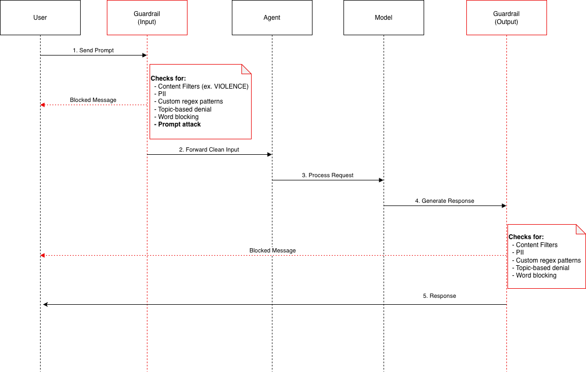
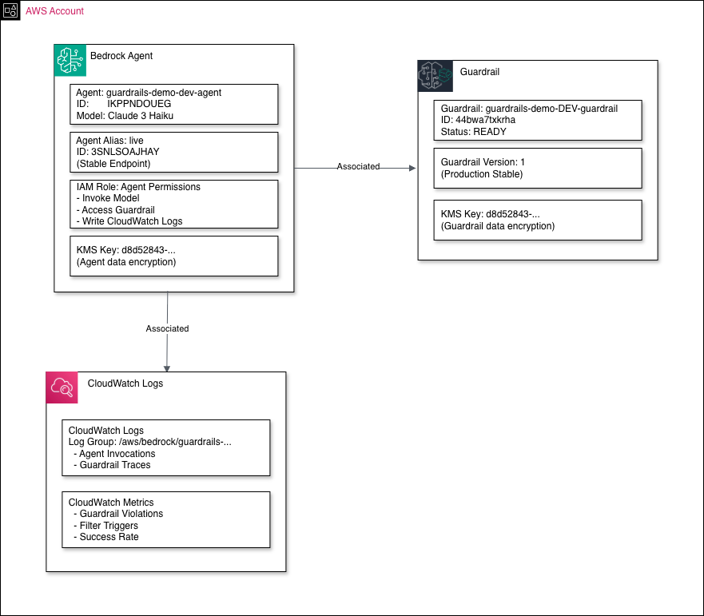

# AWS Bedrock Guardrails: Architecture, Filtering, and Implementation Guide

A deep dive into how Amazon Bedrock Guardrails work — covering content filters, PII detection, denied topics, input/output filtering, strength levels, and real-world examples of how guardrails protect your AI agents in production.

<!-- more -->

## High-Level Architecture

Amazon Bedrock Guardrails act as a security layer that inspects both **input** (user prompts) and **output** (model responses), blocking or anonymizing content that violates your policies.

```
┌─────────────────┐
│ User/Application│
└────────┬────────┘
         │
         │ 1. User Input
         │
         ▼
┌─────────────────────────┐
│   Guardrail (Input)     │◄──── If Violation: Return Blocked Message
│   - Content Filters     │
│   - PII Detection       │
│   - Denied Topics       │
└────────┬────────────────┘
         │
         │ 2. Input Filtered
         │
         ▼
┌─────────────────────────┐
│    Bedrock Agent        │
│  (Orchestration Logic)  │
└────────┬────────────────┘
         │
         │ 3. Processed Request
         │
         ▼
┌─────────────────────────┐
│   Foundation Model      │
│   (Claude 3 Haiku)      │
└────────┬────────────────┘
         │
         │ 4. Generated Response
         │
         ▼
┌─────────────────────────┐
│   Guardrail (Output)    │◄──── If Violation: Return Blocked Message
│   - Content Filters     │
│   - PII Detection       │
│   - Contextual Ground   │
└────────┬────────────────┘
         │
         │ 5. Output Filtered
         │
         ▼
┌─────────────────┐
│ User/Application│
└─────────────────┘
```



---

## Detailed Request Flow

```
User                Guardrail           Agent              Model            Guardrail          User
 │                  (Input)              │                   │              (Output)            │
 │                    │                  │                   │                 │                │
 │──1. Send Prompt───>│                  │                   │                 │                │
 │                    │                  │                   │                 │                │
 │                    │◄─ Check Input Filters:              │                 │                │
 │                    │   • Content Filters                  │                 │                │
 │                    │   • PII Detection                    │                 │                │
 │                    │   • Denied Topics                    │                 │                │
 │                    │   • Word Filters                     │                 │                │
 │                    │   • Prompt Attack                    │                 │                │
 │                    │                  │                   │                 │                │
 │                    ├─ Violation? ────┐                   │                 │                │
 │                    │                  │                   │                 │                │
 │◄─ YES: Blocked ────┤                  │                   │                 │                │
 │    Message         │                  │                   │                 │                │
 │                    │                  │                   │                 │                │
 │                    ├─ NO: Pass ───────┼──2. Forward ─────>│                 │                │
 │                    │                  │   Clean Input     │                 │                │
 │                    │                  │                   │                 │                │
 │                    │                  │──3. Process ─────>│                 │                │
 │                    │                  │   Request         │                 │                │
 │                    │                  │                   │                 │                │
 │                    │                  │                   │──4. Generate ───>│                │
 │                    │                  │                   │   Response      │                │
 │                    │                  │                   │                 │                │
 │                    │                  │                   │                 │◄─ Check Output │
 │                    │                  │                   │                 │   Filters      │
 │                    │                  │                   │                 │                │
 │                    │                  │                   │                 ├─ Violation? ───┐
 │                    │                  │                   │                 │                │
 │◄───────────────────┴──────────────────┴───────────────────┴─ YES: Blocked ─┤                │
 │                                                                 Message     │                │
 │                                                                             │                │
 │◄───────────────────────────────────────────────────────────── NO: Return ──┤                │
 │                                                             5. Response     │                │
 │                                                                             │                │
```

---

## Guardrail Components Architecture

```
┌─────────────────────────────────────────────────────────────────┐
│                      GUARDRAIL POLICIES                         │
├─────────────────────────────────────────────────────────────────┤
│                                                                 │
│  ┌──────────────────────┐                                      │
│  │  Content Filters     │ ──────────┐                          │
│  │  • Violence          │           │                          │
│  │  • Hate              │           │                          │
│  │  • Sexual            │           ▼                          │
│  │  • Insults           │      ┌─────────┐                    │
│  │  • Misconduct        │      │ BLOCK   │                    │
│  │  • Prompt Attack     │      │ Request │                    │
│  └──────────────────────┘      └─────────┘                    │
│                                                                 │
│  ┌──────────────────────┐                                      │
│  │  PII Filters         │ ──────┬───────┐                     │
│  │  • SSN               │       │       │                      │
│  │  • Email             │       │       ▼                      │
│  │  • Phone             │       │  ┌──────────┐                │
│  │  • Credit Cards      │       │  │ANONYMIZE │                │
│  │  • Names             │       │  │ Replace  │                │
│  │  • Bank Accounts     │       │  │ with PII │                │
│  └──────────────────────┘       │  └──────────┘                │
│                                  │                              │
│  ┌──────────────────────┐       │                              │
│  │  Denied Topics       │       │                              │
│  │  • Fiduciary Advice  │ ──────┤                              │
│  │  • Medical Diagnoses │       │                              │
│  │  • Custom Topics     │       │                              │
│  └──────────────────────┘       │                              │
│                                  │                              │
│  ┌──────────────────────┐       │                              │
│  │  Word Filters        │       │                              │
│  │  • Profanity         │ ──────┤                              │
│  │  • Custom Words      │       │                              │
│  └──────────────────────┘       │                              │
│                                  │                              │
│  ┌──────────────────────┐       │                              │
│  │  Custom Regex        │ ──────┴───────┐                     │
│  │  • Account Numbers   │               │                      │
│  │  • Custom Patterns   │               │                      │
│  └──────────────────────┘               │                      │
│                                          │                      │
│  ┌──────────────────────┐               │                      │
│  │ Contextual Grounding │ ──────────────┘                      │
│  │  • Hallucination     │                                      │
│  │    Prevention        │                                      │
│  │  • RAG Validation    │                                      │
│  └──────────────────────┘                                      │
│                                                                 │
└─────────────────────────────────────────────────────────────────┘
```

Each guardrail can include any combination of these six policy types. They are evaluated in parallel for minimal latency impact.

---

## Filter Strength Levels

Filter strength determines how aggressively a guardrail blocks content based on the **confidence score** of a detected violation:

```
                          ┌─────────────┐
                          │ User Input  │
                          └──────┬──────┘
                                 │
                                 ▼
                         ┌───────────────┐
                         │Filter Strength│
                         └───────┬───────┘
                                 │
                ┌────────────────┼────────────────┬────────────────┐
                │                │                │                │
                ▼                ▼                ▼                ▼
            ┌──────┐      ┌──────────┐    ┌──────────┐    ┌──────────┐
            │ NONE │      │   LOW    │    │  MEDIUM  │    │   HIGH   │
            └──┬───┘      └────┬─────┘    └────┬─────┘    └────┬─────┘
               │               │               │               │
               │               ▼               ▼               ▼
               │        ┌────────────┐  ┌────────────┐  ┌────────────┐
               │        │ High Conf  │  │High/Medium │  │ Any Conf   │
               │        │ Violation? │  │   Conf?    │  │  Level?    │
               │        └──────┬─────┘  └──────┬─────┘  └──────┬─────┘
               │               │               │               │
               │          ┌────┴────┐     ┌────┴────┐     ┌────┴────┐
               │          │         │     │         │     │         │
               │        YES       NO    YES       NO    YES       NO
               │          │         │     │         │     │         │
               │          ▼         ▼     ▼         ▼     ▼         ▼
               │      ┌──────┐ ┌──────┐ ┌──────┐ ┌──────┐ ┌──────┐ ┌──────┐
               ▼      │BLOCK │ │ PASS │ │BLOCK │ │ PASS │ │BLOCK │ │ PASS │
            ┌──────┐  └──────┘ └──────┘ └──────┘ └──────┘ └──────┘ └──────┘
            │ PASS │     ❌       ✅       ❌       ✅       ❌       ✅
            └──────┘  (Strict) (Lenient)(Medium)(Lenient)(Strictest)
               ✅
          (No Filter)

Legend:
  NONE   = No filtering applied
  LOW    = Block only HIGH confidence violations
  MEDIUM = Block MEDIUM and HIGH confidence violations  
  HIGH   = Block LOW, MEDIUM, and HIGH confidence violations
```

---

## Input vs Output Filtering

```
      ┌──────────────────────────────────────────────────────────────────┐
      │                   INPUT FILTERS (User → Model)                   │
      ├──────────────────────────────────────────────────────────────────┤
      │                                                                  │
      │  ✓ Content Filters ................... HIGH                      │
      │  ✓ Prompt Attack ..................... HIGH                      │
      │  ✓ PII Detection ..................... BLOCK/ANONYMIZE           │
      │  ✓ Denied Topics ..................... ENABLED                   │
      │  ✓ Word Filters ...................... ENABLED                   │
      │                                                                  │
      └────────────────────────────┬─────────────────────────────────────┘
                                   │
                                   │ Clean Input
                                   │
                                   ▼
                          ┌────────────────┐
                          │     Model      │
                          │  (Claude 3)    │
                          └────────┬───────┘
                                   │
                                   │ Generated Response
                                   │
                                   ▼
      ┌──────────────────────────────────────────────────────────────────┐
      │                  OUTPUT FILTERS (Model → User)                   │
      ├──────────────────────────────────────────────────────────────────┤
      │                                                                  │
      │  ✓ Content Filters ................... HIGH                      │
      │  ✗ Prompt Attack ..................... NONE (Not Applicable)     │
      │  ✓ PII Detection ..................... BLOCK/ANONYMIZE           │
      │  ✓ Denied Topics ..................... ENABLED                   │
      │  ✓ Word Filters ...................... ENABLED                   │
      │  ✓ Contextual Grounding .............. ENABLED (RAG Apps Only)   │
      │                                                                  │
      └────────────────────────────┬─────────────────────────────────────┘
                                   │
                                   │ Safe Response
                                   │
                                   ▼
                              ┌────────┐
                              │  User  │
                              └────────┘

KEY DIFFERENCE: Prompt Attack only filters INPUT (users trying to hack the model),
                not OUTPUT (model doesn't generate prompt attacks)
```

---

## Integration with Bedrock Agent

The diagram below shows how a guardrail is associated with a Bedrock Agent and the supporting AWS resources:

```
┌─────────────────────────────────────────────────────────────────────────┐
│                         AWS ACCOUNT RESOURCES                            │
│                                                                          │
│  ┌─────────────────────────────────────────────────────────────────┐   │
│  │                      BEDROCK AGENT                              │   │
│  │                                                                 │   │
│  │  ┌───────────────────────────────────────────┐                 │   │
│  │  │  Agent: guardrails-demo-agent             │                 │   │
│  │  │  Model: Claude 3 Haiku                    │                 │   │
│  │  └──────────────────┬────────────────────────┘                 │   │
│  │                     │                                           │   │
│  │                     ▼                                           │   │
│  │  ┌───────────────────────────────────────────┐                 │   │
│  │  │  Agent Alias: live                        │                 │   │
│  │  │  (Stable Endpoint)                        │                 │   │
│  │  └───────────────────────────────────────────┘                 │   │
│  │                                                                 │   │
│  │  ┌───────────────────────────────────────────┐                 │   │
│  │  │  IAM Role: Agent Permissions              │                 │   │
│  │  │  • Invoke Model                           │                 │   │
│  │  │  • Access Guardrail                       │                 │   │
│  │  │  • Write CloudWatch Logs                  │                 │   │
│  │  └───────────────────────────────────────────┘                 │   │
│  └─────────────────────────────────────────────────────────────────┘   │
│                          │                                              │
│                          │ Associated                                   │
│                          ▼                                              │
│  ┌─────────────────────────────────────────────────────────────────┐   │
│  │                        GUARDRAIL                                │   │
│  │                                                                 │   │
│  │  ┌───────────────────────────────────────────┐                 │   │
│  │  │ Guardrail: guardrails-demo-guardrail      │                 │   │
│  │  │ Status: READY                             │                 │   │
│  │  └──────────────────┬────────────────────────┘                 │   │
│  │                     │                                           │   │
│  │                     ▼                                           │   │
│  │  ┌───────────────────────────────────────────┐                 │   │
│  │  │ Guardrail Version: 1                      │                 │   │
│  │  │ (Production Stable)                       │                 │   │
│  │  └───────────────────────────────────────────┘                 │   │
│  │                                                                 │   │
│  │  ┌───────────────────────────────────────────┐                 │   │
│  │  │ KMS Key: (Encryption)                     │                 │   │
│  │  └───────────────────────────────────────────┘                 │   │
│  └─────────────────────────────────────────────────────────────────┘   │
│                                                                          │
│  ┌─────────────────────────────────────────────────────────────────┐   │
│  │                        MONITORING                               │   │
│  │                                                                 │   │
│  │  ┌───────────────────────────────────────────┐                 │   │
│  │  │ CloudWatch Logs                           │                 │   │
│  │  │ Log Group: /aws/bedrock/guardrails/...    │                 │   │
│  │  │ • Agent Invocations                       │                 │   │
│  │  │ • Guardrail Traces                        │                 │   │
│  │  └───────────────────────────────────────────┘                 │   │
│  │                                                                 │   │
│  │  ┌───────────────────────────────────────────┐                 │   │
│  │  │ CloudWatch Metrics                        │                 │   │
│  │  │ • Guardrail Violations                    │                 │   │
│  │  │ • Filter Triggers                         │                 │   │
│  │  │ • Success Rate                            │                 │   │
│  │  └───────────────────────────────────────────┘                 │   │
│  └─────────────────────────────────────────────────────────────────┘   │
│                                                                          │
└─────────────────────────────────────────────────────────────────────────┘
           ▲
           │
           │ Invoke Agent
           │
     ┌─────────────┐
     │    Your     │
     │ Application │
     └─────────────┘
```



---

## PII Detection and Action Flow

Guardrails support two actions for PII: **ANONYMIZE** (replace with placeholder, conversation continues) and **BLOCK** (stop the request entirely).

```
                         ┌──────────────────┐
                         │ Input/Output Text│
                         └────────┬─────────┘
                                  │
                                  ▼
                         ┌─────────────────┐
                         │ PII Detection   │
                         │ ML Engine       │
                         └────────┬─────────┘
                                  │
                    ┌─────────────┴─────────────┐
                    │                           │
                 No PII                    PII Found
                    │                           │
                    ▼                           │
            ┌──────────────┐                   │
            │ Pass Through │                   │
            │      ✅       │                   │
            └──────────────┘                   │
                                               │
                ┌──────────────────────────────┴─────────────────┬────────────────┐
                │                                                │                │
                ▼                                                ▼                ▼
        ┌───────────────┐                              ┌───────────────┐  ┌───────────────┐
        │  NAME Found   │                              │   SSN Found   │  │ Custom Regex  │
        └───────┬───────┘                              └───────┬───────┘  │   Pattern     │
                │                                              │          └───────┬───────┘
                │ Action: ANONYMIZE                            │                  │
                │                                              │ Action: BLOCK    │
                ▼                                              │                  ▼
        ┌───────────────┐                              ┌───────────────┐  ┌───────────────┐
        │ Replace with  │                              │ Block Request │  │ Check Action  │
        │   [NAME]      │                              │ Return Error  │  │    Type       │
        └───────────────┘                              │      ❌       │  └───────┬───────┘
                                                       └───────────────┘          │
        ┌───────────────┐                                                         │
        │ EMAIL Found   │                              ┌───────────────┐          │
        └───────┬───────┘                              │  Bank Account │          │
                │                                      │     Found     │     ┌────┴────┐
                │ Action: ANONYMIZE                    └───────┬───────┘     │         │
                │                                              │          ANONYMIZE  BLOCK
                ▼                                              │             │         │
        ┌───────────────┐                                      │ Action:     ▼         ▼
        │ Replace with  │                                      │ BLOCK   ┌────────┐ ┌────────┐
        │   [EMAIL]     │                                      │         │Replace │ │ Block  │
        └───────────────┘                                      ▼         │  with  │ │Request │
                                                       ┌───────────────┐ │[REDACT]│ │  ❌   │
        ┌───────────────┐                              │ Block Request │ └────────┘ └────────┘
        │ PHONE Found   │                              │ Return Error  │
        └───────┬───────┘                              │      ❌       │
                │                                      └───────────────┘
                │ Action: ANONYMIZE
                │                                      ┌───────────────┐
                ▼                                      │  Credit Card  │
        ┌───────────────┐                              │     Found     │
        │ Replace with  │                              └───────┬───────┘
        │   [PHONE]     │                                      │
        └───────────────┘                                      │ Action: BLOCK
                                                               │
                                                               ▼
                                                       ┌───────────────┐
                                                       │ Block Request │
                                                       │ Return Error  │
                                                       │      ❌       │
                                                       └───────────────┘

ANONYMIZE = Safer for UX, allows conversation to continue
BLOCK     = Maximum security, stops request immediately
```

---

## Real-World Example Flows

### Example 1: Blocked by Denied Topics

```
User: "What stocks should I invest in for my retirement?"
  │
  │
  ▼
┌─────────────────────────────────────────┐
│ Guardrail (Input Filters)              │
│                                         │
│ Checking Denied Topics...              │
│ ✗ MATCH FOUND: "Fiduciary Advice"      │
│   - Topic Definition: Financial advice │
│   - Confidence: HIGH                   │
│                                         │
│ ACTION: BLOCK ❌                        │
└────────────┬────────────────────────────┘
             │
             │ Blocked Message
             │
             ▼
User: "I'm unable to process this request as it violates 
       our content policy. Please rephrase your question..."
```

### Example 2: Safe Query with PII Anonymization

```
User: "My email is john.doe@example.com, what is cloud computing?"
  │
  │
  ▼
┌─────────────────────────────────────────┐
│ Guardrail (Input Filters)              │
│                                         │
│ Checking PII...                         │
│ ✓ FOUND: john.doe@example.com (EMAIL)  │
│   Action: ANONYMIZE                     │
│                                         │
│ Modified Input:                         │
│ "My email is [EMAIL], what is cloud...?"│
└────────────┬────────────────────────────┘
             │
             │ Clean Input
             │
             ▼
      ┌──────────────┐
      │Bedrock Agent │
      └──────┬───────┘
             │
             │ Process Request
             │
             ▼
      ┌──────────────┐
      │ Foundation   │
      │    Model     │
      └──────┬───────┘
             │
             │ Generated Response
             │
             ▼
┌─────────────────────────────────────────┐
│ Guardrail (Output Filters)             │
│                                         │
│ Checking Output...                      │
│ ✓ No harmful content                   │
│ ✓ No PII in response                   │
│ ✓ No denied topics                     │
│                                         │
│ ACTION: PASS ✅                         │
└────────────┬────────────────────────────┘
             │
             │ Safe Response
             │
             ▼
User: "Cloud computing is a technology that delivers
       computing services over the internet..."
```

### Example 3: Blocked by Content Filter (Hate Speech)

```
User: "I hate people from [group]"
  │
  │
  ▼
┌─────────────────────────────────────────┐
│ Guardrail (Input Filters)              │
│                                         │
│ Checking Content Filters...             │
│ ✗ HATE SPEECH DETECTED                  │
│   - Confidence: HIGH                    │
│   - Filter Strength: HIGH               │
│                                         │
│ ACTION: BLOCK ❌                        │
└────────────┬────────────────────────────┘
             │
             │ Blocked Message
             │
             ▼
User: "I'm unable to process this request as it violates
       our content policy..."
```

---

## Key Concepts

### 1. **Defense in Depth**

Guardrails provide multiple layers of protection:

- Content filters catch harmful content
- PII filters protect sensitive data
- Topic filters enforce business rules
- Word filters block specific terms

### 2. **Input vs Output**

- **Input filters**: Protect the model from harmful/inappropriate prompts
- **Output filters**: Ensure the model's responses are safe and compliant

### 3. **Actions**

- **BLOCK**: Completely stop the request/response and return a blocked message
- **ANONYMIZE**: Replace sensitive data with placeholders (e.g., `[EMAIL]`, `[SSN]`)

### 4. **Strength Levels**

- **HIGH**: Most strict, blocks low/medium/high confidence violations
- **MEDIUM**: Moderate, blocks medium/high confidence violations
- **LOW**: Lenient, blocks only high confidence violations
- **NONE**: No filtering

### 5. **Versioning**

Guardrails are versioned for production stability:

- Update policies in DRAFT
- Create version when ready
- Agent aliases reference specific versions

---

## Performance Characteristics

| Metric | Value |
|--------|-------|
| **Harmful Content Blocking** | 88% |
| **Validation Accuracy** | 99% |
| **False Positives** | Low (due to confidence scoring) |
| **Latency Impact** | Minimal (parallel processing) |

---

## CloudWatch Monitoring

Guardrails automatically log to CloudWatch:

```
                    ┌──────────────┐
                    │  Guardrail   │
                    │  Processing  │
                    └──────┬───────┘
                           │
                           │ Logs all activity
                           │
                           ▼
              ┌────────────────────────┐
              │   CloudWatch Logs      │
              │ /aws/bedrock/...       │
              └────────┬───────────────┘
                       │
        ┌──────────────┼──────────────┬──────────────┐
        │              │              │              │
        ▼              ▼              ▼              ▼
┌───────────────┐ ┌───────────────┐ ┌───────────────┐ ┌───────────────┐
│  Trace Data   │ │    Metrics    │ │    Alarms     │ │   Dashboards  │
├───────────────┤ ├───────────────┤ ├───────────────┤ ├───────────────┤
│• Filter       │ │• Violation    │ │• High         │ │• Real-time    │
│  triggered    │ │  count        │ │  violation    │ │  monitoring   │
│               │ │               │ │  rate         │ │               │
│• Confidence   │ │• Filter type  │ │               │ │• Filter       │
│  score        │ │  breakdown    │ │• PII leakage  │ │  statistics   │
│               │ │               │ │  detection    │ │               │
│• Action taken │ │• Success rate │ │               │ │• Trend        │
│  (Block/Pass) │ │               │ │• Policy       │ │  analysis     │
│               │ │• PII detected │ │  breaches     │ │               │
│• Request ID   │ │               │ │               │ │• Compliance   │
│               │ │• Latency      │ │• Anomaly      │ │  reports      │
└───────────────┘ └───────────────┘ │  detection    │ └───────────────┘
                                    └───────────────┘
```

---

## Best Practices

1. **Use HIGH strength for critical filters** (Violence, Hate, Misconduct)
2. **Set PROMPT_ATTACK to input-only** (output filtering not needed)
3. **ANONYMIZE sensitive PII** (Name, Email) for UX
4. **BLOCK critical PII** (SSN, Credit Cards) for security
5. **Version guardrails** before production deployment
6. **Monitor CloudWatch** for violation patterns
7. **Test thoroughly** with edge cases

---

## Official References

- [AWS Bedrock Guardrails Documentation](https://docs.aws.amazon.com/bedrock/latest/userguide/guardrails.html)
- [Content Filters Guide](https://docs.aws.amazon.com/bedrock/latest/userguide/guardrails-content-filters-overview.html)
- [AWS Official Terraform Sample — Bedrock Guardrails](https://github.com/aws-samples/aws-generative-ai-terraform-samples/tree/main/samples/bedrock-guardrails)
- [AWS Bedrock Guardrails API Reference](https://docs.aws.amazon.com/bedrock/latest/APIReference/API_CreateGuardrail.html)
- [Terraform AWS Provider — Bedrock Guardrail](https://registry.terraform.io/providers/hashicorp/aws/latest/docs/resources/bedrock_guardrail)
