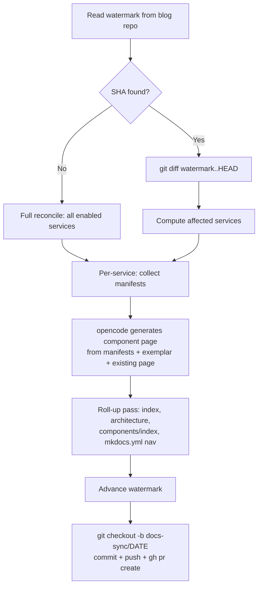

---

```markdown
---
date: 2026-06-11
categories:
  - Infrastructure
  - Automation
tags:
  - gitops
  - documentation
  - flux-cd
  - opencode
  - mkdocs
authors:
  - jiwoo
---

# Watermark-Based Docs Sync for Fleet-Infra

Documentation for a GitOps platform drifts the moment you merge a service change without updating the docs. This post covers a new automation that keeps the component reference pages on this site in sync with the actual Kubernetes manifests in fleet-infra, using a watermark pattern to make incremental syncs cheap and full reconciles possible.

<!-- more -->

## Overview

`make update-docs` is a local script (`scripts/update-docs.sh`) that reads the current state of services in fleet-infra, generates or refreshes Markdown reference pages in the blog repo, and opens a PR for human review. It uses a commit-SHA watermark stored in the blog repo to track what's already documented, so incremental runs only touch services that actually changed.

No CI pipelines. No auto-merge. The script drafts, you review.

## Why This Change

The fleet-infra platform now manages 25+ services. Keeping `docs/projects/flux-infra/components/` accurate by hand was failing — pages went stale within days of a HelmRelease bump or dependency change. The pre-push hook (`check-docs-freshness.sh`) already blocks pushes that lack doc updates, but it only enforces the *rule*. It doesn't do the *work*.

The docs sync script closes that gap: after infra changes land, run one command and get a PR with refreshed component pages, updated architecture diagrams, and correct service counts — all derived from the manifests themselves.

## Technical Details

### Watermark mechanism

The watermark lives at `docs/projects/flux-infra/.docs-sync-state.json` in the blog repo:

```json
{
  "fleet_infra_commit": "0bbe860...",
  "synced_at": "2026-06-11T13:48:34Z"
}
```

On incremental runs, the script diffs `watermark_sha..HEAD` across `apps/base/` and `base/services/` to identify which services changed. Only those get regenerated. The watermark advances to HEAD in the same PR as the doc updates — so when the PR merges, the next run starts from the right point. This is the same pattern `release-please` uses with its manifest file.

### Generation pipeline



Each service page is generated by feeding the actual YAML manifests (HelmRelease, Kustomization, namespace, values) into opencode alongside an exemplar page for consistent structure. Existing page content is passed in too — the model refreshes rather than rewrites, preserving any manual additions.

### Service slug mapping

Multiple services can share a single component page (e.g., `external-secrets-operator` and `external-secrets-config` both map to `external-secrets.md`). Internal glue services like `grafana-sa-setup` and `gateway-api-crds` are skipped entirely — they have no standalone documentation value.

### Roll-up regeneration

After individual pages are written, a second opencode pass regenerates the index pages, architecture diagram, and mkdocs.yml nav block. This ensures service counts, layer tables, and mermaid dependency graphs stay accurate without manual bookkeeping.

## Operational Impact

**Before:** Documentation drifted silently. The pre-push hook caught missing updates but offered no assistance beyond "go write docs."

**After:**

| Scenario | Command | Time |
|----------|---------|------|
| Single service changed | `make update-docs` | ~90s (local Ollama) |
| Full reconcile (25+ services) | `make update-docs MODE=all` | ~45min local, ~5min with remote model |
| Preview without PR | Omit the PR step (script detects no changes) | Instant |

Key operational properties:

- **No CI secrets needed** — runs locally with your existing `opencode` and `gh` auth
- **Idempotent** — re-running without infra changes produces no PR (detects empty diff)
- **Duplicate-safe** — refuses to create a branch if `docs-sync/DATE` already exists on origin
- **Dirty-repo-safe** — aborts if the blog repo has uncommitted changes in the docs path
- **Model-portable** — set `DOCS_SYNC_MODEL=claude-sonnet-4-5` to use a remote model instead of local Ollama

The pre-push hook and the sync script form a closed loop: the hook enforces that docs stay fresh, and the sync script makes freshness cheap to achieve.
```
