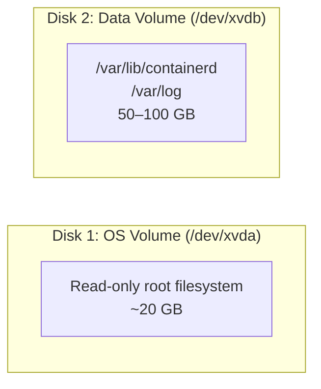
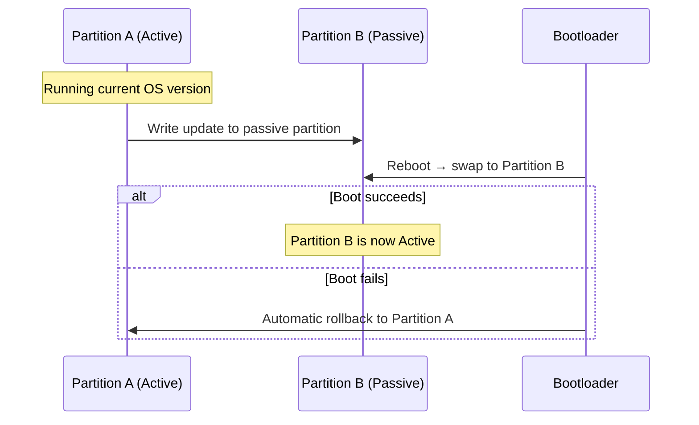
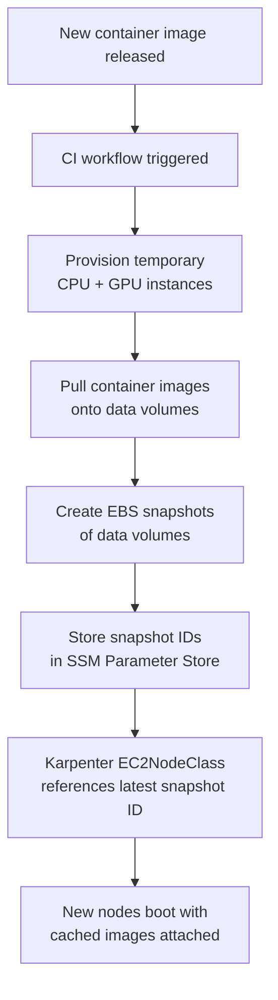

# Migrating EKS Nodes to Bottlerocket: Architecture, Operations, and Lessons Learned

After migrating multiple EKS clusters from Amazon Linux 2 to Bottlerocket, I want to share the architecture differences, what changed operationally, the EBS snapshot workflow we built for image caching, and the production challenges we hit along the way.

<!-- more -->

## Why Bottlerocket?

Amazon Linux 2 (AL2) is a general-purpose Linux distribution — it ships with a package manager, SSH, and a full userland. That flexibility comes at a cost: larger attack surface, mutable state, and operational patterns (SSH + bash scripts) that don't align well with Kubernetes-native workflows.

Bottlerocket is AWS's container-optimized OS, purpose-built to run containers and nothing else. The migration was driven by security posture, operational simplicity, and node provisioning speed.

---

## Architecture Deep Dive

Understanding Bottlerocket's architecture explains why the migration was worth the effort.

### Container-Optimized Minimal OS

Bottlerocket ships exactly three things: **containerd**, **kubelet**, and minimal system services. That's it.

- No package manager (no `yum`, no `apt`)
- No SSH by default
- No user-installed software

This results in roughly **80% smaller attack surface** compared to a general-purpose Linux distribution.

### Immutable Root Filesystem

System components are **read-only at runtime**. You cannot modify them. Configuration happens through declarative TOML files, not imperative shell scripts. Any changes require a full image update — not in-place package installs.

This is a fundamental shift from how most teams operate with AL2.

### Dual-Disk Architecture

Bottlerocket separates the OS and data onto **two independent disks**:



The key benefit: **container storage is completely isolated from the OS** and survives OS updates. Your running containers and their data are unaffected when the OS partition is updated.

### A/B Partition Updates

The OS disk has two partitions — **Partition A** and **Partition B**. One is active, the other is passive.



When an update arrives:

1. It writes to the **passive** partition
2. On reboot, an **atomic swap** makes the passive partition active
3. If the boot fails, it **automatically rolls back** to the previous partition

Zero-downtime updates with a built-in safety net.

### Security Enforcement

- **SELinux in enforcing mode** by default (AL2 typically runs permissive)
- **IMDSv2 required** — blocks SSRF attacks on the metadata service
- Fewer binaries overall → fewer CVEs to track and easier compliance audits

### Kubernetes-Native Operation Model

There's no more "SSH into the node and fix things." Everything flows through Kubernetes:

- **Configuration** → Kubernetes user data (TOML)
- **Debugging** → ephemeral admin containers via `kubectl`
- **Monitoring** → metrics and logs, not shell access

---

## The Admin Container: Debugging Without SSH

Since there's no SSH, how do you debug node-level issues? Bottlerocket provides an **admin container** — a special privileged container you temporarily deploy on a node for low-level access.

### How It Works

```bash
# Launch an admin container on a specific node
kubectl debug node/<node-name> -it --image=public.ecr.aws/bottlerocket/bottlerocket-admin:latest \
  --profile=sysadmin

# Inside the admin container, useful commands:
sheltie           # Enter the host namespace
journalctl -u kubelet    # Check kubelet logs
crictl ps                # List running containers
mount | grep xvd         # Inspect disk mounts
cat /etc/bottlerocket/config.toml  # View node configuration
```

Key characteristics:

- Runs with **elevated privileges** (`--profile=sysadmin`)
- **Mounts the host filesystem** for full node inspection
- **Ephemeral** — you delete it when done

For most day-to-day operations (checking logs, viewing metrics, inspecting resources), standard Kubernetes tooling like `kubectl top node` or your observability stack is still the recommended approach. The admin container is for when you need to go deeper.

---

## Operational Impact: What Changed

Here's a concrete comparison of how daily operations shifted:

| Area | Amazon Linux 2 | Bottlerocket |
|------|---------------|-------------|
| **Node debugging** | SSH + shell commands | Ephemeral admin container via `kubectl debug node` |
| **Config changes** | Bash scripts applied via SSH | TOML config via Kubernetes user data |
| **OS patching** | Scheduled maintenance window (`yum update` + reboot) | Atomic A/B partition update, zero downtime |
| **AMI management** | Custom AMIs with pre-pulled images (Packer builds) | AWS base AMI, no customization needed |
| **Image caching** | Bake container images into custom AMIs | Attach EBS snapshots with cached images |
| **Multi-region** | Copy custom AMIs across regions | Replicate EBS snapshots across regions |
| **GPU drivers** | Manual install and update | Built into AWS Bottlerocket NVIDIA AMI variants |
| **Node provisioning** | ~4 minutes to join cluster | ~30 seconds (87% reduction) |

The provisioning speed improvement was immediately noticeable during migration. For Karpenter-based autoscaling, this means much faster response to workload spikes and less time waiting for capacity.

---

## EBS Snapshot Workflow for Image Caching

This was a significant part of the migration effort. The problem: when a pod gets scheduled on a fresh node without cached images, pulling large container images can take **40+ minutes** — unacceptable for user-facing workloads.

### The Old Approach (AL2)

With AL2, we maintained **custom AMIs** with pre-pulled images:

1. A CI pipeline used **HashiCorp Packer** to build custom AMIs
2. Separate AMIs for CPU and GPU across regions
3. Every time new container images were released, **rebuild all AMIs** and replicate them across regions
4. AMI IDs were hardcoded in infrastructure config and manually updated

This was a lot of maintenance overhead.

### The New Approach (Bottlerocket)

With Bottlerocket, we use **AWS's base AMI** (no customization) and manage **EBS snapshots** for image caching:



How it works:

1. When new container images are released, automation provisions temporary CPU and GPU instances
2. Images are pulled onto those instances' data volumes
3. **EBS snapshots** are created from those data volumes
4. Snapshot IDs are saved to **SSM Parameter Store**, so the node provisioner (Karpenter) always references the latest snapshot automatically
5. In the **EC2NodeClass** `blockDeviceMappings`, we reference those snapshot IDs
6. When Karpenter provisions a node, it uses the base Bottlerocket AMI and **attaches the snapshot as the data volume** — the node boots with all images already cached

This is AWS's officially recommended method. Packer doesn't even support Bottlerocket AMI customization. It's a much cleaner architecture with significantly better maintainability.

!!! note
    This snapshot-based approach only applies to clusters that require large image caching. Standard service clusters don't need it.

---

## Production Challenges and Lessons

### Mass Image Pulls During Migration

During one cluster migration, all deployments tried to pull Docker images simultaneously when new Bottlerocket nodes came online. This created significant **memory pressure** on the nodes.

**Resolution**: We leveraged Karpenter's self-healing capabilities. For stateless service deployments that remain running unless manually stopped, we brought down all AL2 nodes at once and let pods get recreated on Bottlerocket nodes. For user-facing workloads that restart naturally on termination, we used a **gradual rollout strategy**. The entire process resolved in about 15 minutes as image pulls spread out over time.

**What I'd do differently**:

1. **Over-provision capacity by 30%** during the migration window
2. **Automate batch draining** with health checks between batches

### cgroup Version Mismatch

AL2 uses **cgroup v1**; Bottlerocket uses **cgroup v2**. Applications that directly interacted with cgroup APIs broke after migration.

We had two options: downgrade Bottlerocket to cgroup v1 for backward compatibility, or keep v2 and update the application code.

**Decision**: Keep cgroup v2. Since v1 is being phased out across the Linux ecosystem, downgrading would create technical debt. We worked with the affected team to find a temporary workaround for their production issue while they implemented a permanent fix for v2 compatibility.

### NVIDIA Device Plugin Conflict

On AL2, the **NVIDIA device plugin for Kubernetes** is manually installed to expose GPUs as schedulable resources. Bottlerocket's NVIDIA AMI variants have **built-in GPU support**.

When migrating GPU nodes, both the device plugin *and* Bottlerocket's native GPU support tried to expose GPUs — causing **resource conflicts**.

**Temporary fix**: Add a node selector to prevent the NVIDIA device plugin DaemonSet from running on Bottlerocket nodes:

```yaml
affinity:
  nodeAffinity:
    requiredDuringSchedulingIgnoredDuringExecution:
      nodeSelectorTerms:
        - matchExpressions:
            - key: kubernetes.io/os-variant
              operator: NotIn
              values:
                - bottlerocket
```

**Permanent fix**: Once all GPU workloads are fully migrated to Bottlerocket, remove the NVIDIA device plugin entirely.

---

## Key Takeaways

1. **Immutability changes your operational model** — no SSH, no imperative scripts. Everything flows through Kubernetes APIs and declarative config. This is a paradigm shift that pays off in consistency and auditability.

2. **Dual-disk + A/B partitions = safe updates** — container data survives OS updates, and failed updates automatically roll back. This eliminates an entire class of "patching gone wrong" incidents.

3. **EBS snapshots > custom AMIs for image caching** — cleaner, more maintainable, and AWS's recommended approach. The snapshot workflow integrates naturally with Karpenter and SSM Parameter Store.

4. **Production migrations are about operational maturity** — you can't plan for every edge case. What matters is the ability to triage quickly, mitigate impact, and circle back to do things properly. The cgroup mismatch and GPU plugin conflict were both discovered in production, and both were resolved without extended downtime.

5. **Node provisioning speed matters more than you think** — going from 4 minutes to 30 seconds fundamentally changes how autoscaling feels. Karpenter can respond to workload spikes almost immediately.
