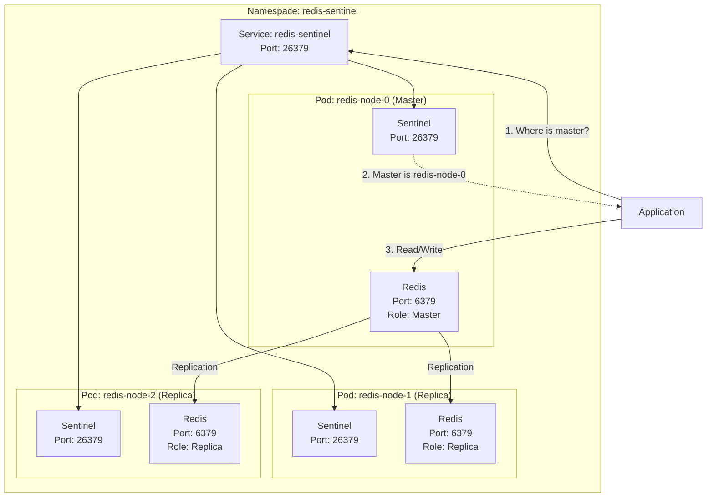
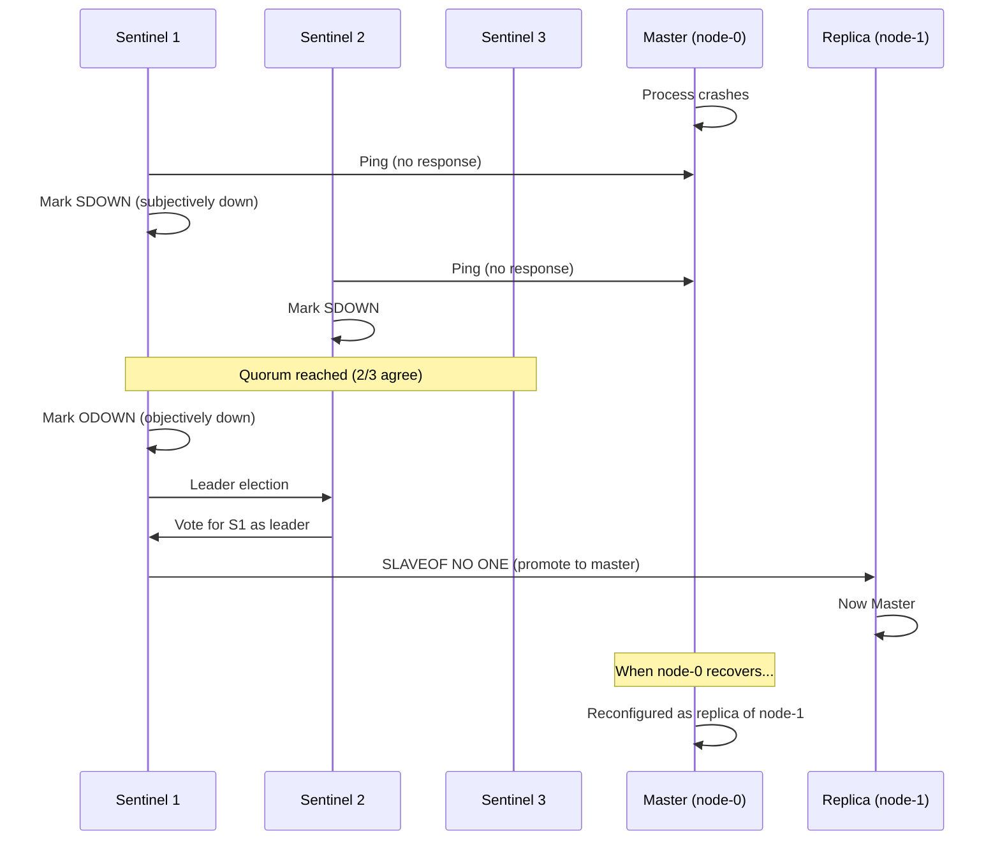
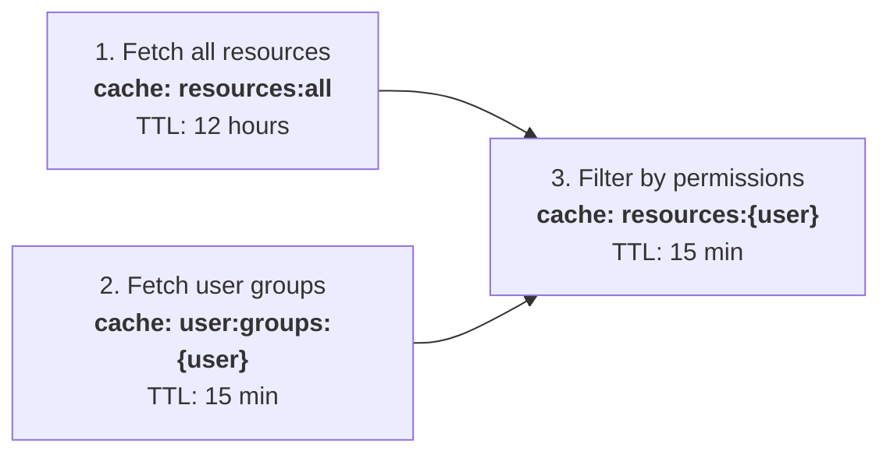

# Redis Sentinel on Kubernetes: Architecture, Failover, and Cache Invalidation

Running Redis in production demands more than a single instance. After implementing Redis Sentinel on Kubernetes for caching across several services, I want to share the architecture decisions, failover mechanics, persistence strategies, and cache invalidation patterns I learned along the way.

<!-- more -->

## Self-Managed vs. Cloud-Managed Redis

The first decision was how to run Redis: use a cloud-managed offering (e.g., Amazon ElastiCache) or run Redis Sentinel in-cluster on Kubernetes.

### Cloud-Managed Redis

The appeal is obvious:

- **Fully managed** — the provider handles patching, updates, and infrastructure
- **Simple setup** — a few clicks and you have a running cluster
- **Built-in failover** — Multi-AZ replication and automatic failover out of the box

But there are trade-offs:

- **No Sentinel protocol** — cloud providers use their own failover mechanisms, which are less transparent and give you less control over discovery
- **Limited configuration** — restrictions on features like database selection, persistence options (e.g., some providers support RDB snapshots but not AOF), and fine-grained tuning
- **Cost at scale** — managed Redis gets expensive quickly with larger workloads

### In-Cluster Redis Sentinel

Running Sentinel ourselves gave us:

- **Full Sentinel discovery** — applications ask Sentinel for the current master, making failover seamless
- **Deep customization** — configurable failover thresholds, database selection (0–16), and full control over persistence
- **Kubernetes-native networking** — ClusterIP services simplify networking since everything runs in the same cluster

The trade-off is operational responsibility — writing manifests, configuring Sentinel, setting up persistent volumes, and testing failover scenarios thoroughly.

For our use case — caching layer, not a primary data store — the control and cost savings of in-cluster Sentinel won out.

---

## Architecture Deep Dive: How Sentinel Works

Sentinel is a watchdog process for Redis with three core responsibilities:

1. **Monitoring** — continuously pings Redis instances every few seconds
2. **Automatic failover** — when the master fails, Sentinel promotes a replica automatically
3. **Data-safe promotion** — Sentinel promotes the replica that is most caught up with the master's data

### Quorum: Preventing False Positives

How does Sentinel decide the master is *actually* down? Networks are unreliable — one Sentinel might lose connectivity while the master is fine.

Sentinel uses a **two-phase detection system**:

1. **Subjectively Down (SDOWN)** — a single Sentinel thinks the master is unreachable. This is just one node's opinion.
2. **Objectively Down (ODOWN)** — enough Sentinels agree the master is down. The threshold is the **quorum** value (e.g., quorum=2 means at least 2 Sentinels must agree).

This consensus mechanism prevents a single Sentinel with network issues from triggering an unnecessary failover.

### Cluster Topology

Here's what the architecture looks like inside Kubernetes:



Each pod runs **two containers**:

- **Sentinel** (port 26379) — monitors Redis health, communicates with other Sentinels, triggers failover
- **Redis** (port 6379) — the actual data store

The **Sentinel discovery pattern** is what makes this elegant:

1. The application connects to the Sentinel service (any Sentinel instance)
2. It asks: *"Where is the current master?"*
3. Sentinel responds with the master's address
4. The application connects directly to the master for read/write operations

Applications never hardcode a specific Redis pod. They always ask Sentinel first.

### Master vs. Replica Roles

- **Master** — handles both reads and writes. All data written here is replicated to replicas in real-time.
- **Replicas** — handle reads only. Useful for distributing read-heavy workloads across multiple nodes.

---

## Failover: What Happens When the Master Dies

Let's walk through a failover scenario step by step:



1. The master becomes unreachable (crash, pod eviction, node failure)
2. Individual Sentinels detect the failure and mark it as **SDOWN**
3. Once quorum is reached, the master is marked **ODOWN**
4. Sentinels elect a leader among themselves
5. The leader promotes the best replica (most up-to-date data) to master
6. When the old master recovers, Sentinel reconfigures it as a replica of the new master

The entire process typically takes **15–30 seconds**. During this window, write operations may fail, but reads can still be served by healthy replicas.

### After Failover: Roles Flip

After failover completes, the topology has changed:

- The **old master** (node-0) is now a **replica**
- The **old replica** (node-1) is now the **master**

From the application's perspective, almost nothing changed. It continues asking Sentinel for the current master, and Sentinel returns the correct answer. No application restarts, no config changes, no manual intervention.

---

## Persistence: Protecting Against Catastrophic Failures

Sentinel handles instance-level failures, but what if *all* Redis pods crash? What if you lose the entire node? You need data persistence.

Redis provides two persistence mechanisms:

### AOF (Append-Only File)

AOF logs every write command to disk in text format, continuously. If Redis crashes, replay the AOF to recover the exact state.

**Trade-off**: every write hits disk. Disk I/O is orders of magnitude slower than memory, making AOF a bottleneck for high-throughput workloads.

**When to use AOF**: when Redis is your source of truth and you cannot tolerate any data loss.

### RDB Snapshots

RDB takes point-in-time snapshots of the dataset in a compact binary format at configurable intervals (e.g., every 3 hours, only if data changed).

When a pod crashes and restarts, it loads the snapshot from the persistent volume and the cache is restored.

**Trade-off**: you may lose data written since the last snapshot. For a 3-hour interval, you could lose up to 3 hours of cached data.

**When to use RDB**: when Redis is a cache layer and data can be regenerated from upstream sources.

### Our Strategy

Since Redis serves as a **cache** — not a primary data store — we chose:

- **AOF: disabled** — we don't need per-write durability and can't afford the I/O cost
- **RDB: enabled** — snapshots every 3 hours with 2x memory allocated for storage (e.g., 64GB storage for 32GB Redis memory)

This gives us **two layers of high availability**:

| Layer | Protects Against | Recovery Time |
|-------|-----------------|---------------|
| Sentinel failover | Single instance failure | 15–30 seconds |
| RDB snapshots | All pods crash / full restart | Minutes (snapshot load + cache rebuilds) |

---

## Cache Invalidation Strategies

Infrastructure is only half the story. The harder problem is **cache invalidation** — making sure cached data doesn't go stale.

> *"There are only two hard things in Computer Science: cache invalidation and naming things."*
> — Phil Karlton

### Fundamental Design Questions

Before implementing caching, consider:

1. **Service health** — what happens when Redis is unavailable?
2. **TTL strategy** — what do you cache, and for how long?
3. **Race conditions** — what if two requests try to update the same cache key simultaneously?
4. **Stale data** — how do you detect and resolve it?

### Health Check: 3-Tier Auto-Recovery

Your API should **never depend on Redis being available 100% of the time**. When Redis goes down, the API should continue functioning — just without cache (hitting upstream sources directly).

We implemented a tiered recovery strategy based on how long Redis has been unavailable:

| Tier | Downtime | Action | Rationale |
|------|----------|--------|-----------|
| 1 | < 30 seconds | Do nothing | Likely a brief blip — Sentinel failover or momentary network issue |
| 2 | > 5 minutes | Flush volatile caches (e.g., user sessions, permissions) | Redis recovers from an RDB snapshot that could be hours old. Security-sensitive data like group memberships may have changed. |
| 3 | > 30 minutes | Flush everything | Don't trust any data in the snapshot after prolonged downtime |

Additionally, expose **admin endpoints** for manual cache invalidation when automated strategies aren't sufficient.

### Multi-Layer Caching Example

Consider an API endpoint that returns filtered resources based on user permissions. This involves three data sources with different volatility:



- **All resources** (TTL: 12 hours) — resource metadata changes infrequently
- **User groups** (TTL: 15 minutes) — group memberships change more often and have security implications
- **Filtered results** (TTL: 15 minutes) — derived from the above two, so it's only as fresh as its inputs

### Why Invalidation Is Hard

These three cache layers **depend on each other**. A single change can ripple through multiple layers:

| Event | Keys to Invalidate |
|-------|-------------------|
| Resource created/updated/deleted | `resources:all` + `resources:{user}` for affected users |
| User added/removed from a group | `user:groups:{user}` + `resources:{user}` |

A single admin action (e.g., removing a user from a group) requires invalidating multiple cache keys across different layers. Miss one, and you serve stale data. Over-invalidate, and you lose the performance benefit of caching.

### Decorator-Based Invalidation

To manage this complexity, build cache invalidation as **composable, reusable decorators** (or middleware). Each decorator handles one invalidation concern:

```python
@invalidate_user_resources(user_id)
@invalidate_user_groups(user_id)
def remove_user_from_group(user_id: str, group_id: str):
    # ... business logic ...
```

This pattern lets you:

- **Stack invalidation logic** declaratively on any function that mutates state
- **Reuse invalidation rules** across different endpoints
- **Reason about cache correctness** by reading the decorator chain

When a new endpoint needs the same invalidation behavior, you just add the relevant decorators — no duplicated logic.

---

## Key Takeaways

1. **Sentinel discovery abstracts failover** — applications never hardcode Redis addresses. They ask Sentinel, and Sentinel always knows the current master.
2. **Quorum prevents false positives** — consensus-based failure detection avoids unnecessary failovers from transient network issues.
3. **Match persistence to your use case** — AOF for durability, RDB for caching workloads. Don't pay the I/O cost if you don't need per-write guarantees.
4. **Design for Redis being unavailable** — your application should degrade gracefully, not crash.
5. **Cache invalidation requires tracing dependencies** — map out every mutation and its downstream cache impact before writing code.
6. **Make invalidation composable** — decorator/middleware patterns keep invalidation logic maintainable as your caching surface grows.
