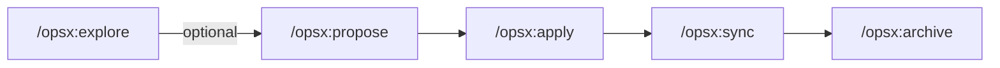

# OpenSpec

Spec-driven development for AI coding assistants. You draft the plan (proposal + delta specs + tasks) *before* code is written, review it, then the AI implements against it. Reduces "confidently wrong" AI output on non-trivial changes.

## Install

```bash
npm install -g @fission-ai/openspec@latest   # requires Node 20.19+
cd your-project
openspec init --tools claude,cursor,opencode --profile core
```

Restart your IDE for slash commands to activate.

## Slash commands (in AI chat)

| Command | What it does |
|---|---|
| `/opsx:explore "<idea>"` | Think through a fuzzy idea before committing to a change |
| `/opsx:propose "<idea>"` | Scaffold change + generate proposal, specs, design, tasks in one step |
| `/opsx:apply` | Implement tasks from the current change |
| `/opsx:update` | Revise a change's planning artifacts (keeps them coherent) |
| `/opsx:sync` | Merge delta specs into main `specs/` |
| `/opsx:archive` | Finalize a completed change — moves to `changes/archive/` |

## CLI (in terminal)

| Command | Purpose |
|---|---|
| `openspec doctor` | Health-check the setup |
| `openspec list` | List active changes |
| `openspec show <name>` | View a change or spec |
| `openspec status --change <name>` | Artifact completion progress |
| `openspec validate --all` | Lint changes + specs |
| `openspec view` | Interactive TUI dashboard |

## Workflow



## Repository layout

```text
openspec/
├── config.yaml      # project context + per-artifact rules
├── specs/           # source of truth (what your system does today)
│   └── <domain>/spec.md
└── changes/
    ├── <change>/    # active change
    │   ├── proposal.md
    │   ├── specs/   # delta specs (ADDED / MODIFIED / REMOVED)
    │   ├── design.md
    │   └── tasks.md
    └── archive/     # completed changes
```

## Tune per repo — `openspec/config.yaml`

Two knobs, both injected into every artifact template the AI drafts:

- **`context: |`** — free-form paragraph as background. Encode the repo's DNA (tech stack, conventions, invariants, related ADRs).
- **`rules:`** — per-artifact string lists (`proposal` / `specs` / `design` / `tasks`) as hard constraints. AI treats these as "must not violate".

!!! tip "One YAML gotcha"
    Rule list items are plain scalars — do not put `": "` (colon-space) inside them. YAML parses that as a mapping and OpenSpec silently drops the rule with a `must be an array of strings` warning. Use an em-dash or wrap the item in quotes.

## My repos

| Repo | The one invariant that matters most |
|---|---|
| [fleet-infra](https://github.com/JiwooL0920/fleet-infra) | Every change flows Git → PR → Flux reconcile. Never `kubectl apply` directly. |
| [terraform-infra](https://github.com/JiwooL0920/terraform-infra) | Two-phase first apply. Cluster names (`dev-services-amer`, `dev-applications`) are load-bearing across fleet-infra + argocd-applications. |
| [argocd-applications](https://github.com/JiwooL0920/argocd-applications) | No inline `Secret` manifests ever — always ExternalSecrets (or SealedSecrets). |
| [grafana-dashboards](https://github.com/JiwooL0920/grafana-dashboards) | The `llm-metrics` dashboard is fleet-infra's healthCheck target — do not rename or move it. |
| [jiwool0920.github.io](https://github.com/JiwooL0920/jiwool0920.github.io) | Blog nav is auto-synced from Obsidian — never hand-edit the sync-nav block in `mkdocs.yml`. |

## Anti-patterns

!!! danger "Avoid these"
    - Editing `openspec/changes/archive/**` after archive — history is append-only
    - Skipping `/opsx:apply` and doing the work manually — the tasks.md checkboxes are your progress bar
    - Bumping the OpenSpec CLI globally without running `openspec update` inside each project (agent instructions can drift)
    - Adding rules to `openspec/config.yaml` without testing — validate with `openspec doctor` first

## Links

- [OpenSpec on GitHub](https://github.com/Fission-AI/OpenSpec) — upstream project (60K+ stars)
- [OPSX docs](https://github.com/Fission-AI/OpenSpec/blob/main/docs/opsx.md) — full command reference
- [Getting started](https://github.com/Fission-AI/OpenSpec/blob/main/docs/getting-started.md) — the official quickstart
