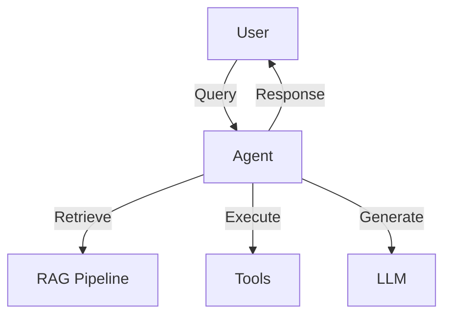
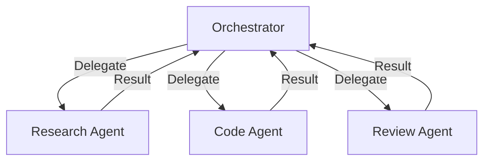
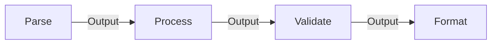
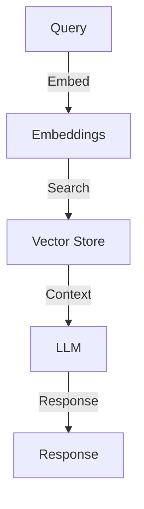

# Agent Architectures

Design patterns for AI agents and multi-agent systems.

## Single Agent Architecture



## Multi-Agent Patterns

### Pattern: Orchestrator

Central coordinator managing specialized agents.



### Pattern: Pipeline

Sequential processing through specialized agents.



### Pattern: Debate

Multiple agents propose and critique solutions.

## RAG Architecture



### Chunking Strategies

| Strategy | Use Case | Chunk Size |
|----------|----------|------------|
| Fixed | Simple docs | 512 tokens |
| Semantic | Technical docs | Variable |
| Hierarchical | Long documents | Parent/child |

## Tool Design

!!! tip "Tool Best Practices"
    - Clear, specific descriptions
    - Minimal required parameters
    - Idempotent when possible
    - Graceful error handling

```python
@tool
def search_database(query: str, limit: int = 10) -> list[dict]:
    """Search the database for records matching query.
    
    Args:
        query: Natural language search query
        limit: Maximum results to return (default: 10)
    
    Returns:
        List of matching records with id, title, and score
    """
    ...
```

## Anti-Patterns

!!! danger "Avoid These"
    - Agents with unclear responsibilities
    - Missing guardrails/validation
    - No fallback for tool failures
    - Unbounded agent loops
