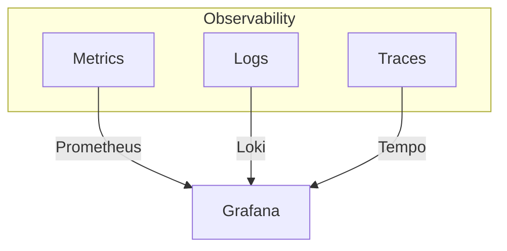

# Observability

Metrics, logging, and tracing for distributed systems.

## Three Pillars



## Metrics Strategy

### USE Method (Resources)

| Metric | Description | Example |
|--------|-------------|---------|
| **U**tilization | % time busy | CPU usage |
| **S**aturation | Queue depth | Request backlog |
| **E**rrors | Error count | 5xx responses |

### RED Method (Services)

| Metric | Description | Example |
|--------|-------------|---------|
| **R**ate | Requests/sec | HTTP RPS |
| **E**rrors | Failed requests | Error rate |
| **D**uration | Latency | p99 response time |

## Pattern: SLI/SLO Definition

```yaml
# Example SLO
slo:
  name: api-availability
  target: 99.9%
  window: 30d
  sli:
    type: availability
    good: status_code < 500
    total: all_requests
```

## Alerting Strategy

!!! warning "Alert on Symptoms, Not Causes"
    Alert when users are impacted, not when a component is unhealthy.

### Alert Severity

| Severity | Response | Example |
|----------|----------|---------|
| Critical | Page immediately | Service down |
| Warning | Review next day | Degraded performance |
| Info | Weekly review | Capacity trending |

## Anti-Patterns

!!! danger "Avoid These"
    - Alerting on every error
    - No runbooks for alerts
    - Metrics without context
    - Log everything (expensive!)
