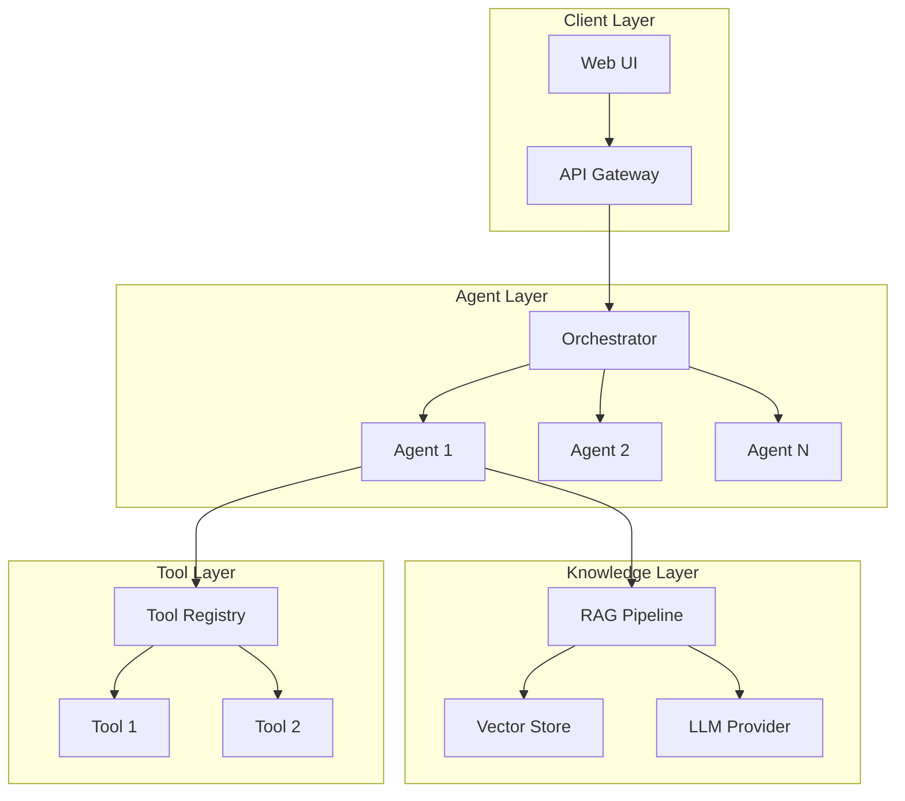

# Architecture

## System Overview

## Key Components

### Orchestrator

Manages agent lifecycle and workflow coordination.

### RAG Pipeline

Retrieval-augmented generation for context-aware responses.

### Tool Registry

Extensible tool system for agent capabilities.

## Design Decisions

!!! note "Multi-Agent vs Single Agent"
    Multi-agent architecture chosen for separation of concerns and specialized capabilities.
