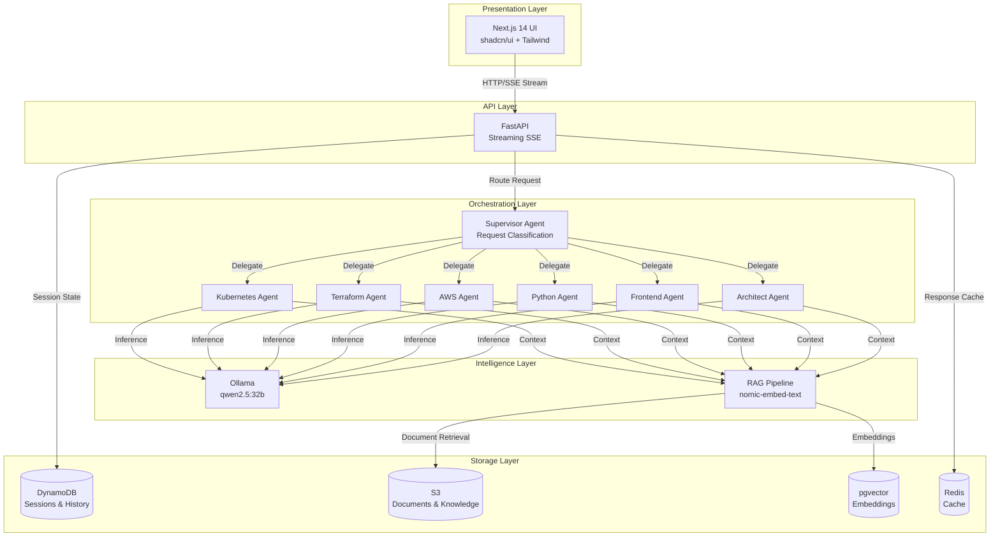
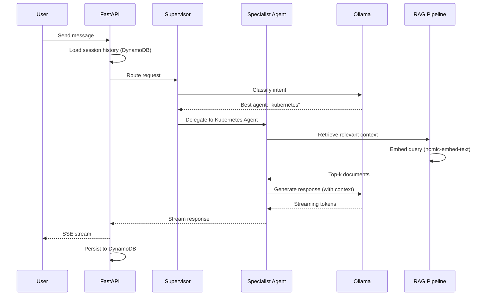
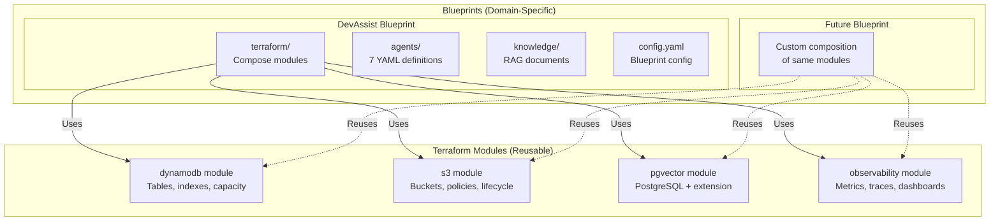
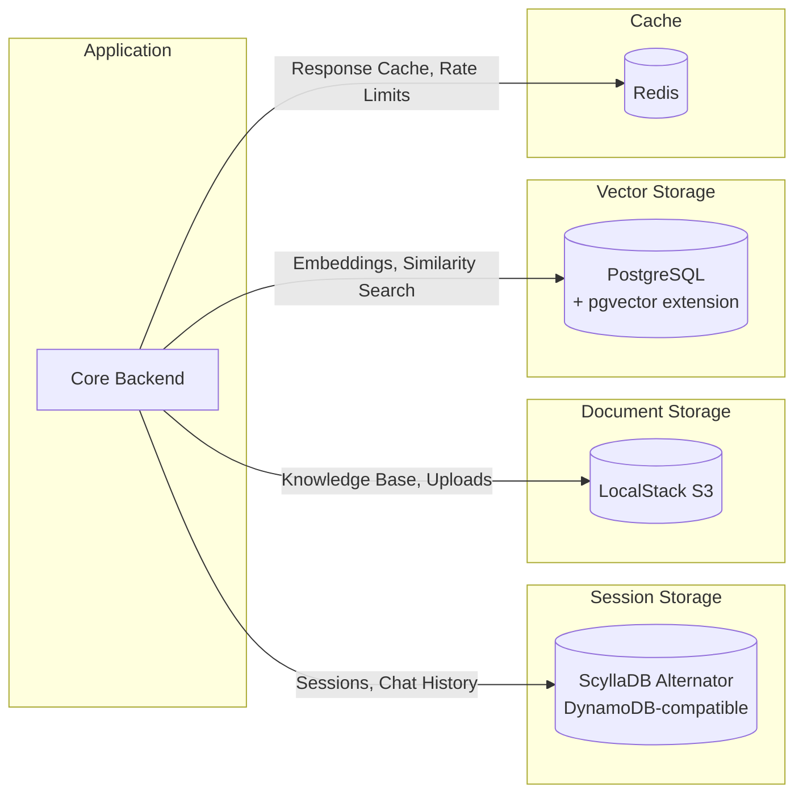
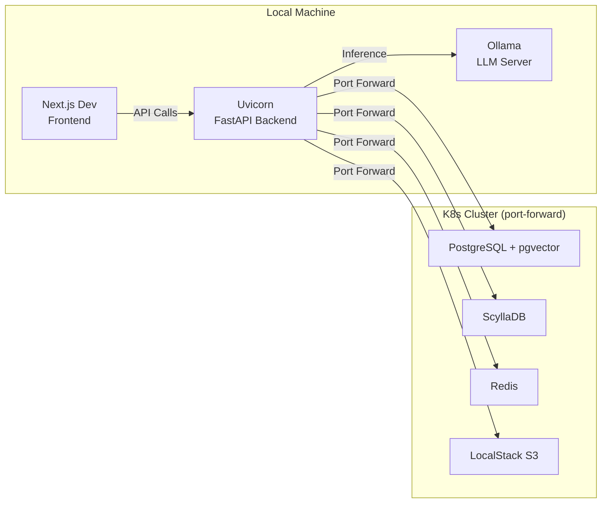
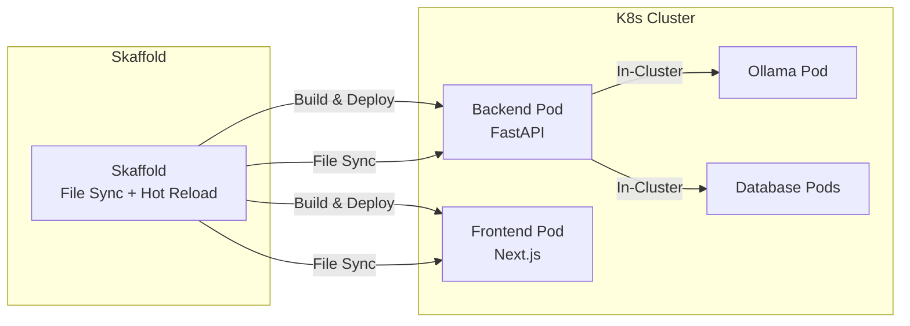
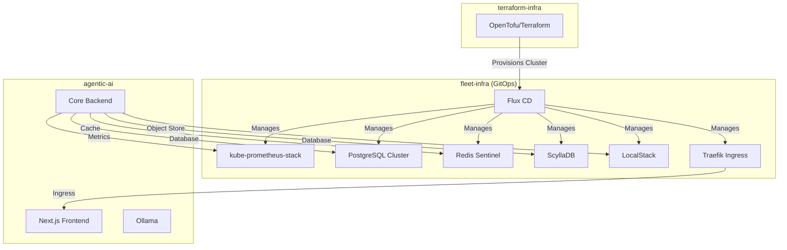

# Architecture

## High-Level Overview

The Agentic AI platform follows a layered architecture with a supervisor orchestration pattern. User requests flow through a Next.js frontend to a FastAPI backend, where a supervisor agent intelligently routes to specialist agents powered by local Ollama inference.



## Supervisor Orchestration

The platform uses agent-squad's **supervisor pattern** rather than a sequential chain. The supervisor agent analyzes each incoming request and routes it to the most appropriate specialist.



### Routing Strategy

| Routing Mode | Description |
|--------------|-------------|
| **Supervisor** | LLM-based classification — supervisor analyzes request and selects best agent |
| **Direct** | Explicit agent selection — user or API specifies which agent to use |

The supervisor agent uses the descriptions and capabilities defined in each agent's YAML configuration to make routing decisions.

## Module-Blueprint Pattern

The infrastructure follows a two-tier composition pattern that separates reusable modules from domain-specific deployments.



### Blueprint Configuration

Each blueprint is defined by a `config.yaml` that specifies:

| Field | Description |
|-------|-------------|
| `name` | Blueprint identifier (e.g., `devassist`) |
| `description` | Human-readable purpose |
| `supervisor_mode` | Orchestration strategy (`supervisor`) |
| `agents` | List of agent YAML files to load |
| `knowledge_base` | RAG document paths |
| `storage` | Backend configuration (DynamoDB tables, S3 buckets) |

### Agent YAML Definition

Agents are defined declaratively with personality, capabilities, and tool access:

```yaml
# blueprints/devassist/agents/kubernetes.yaml
name: kubernetes
description: "Kubernetes specialist for manifests, debugging, and cluster operations"
model: qwen2.5:32b
system_prompt: |
  You are a Kubernetes expert...
tools:
  - kubectl_explain
  - manifest_generator
capabilities:
  - kubernetes_manifests
  - cluster_debugging
  - helm_charts
```

## Storage Architecture



| Store | Technology | Purpose | Data |
|-------|-----------|---------|------|
| **Sessions** | ScyllaDB Alternator (DynamoDB API) | Conversation persistence | Chat history, session metadata |
| **Documents** | LocalStack S3 | Knowledge base storage | RAG source documents, uploads |
| **Embeddings** | PostgreSQL + pgvector | Vector similarity search | Document embeddings, search index |
| **Cache** | Redis | Performance optimization | Response cache, rate limiting |

## Development Modes

The platform supports two development workflows:

### Local Development



| Aspect | Detail |
|--------|--------|
| **Backend** | `uvicorn` with auto-reload |
| **Frontend** | `next dev` with fast refresh |
| **LLM** | Ollama running natively |
| **Databases** | Port-forwarded from fleet-infra cluster |
| **Command** | `make dev-local` |

### Kubernetes Development (Skaffold)



| Aspect | Detail |
|--------|--------|
| **Orchestration** | Skaffold with two configs: `backend-only` and `full` |
| **Hot Reload** | File sync maps local changes into running pods |
| **Networking** | In-cluster service discovery (no port-forwarding needed) |
| **Command** | `make dev-k8s` or `skaffold dev -p backend-only` |

## Integration with Fleet Infrastructure

The agentic-ai platform runs on the Kubernetes cluster provisioned by [terraform-infra](../terraform-infra/index.md) and managed by [fleet-infra](../fleet-infra/index.md).



## Design Decisions

!!! success "agent-squad over LangChain/LangGraph"
    The agent-squad framework (AWS Labs) was chosen for its lightweight supervisor pattern and native multi-agent support. Unlike LangChain's chain-based approach, agent-squad provides:
    
    - **Built-in supervisor routing** without custom graph definitions
    - **YAML-driven agent configuration** for rapid iteration
    - **Minimal abstraction overhead** compared to LangGraph's state machines

!!! info "Ollama for Local-First Inference"
    All LLM inference runs locally via Ollama, eliminating cloud API costs and latency:
    
    - **Zero API costs** — no OpenAI/Anthropic billing
    - **Full data privacy** — no data leaves the local network
    - **Offline capable** — works without internet connectivity
    - **Model flexibility** — swap models by changing one config line

!!! tip "Supervisor Pattern vs Direct Routing"
    The supervisor agent dynamically classifies requests using the LLM itself, rather than keyword matching or static rules:
    
    - **Adaptive routing** — learns from agent descriptions in YAML
    - **Graceful degradation** — falls back to general-purpose agent
    - **No maintenance** — adding a new agent YAML automatically updates routing

!!! note "Dual Development Modes"
    Supporting both local (uvicorn) and Kubernetes (Skaffold) development accommodates different workflows:
    
    - **Local mode** — fastest iteration, minimal resource usage, ideal for backend changes
    - **K8s mode** — production-like environment, tests service mesh, ideal for integration testing
