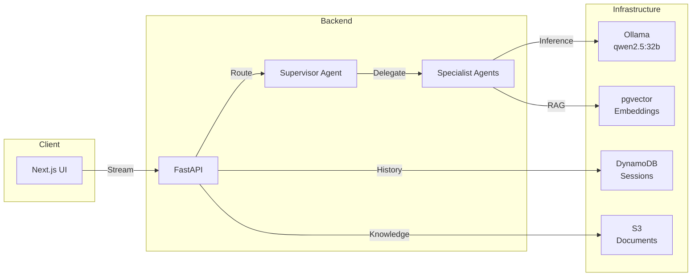

# Agentic AI

Multi-agent AI platform powered by **local LLMs** with supervisor orchestration, RAG pipeline, and a **Module-Blueprint pattern** for composable infrastructure.

## Overview

Agentic AI is a self-hosted, multi-agent platform designed for building domain-specific AI assistants that run entirely on local hardware. It uses the **agent-squad** framework (AWS Labs) with **Ollama** for LLM inference, enabling fully offline operation with no cloud LLM dependencies. The platform features a pnpm monorepo architecture with a Python/FastAPI backend and Next.js 14 frontend.

The **Module-Blueprint pattern** separates reusable Terraform modules from domain-specific compositions (blueprints), allowing rapid creation of new AI assistant configurations through YAML-driven agent definitions.

### Key Features

| Feature | Description |
|---------|-------------|
| **Local-First LLMs** | Ollama-powered inference with qwen2.5:32b — no cloud API keys required |
| **Supervisor Orchestration** | Intelligent routing via supervisor agent that delegates to specialist agents |
| **YAML-Driven Agents** | Define agent personalities, tools, and behaviors in declarative YAML files |
| **Module-Blueprint Pattern** | Reusable Terraform modules composed into domain-specific blueprints |
| **RAG Pipeline** | Document ingestion with pgvector embeddings for context-aware responses |
| **Streaming Chat UI** | Real-time streaming responses with blueprint selection via Next.js 14 |
| **Dual Dev Modes** | Local development (uvicorn) or Kubernetes (Skaffold with hot-reload) |

### Technology Stack

| Category | Technologies |
|----------|--------------|
| **Backend** | Python, FastAPI, Uvicorn |
| **Frontend** | Next.js 14, React, shadcn/ui, Tailwind CSS |
| **AI Framework** | agent-squad (AWS Labs), Ollama |
| **Models** | qwen2.5:32b (chat), nomic-embed-text (embeddings) |
| **Databases** | PostgreSQL + pgvector, ScyllaDB Alternator (DynamoDB-compatible), Redis |
| **Storage** | S3 (LocalStack) for documents, DynamoDB for sessions |
| **Infrastructure** | Terraform, Kubernetes, Skaffold, Kustomize |
| **Monorepo** | pnpm workspaces, Husky, Node 20+ |

## Quick Links

- [Architecture](architecture.md) - System design, orchestration flow, and storage architecture
- [Packages](packages.md) - Monorepo packages, modules, and blueprints documentation
- [Decisions](decisions.md) - Architecture Decision Records

## Repository Structure

```
agentic-ai/
├── Makefile                        # 347 commands: setup, dev, ollama, blueprint, test, clean
├── package.json                    # pnpm monorepo root (Node 20+)
├── pnpm-workspace.yaml             # Workspace: packages/*
├── skaffold.yaml                   # K8s dev workflow (backend-only + full configs)
│
├── packages/
│   ├── core/                       # Python/FastAPI backend
│   │   └── src/
│   │       ├── agents/             # OllamaAgent, agent factory
│   │       ├── api/                # FastAPI routes and middleware
│   │       ├── orchestrator/       # SupervisorOrchestrator
│   │       ├── rag/                # RAG pipeline, embeddings
│   │       ├── repositories/       # Storage adapters (DynamoDB, S3, pgvector)
│   │       ├── llm/                # LLM client abstractions
│   │       ├── cache/              # Redis caching layer
│   │       ├── config/             # Configuration management
│   │       ├── observability/      # Metrics and tracing
│   │       ├── schemas/            # Pydantic models
│   │       ├── services/           # Business logic services
│   │       └── tools/              # Agent tool definitions
│   │
│   └── ui/                         # Next.js 14 frontend
│       ├── app/[blueprint]/        # Dynamic blueprint routing
│       └── components/             # shadcn/ui components
│
├── blueprints/
│   └── devassist/                  # DevAssist blueprint
│       ├── config.yaml             # Blueprint configuration
│       ├── agents/                 # 7 YAML agent definitions
│       ├── knowledge/              # RAG knowledge base documents
│       └── terraform/              # Blueprint-specific infra
│
├── terraform/
│   ├── modules/                    # Reusable infrastructure modules
│   │   ├── dynamodb/               # Session and history storage
│   │   ├── s3/                     # Document and knowledge storage
│   │   ├── pgvector/               # Vector embedding database
│   │   └── observability/          # Metrics and tracing
│   └── shared/                     # Shared provider configuration
│
├── k8s/dev/                        # Kubernetes development manifests
└── infrastructure/                 # Reserved for future use
```

## Current Blueprint: DevAssist

The platform currently ships with the **DevAssist** blueprint — a development assistant with 7 specialized agents:

| Agent | Role | Description |
|-------|------|-------------|
| **Supervisor** | Router | Analyzes requests and delegates to the best specialist agent |
| **Kubernetes** | Specialist | Kubernetes manifests, debugging, and cluster operations |
| **Terraform** | Specialist | Infrastructure as Code, module design, and state management |
| **AWS** | Specialist | AWS services, IAM policies, and cloud architecture |
| **Python** | Specialist | Python development, FastAPI, testing, and best practices |
| **Frontend** | Specialist | React, Next.js, TypeScript, and UI/UX development |
| **Architect** | Specialist | System design, architecture decisions, and technical strategy |

## Orchestration Flow



## Quick Start

```bash
# 1. Install prerequisites
brew install ollama pnpm node

# 2. Pull required models
make ollama-setup    # Pulls qwen2.5:32b + nomic-embed-text

# 3. Install dependencies
pnpm install

# 4. Start local development
make dev-local       # Starts backend (uvicorn) + frontend (next dev)

# 5. Open the UI
open http://localhost:3000
```

!!! warning "Hardware Requirements"
    Running qwen2.5:32b locally requires **32GB+ RAM**. For machines with less memory, configure a smaller model in the blueprint's `config.yaml`.

## Source Code

[:octicons-mark-github-16: View on GitHub](https://github.com/JiwooL0920/agentic-ai){ .md-button }
