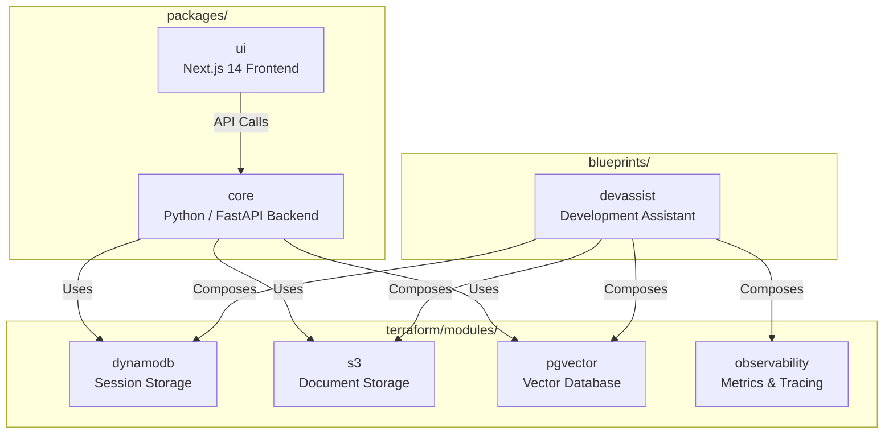
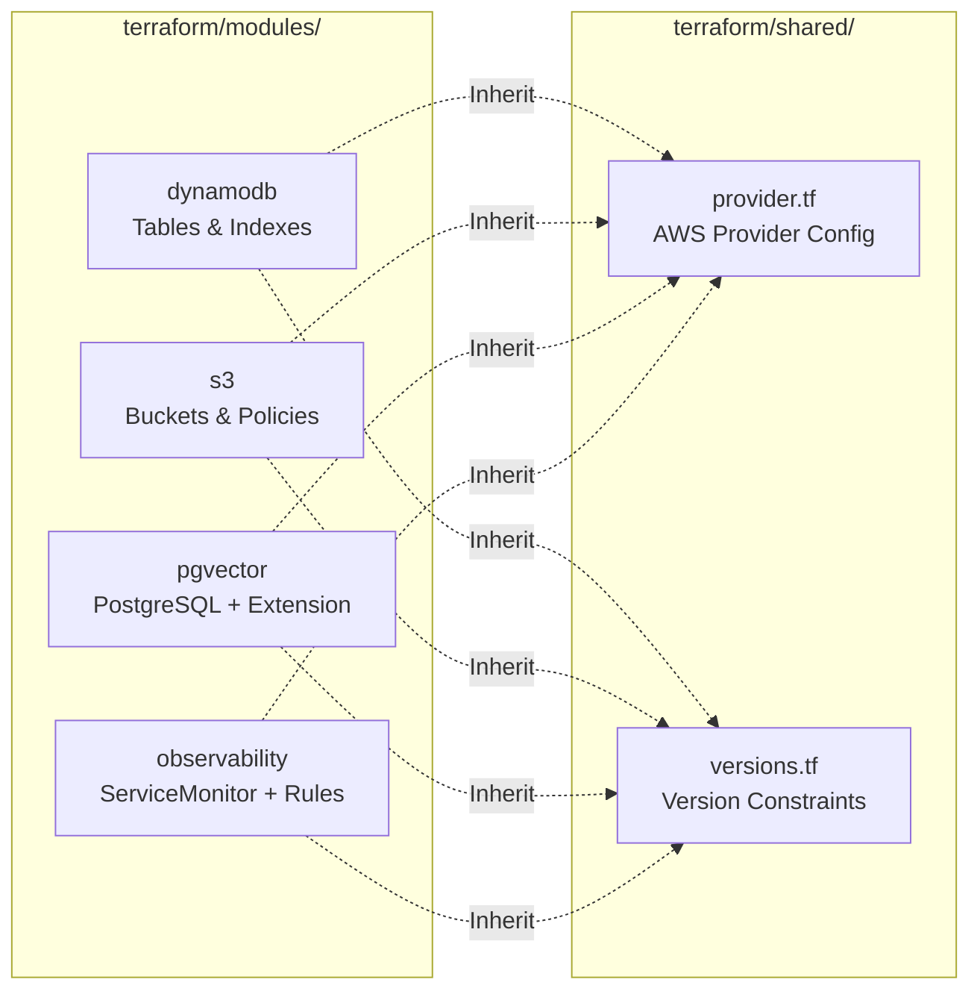

# Packages

This section documents all packages, Terraform modules, and blueprints in the agentic-ai monorepo.

## Package Inventory



| Package | Path | Language | Purpose |
|---------|------|----------|---------|
| [core](#core) | `packages/core/` | Python | FastAPI backend — agents, orchestration, RAG, storage |
| [ui](#ui) | `packages/ui/` | TypeScript | Next.js 14 frontend — streaming chat, blueprint selector |
| [Terraform Modules](#terraform-modules) | `terraform/modules/` | HCL | Reusable infrastructure: DynamoDB, S3, pgvector, observability |
| [Blueprints](#blueprints) | `blueprints/` | YAML | Domain-specific agent configurations |

---

## core

The Python backend powering the agent platform — FastAPI server with supervisor orchestration, RAG pipeline, and multi-backend storage adapters.

### Overview

| Property | Value |
|----------|-------|
| **Path** | `packages/core/` |
| **Language** | Python |
| **Framework** | FastAPI + Uvicorn |
| **AI Framework** | agent-squad (AWS Labs) |
| **LLM Runtime** | Ollama |

### Source Structure

```
packages/core/src/
├── agents/             # OllamaAgent wrapper, agent factory
├── api/                # FastAPI routes, middleware, SSE streaming
├── cache/              # Redis caching layer
├── config/             # Configuration management, environment loading
├── llm/                # LLM client abstractions (Ollama interface)
├── observability/      # Prometheus metrics, OpenTelemetry tracing
├── orchestrator/       # SupervisorOrchestrator — request routing
├── rag/                # RAG pipeline — ingestion, embedding, retrieval
├── repositories/       # Storage adapters (DynamoDB, S3, pgvector)
├── schemas/            # Pydantic models for request/response
├── services/           # Business logic services
└── tools/              # Agent tool definitions and registry
```

### Key Components

| Component | Module | Description |
|-----------|--------|-------------|
| **OllamaAgent** | `agents/` | Wraps agent-squad's Agent class with Ollama-specific configuration |
| **SupervisorOrchestrator** | `orchestrator/` | Routes requests to specialist agents via supervisor pattern |
| **Agent Factory** | `agents/` | Creates agent instances from YAML blueprint definitions |
| **RAG Pipeline** | `rag/` | Document ingestion, embedding (nomic-embed-text), pgvector storage, similarity retrieval |
| **Storage Adapters** | `repositories/` | Unified interface for DynamoDB (sessions), S3 (documents), pgvector (embeddings) |
| **Observability** | `observability/` | Prometheus metrics export, OpenTelemetry trace context propagation |

### API Endpoints

| Endpoint | Method | Description |
|----------|--------|-------------|
| `/chat` | POST | Send message to supervisor for routing and response streaming |
| `/blueprints` | GET | List available blueprint configurations |
| `/sessions` | GET | Retrieve session history from DynamoDB |
| `/health` | GET | Liveness and readiness probe |

---

## ui

The Next.js 14 frontend providing a streaming chat interface with dynamic blueprint selection.

### Overview

| Property | Value |
|----------|-------|
| **Path** | `packages/ui/` |
| **Language** | TypeScript |
| **Framework** | Next.js 14 (App Router) |
| **UI Library** | shadcn/ui |
| **Styling** | Tailwind CSS |

### Source Structure

```
packages/ui/
├── app/
│   └── [blueprint]/        # Dynamic route — each blueprint gets its own chat view
│       ├── page.tsx         # Chat page with streaming response display
│       └── layout.tsx       # Blueprint-specific layout
├── components/             # shadcn/ui components
│   ├── chat/               # Message display, input, streaming indicators
│   └── blueprint/          # Blueprint selector, configuration panels
├── lib/                    # Utilities, API client, types
└── public/                 # Static assets
```

### Key Features

| Feature | Description |
|---------|-------------|
| **Blueprint Selector** | Dynamic routing — navigate to `/devassist` to load the DevAssist blueprint |
| **Streaming Chat** | Server-Sent Events (SSE) for real-time token streaming from backend |
| **Session Persistence** | Chat history loaded from DynamoDB via API |
| **Agent Indicators** | Visual display of which specialist agent is handling the current request |
| **Responsive Layout** | Mobile-friendly chat interface with shadcn/ui components |

---

## Terraform Modules

Reusable infrastructure modules under `terraform/modules/` that blueprints compose for their specific needs.

### Module Overview



| Module | Path | Purpose | Resources Created |
|--------|------|---------|-------------------|
| [dynamodb](#dynamodb) | `terraform/modules/dynamodb/` | Session and chat history storage | DynamoDB tables, GSIs |
| [s3](#s3) | `terraform/modules/s3/` | Document and knowledge base storage | S3 buckets, lifecycle policies |
| [pgvector](#pgvector) | `terraform/modules/pgvector/` | Vector embedding database | PostgreSQL with pgvector extension |
| [observability](#observability) | `terraform/modules/observability/` | Metrics and tracing infrastructure | ServiceMonitors, PrometheusRules |

### dynamodb

Provisions DynamoDB tables for conversation persistence. Uses ScyllaDB Alternator in the local development environment for DynamoDB API compatibility.

| Property | Value |
|----------|-------|
| **Tables** | Sessions, chat history, agent metadata |
| **Local Backend** | ScyllaDB Alternator (DynamoDB-compatible API) |
| **Indexes** | GSIs for session lookup by user, timestamp queries |

### s3

Provisions S3 buckets for document storage and knowledge base management. Uses LocalStack for local development.

| Property | Value |
|----------|-------|
| **Buckets** | Knowledge base documents, user uploads |
| **Local Backend** | LocalStack S3 |
| **Features** | Lifecycle policies, versioning |

### pgvector

Provisions PostgreSQL with the pgvector extension for vector similarity search, powering the RAG pipeline's embedding storage and retrieval.

| Property | Value |
|----------|-------|
| **Database** | PostgreSQL with pgvector extension |
| **Use Case** | Document embedding storage, similarity search |
| **Embedding Model** | nomic-embed-text (via Ollama) |

### observability

Provisions monitoring infrastructure for the agentic-ai platform, integrating with fleet-infra's kube-prometheus-stack.

| Property | Value |
|----------|-------|
| **Metrics** | ServiceMonitor CRDs for Prometheus scraping |
| **Alerts** | PrometheusRule CRDs for alerting conditions |
| **Dashboards** | Managed separately in [grafana-dashboards](../grafana-dashboards/index.md) |

---

## Blueprints

Blueprints are domain-specific compositions that combine Terraform modules with agent YAML definitions and knowledge base documents.

### Blueprint Structure

```
blueprints/<name>/
├── config.yaml             # Blueprint configuration (agents, storage, model)
├── agents/                 # YAML agent definitions
│   ├── supervisor.yaml     # Supervisor routing agent
│   └── <specialist>.yaml   # Specialist agent definitions
├── knowledge/              # RAG knowledge base documents
│   └── *.md, *.pdf, *.txt  # Source documents for embedding
└── terraform/              # Blueprint-specific infra composition
    └── main.tf             # Composes terraform/modules/*
```

### DevAssist Blueprint

The currently shipped blueprint — a development assistant with 7 specialized agents.

| Property | Value |
|----------|-------|
| **Path** | `blueprints/devassist/` |
| **Agents** | 7 (supervisor + 6 specialists) |
| **Model** | qwen2.5:32b |
| **Embedding Model** | nomic-embed-text |
| **Orchestration** | Supervisor mode |

#### Agent Definitions

| Agent | File | Capabilities |
|-------|------|-------------|
| **Supervisor** | `supervisor.yaml` | Request classification, agent routing, fallback handling |
| **Kubernetes** | `kubernetes.yaml` | Manifests, debugging, Helm charts, cluster operations |
| **Terraform** | `terraform.yaml` | IaC modules, state management, provider configuration |
| **AWS** | `aws.yaml` | AWS services, IAM policies, cloud architecture patterns |
| **Python** | `python.yaml` | Python development, FastAPI, testing, packaging |
| **Frontend** | `frontend.yaml` | React, Next.js, TypeScript, UI/UX, Tailwind CSS |
| **Architect** | `architect.yaml` | System design, architecture decisions, trade-off analysis |

### Creating a New Blueprint

1. Create a new directory under `blueprints/`:

    ```bash
    mkdir -p blueprints/my-blueprint/{agents,knowledge,terraform}
    ```

2. Define `config.yaml` with agent list and storage configuration:

    ```yaml
    name: my-blueprint
    description: "My custom AI assistant"
    supervisor_mode: supervisor
    model: qwen2.5:32b
    embedding_model: nomic-embed-text
    agents:
      - supervisor
      - my-specialist
    knowledge_base:
      path: knowledge/
    storage:
      sessions: dynamodb
      documents: s3
      embeddings: pgvector
    ```

3. Create agent YAML files in `agents/`
4. Add knowledge base documents to `knowledge/`
5. Compose Terraform modules in `terraform/main.tf`
6. Load the blueprint: `make blueprint-load NAME=my-blueprint`

!!! tip "Blueprint Isolation"
    Each blueprint runs in its own namespace with isolated storage. Switching blueprints via the UI re-initializes the agent pool and knowledge base context.
