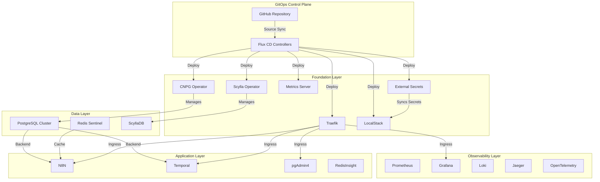
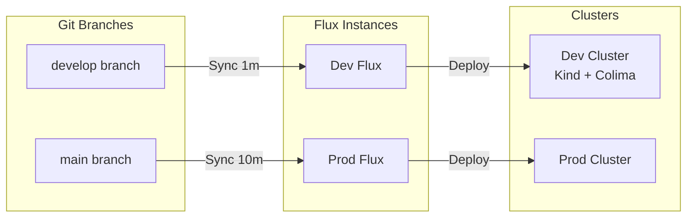
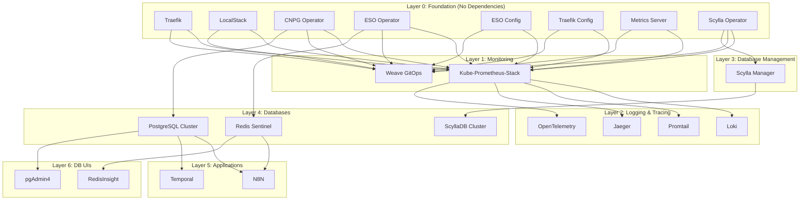
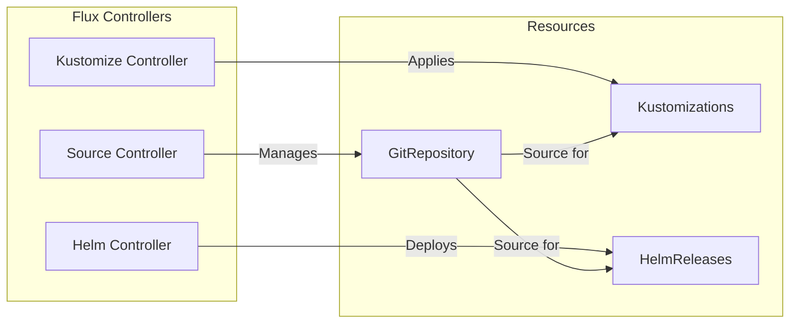

# Architecture

## High-Level Overview

The fleet-infra platform uses a layered architecture with fine-grained service dependencies for optimal parallel deployment.



## Multi-Environment Strategy



| Environment | Branch | Sync Interval | Path |
|-------------|--------|---------------|------|
| Development | `develop` | 1 minute | `clusters/stages/dev/clusters/services-amer` |
| Production | `main` | 10 minutes | `clusters/stages/prod/clusters/services-amer` |

## Service Dependency Graph

Fine-grained dependencies enable maximum parallelism. Services in the same layer deploy concurrently.



## Directory Structure

```
fleet-infra/
├── apps/base/                    # Service Kubernetes manifests
│   ├── traefik/                  # HelmRelease, namespace, config
│   ├── cloudnative-pg/           # PostgreSQL cluster CRDs
│   ├── kube-prometheus-stack/    # Monitoring stack
│   ├── n8n/                      # Workflow automation
│   └── ...                       # 30 service directories
│
├── base/services/                # Fine-grained kustomizations
│   ├── kustomization.yaml        # Master resource list
│   ├── traefik.yaml              # Kustomization with dependsOn
│   ├── postgresql-cluster.yaml   # Database with operator dependency
│   └── ...                       # 32 service definitions
│
├── clusters/stages/
│   ├── dev/clusters/services-amer/
│   │   ├── flux-system/          # Flux controllers
│   │   ├── cluster-vars-patch.yaml  # Dev overrides
│   │   └── kustomization.yaml    # References base/services
│   └── prod/                     # Production (similar structure)
│
└── scripts/
    ├── setup-local-dns.sh        # Configure .local domains
    ├── port-forward.sh           # Traditional port forwarding
    └── validate-kustomize.sh     # CI validation
```

## Flux CD Architecture



| Controller | Responsibility |
|------------|----------------|
| Source Controller | Git repository synchronization |
| Kustomize Controller | Apply Kubernetes manifests with Kustomize |
| Helm Controller | Manage Helm chart releases |

## Design Decisions

!!! success "Fine-Grained Dependencies vs Wave-Based"
    Traditional GitOps uses wave-based deployment (Wave 1 → Wave 2 → Wave 3), causing unnecessary waiting. Fine-grained `dependsOn` relationships enable:
    
    - **8-12 minute deployments** (vs 30-45 minutes)
    - **10+ services deploying in parallel**
    - **Precise failure isolation**

!!! info "Why Flux CD over ArgoCD?"
    - Native Kustomize support without CRD conversion
    - Lighter resource footprint (~200MB vs ~1GB)
    - Better multi-tenancy via Kustomization CRDs
    - Git-native reconciliation model

!!! tip "Local DNS vs Port Forwarding"
    Using Traefik with `.local` domains provides:
    
    - Memorable URLs (`grafana.local` vs `localhost:3030`)
    - No need to remember port numbers
    - Closer to production experience
    - Single Traefik entry point

## Environment Differences

| Resource | Development | Production |
|----------|-------------|------------|
| PostgreSQL Instances | 1 | 3 (HA) |
| PostgreSQL Storage | 10Gi | 20Gi |
| Redis Replicas | 1 | 2+ |
| Prometheus Retention | 7 days | 30 days |
| Prometheus Storage | 20Gi | 50Gi |
| Traefik Replicas | 1 | 3 |
| Backup Retention | 7 days | 30 days |
