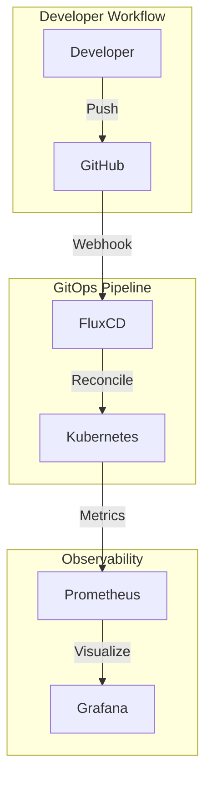

# Architecture

## High-Level Overview

## Components

| Component | Purpose | Version |
|-----------|---------|---------|
| FluxCD | GitOps controller | v2.x |
| Kustomize | Manifest composition | v5.x |
| SOPS | Secrets encryption | v3.x |

## Design Decisions

!!! info "Why FluxCD over ArgoCD?"
    FluxCD was chosen for its native Kustomize support and lighter resource footprint.
