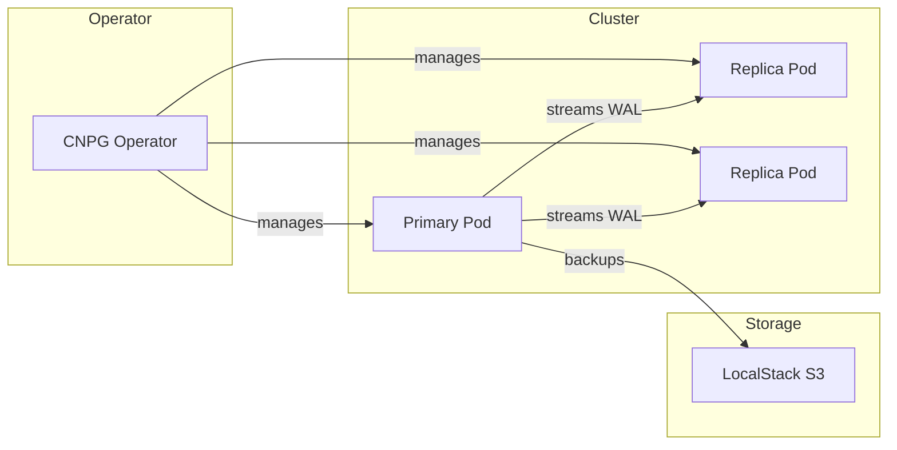

# CNPG Operator

CloudNative PostgreSQL operator for Kubernetes.

## Overview

| Property | Value |
|----------|-------|
| **Namespace** | `cnpg-system` |
| **Type** | HelmRelease |
| **Layer** | Foundation (Layer 0) |
| **Dependencies** | None |

## Purpose

The CloudNative PostgreSQL (CNPG) operator manages PostgreSQL clusters as native Kubernetes resources, providing enterprise-grade database operations.

## Features

- **Declarative Management** - PostgreSQL clusters defined as CRDs
- **Automated Failover** - Automatic promotion of replicas
- **Point-in-Time Recovery** - Restore to any point in time
- **Backup Scheduling** - Automated backups to S3 (LocalStack)
- **Rolling Updates** - Zero-downtime upgrades
- **Connection Pooling** - Built-in PgBouncer support

## Architecture



## Configuration

The operator is installed via Helm with default settings. It watches for `Cluster` CRDs and manages the PostgreSQL lifecycle.

## Managed Resources

The operator creates and manages:

- PostgreSQL pods with proper init containers
- Services for read/write and read-only access
- Secrets for credentials
- ConfigMaps for PostgreSQL configuration
- PersistentVolumeClaims for data storage

## Verification

```bash
# Check operator status
kubectl get pods -n cnpg-system

# Check operator logs
kubectl logs -n cnpg-system deploy/cnpg-controller-manager
```

## Troubleshooting

### Operator not starting

```bash
# Check pod status
kubectl describe pod -n cnpg-system -l app.kubernetes.io/name=cloudnative-pg

# Check events
kubectl get events -n cnpg-system --sort-by='.lastTimestamp'
```

### CRDs not recognized

```bash
# Verify CRDs installed
kubectl get crd | grep cnpg
```

## Related

- [PostgreSQL Cluster](postgresql.md) - Managed database cluster
- [Architecture](../architecture.md) - System design
