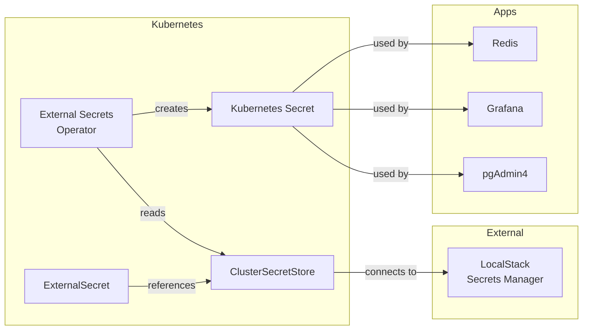

# External Secrets

Kubernetes operator for syncing secrets from external providers.

## Overview

| Property | Value |
|----------|-------|
| **Namespace** | `external-secrets` |
| **Type** | HelmRelease + ClusterSecretStore |
| **Layer** | Foundation (Layer 0) |
| **Dependencies** | LocalStack (for ClusterSecretStore) |

## Purpose

External Secrets Operator (ESO) synchronizes secrets from external secret management systems (LocalStack Secrets Manager) into Kubernetes Secrets.

## Components

### External Secrets Operator

The main operator that:

- Watches for ExternalSecret resources
- Connects to external secret providers
- Creates and updates Kubernetes Secrets
- Handles secret rotation

### External Secrets Config

ClusterSecretStore configuration that:

- Connects ESO to LocalStack Secrets Manager
- Provides cluster-wide secret access
- Depends on both ESO and LocalStack being ready

## Architecture



## Synced Secrets

| Secret | Namespace | Source |
|--------|-----------|--------|
| Redis password | `redis-sentinel` | `redis/credentials/password` |
| pgAdmin credentials | `pgadmin` | `pgadmin/credentials` |
| Grafana admin | `monitoring` | `grafana/credentials` |
| Traefik dashboard | `traefik` | `traefik/credentials` |

## Verification

```bash
# Check operator status
kubectl get pods -n external-secrets

# Check ClusterSecretStore
kubectl get clustersecretstore
kubectl describe clustersecretstore localstack

# Check ExternalSecrets
kubectl get externalsecrets --all-namespaces

# Check sync status
kubectl get externalsecret <name> -n <namespace> -o yaml
```

## Force Sync

```bash
# Force resync of an ExternalSecret
kubectl annotate externalsecret <name> -n <namespace> \
  force-sync=$(date +%s)
```

## Troubleshooting

### ExternalSecret not syncing

```bash
# Check ExternalSecret status
kubectl describe externalsecret <name> -n <namespace>

# Check operator logs
kubectl logs -n external-secrets deploy/external-secrets

# Verify ClusterSecretStore connectivity
kubectl describe clustersecretstore localstack
```

### Secret not created

1. Verify ExternalSecret exists
2. Check ClusterSecretStore is ready
3. Verify LocalStack has the secret
4. Check operator logs for errors

## Related

- [LocalStack](localstack.md) - Secret source
- [Runbooks](../runbooks.md#external-secrets-not-syncing) - Troubleshooting
