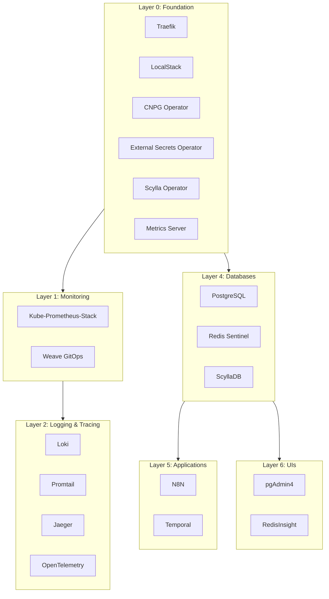

# Components

This section documents all 23 services deployed in the fleet-infra platform, organized by their dependency layer.

## Service Layers

---

## Foundation Services (Layer 0)

Services with no dependencies that deploy immediately in parallel.

| Service | Purpose | Access |
|---------|---------|--------|
| [Traefik](traefik.md) | Ingress controller and load balancer | `http://traefik.local` |
| [LocalStack](localstack.md) | AWS services emulation | `http://localstack.local` |
| [CNPG Operator](cnpg-operator.md) | CloudNative PostgreSQL operator | - |
| [External Secrets](external-secrets.md) | Sync secrets from external providers | - |
| [Scylla Operator](scylla-operator.md) | ScyllaDB Kubernetes operator | - |
| [Metrics Server](metrics-server.md) | Cluster resource metrics for HPA | - |

---

## Monitoring & Observability (Layer 1)

| Service | Purpose | Access |
|---------|---------|--------|
| [Kube-Prometheus-Stack](kube-prometheus-stack.md) | Complete monitoring solution | `http://grafana.local`, `http://prometheus.local` |
| [Weave GitOps](weave-gitops.md) | GitOps dashboard | `http://weave.local` |

---

## Logging & Tracing (Layer 2)

| Service | Purpose | Access |
|---------|---------|--------|
| [Loki](loki.md) | Log aggregation system | - |
| [Promtail](promtail.md) | Log shipping agent | - |
| [Jaeger](jaeger.md) | Distributed tracing backend | `http://jaeger.local` |
| [OpenTelemetry](opentelemetry.md) | Unified telemetry collection | - |

---

## Database Services (Layer 4)

| Service | Purpose | Access |
|---------|---------|--------|
| [PostgreSQL Cluster](postgresql.md) | HA PostgreSQL 16 cluster | Port 5432 |
| [Redis Sentinel](redis.md) | In-memory data store with HA | Port 6379, `http://redis.local` |
| [ScyllaDB Cluster](scylladb.md) | NoSQL with DynamoDB API | `http://scylla.local` |

---

## Application Services (Layer 5)

| Service | Purpose | Access |
|---------|---------|--------|
| [N8N](n8n.md) | Workflow automation platform | `http://n8n.local` |
| [Temporal](temporal.md) | Workflow orchestration platform | `http://temporal.local` |

---

## Database Management UIs (Layer 6)

| Service | Purpose | Access |
|---------|---------|--------|
| [pgAdmin4](pgadmin.md) | PostgreSQL administration | `http://pgadmin.local` |
| [RedisInsight](redisinsight.md) | Redis management interface | `http://redis.local` |

---

## Disabled Services

Available but not deployed by default. Enable by uncommenting in `base/services/kustomization.yaml`.

| Service | Purpose |
|---------|---------|
| Crossplane | Infrastructure as Code platform |
| Crossplane Providers | AWS/GCP/Azure providers |
| Scylla Manager | Backup and repair automation for ScyllaDB |

---

## Quick Access

### Local DNS (Recommended)

| Service | URL |
|---------|-----|
| Traefik Dashboard | `http://traefik.local` |
| Grafana | `http://grafana.local` |
| Prometheus | `http://prometheus.local` |
| AlertManager | `http://alertmanager.local` |
| N8N | `http://n8n.local` |
| Temporal UI | `http://temporal.local` |
| pgAdmin4 | `http://pgadmin.local` |
| RedisInsight | `http://redis.local` |
| Weave GitOps | `http://weave.local` |
| LocalStack | `http://localstack.local` |
| ScyllaDB | `http://scylla.local` |
| Jaeger | `http://jaeger.local` |

### Port Forwarding (Alternative)

| Service | Port |
|---------|------|
| Grafana | 3030 |
| Prometheus | 9090 |
| AlertManager | 9093 |
| N8N | 5678 |
| Temporal UI | 8090 |
| pgAdmin4 | 8080 |
| RedisInsight | 8001 |
| PostgreSQL | 5432 |
| Redis | 6379 |
| LocalStack | 4566 |
| Weave GitOps | 9001 |
