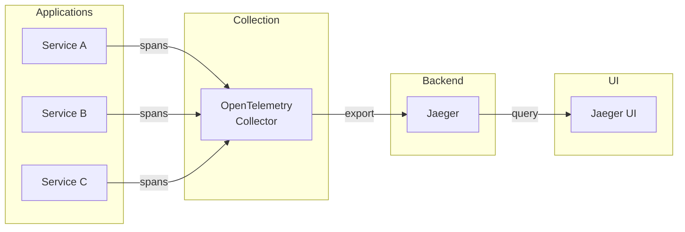

# Jaeger

Distributed tracing backend for microservices.

## Overview

| Property | Value |
|----------|-------|
| **Namespace** | `jaeger` |
| **Type** | HelmRelease |
| **Layer** | Logging & Tracing (Layer 2) |
| **Dependencies** | Foundation services |
| **Access** | `http://jaeger.local` |

## Purpose

Jaeger is used for monitoring and troubleshooting microservices-based distributed systems, providing end-to-end distributed tracing.

## Features

- **Distributed Tracing** - Track requests across services
- **Root Cause Analysis** - Identify performance bottlenecks
- **Service Dependencies** - Visualize service topology
- **Performance Optimization** - Identify slow operations

## Architecture



## Trace Components

| Component | Description |
|-----------|-------------|
| **Trace** | End-to-end request journey |
| **Span** | Single operation within a trace |
| **Tags** | Key-value metadata |
| **Logs** | Structured events within spans |

## Access

=== "Local DNS (Recommended)"

    ```
    http://jaeger.local
    ```

=== "Port Forwarding"

    ```bash
    kubectl port-forward -n jaeger svc/jaeger-query 16686:16686
    ```
    
    Then visit `http://localhost:16686`

## Using the UI

### Search Traces

1. Select service from dropdown
2. Set time range
3. Optionally filter by:
   - Operation name
   - Tags
   - Duration (min/max)
4. Click "Find Traces"

### Analyze Trace

- **Timeline view** - Span hierarchy and timing
- **Critical path** - Longest path through trace
- **Span details** - Tags, logs, process info

## Verification

```bash
# Check Jaeger pods
kubectl get pods -n jaeger

# Check services
kubectl get svc -n jaeger
```

## Troubleshooting

### No traces appearing

1. Verify applications are instrumented
2. Check OpenTelemetry Collector is running
3. Verify collector is exporting to Jaeger

```bash
# Check OTEL collector
kubectl logs -n opentelemetry deploy/opentelemetry-collector
```

### UI not loading

```bash
# Check Jaeger query service
kubectl get pods -n jaeger -l app.kubernetes.io/component=query
kubectl logs -n jaeger -l app.kubernetes.io/component=query
```

## Related

- [OpenTelemetry](opentelemetry.md) - Trace collection
- [Kube-Prometheus-Stack](kube-prometheus-stack.md) - Metrics correlation
