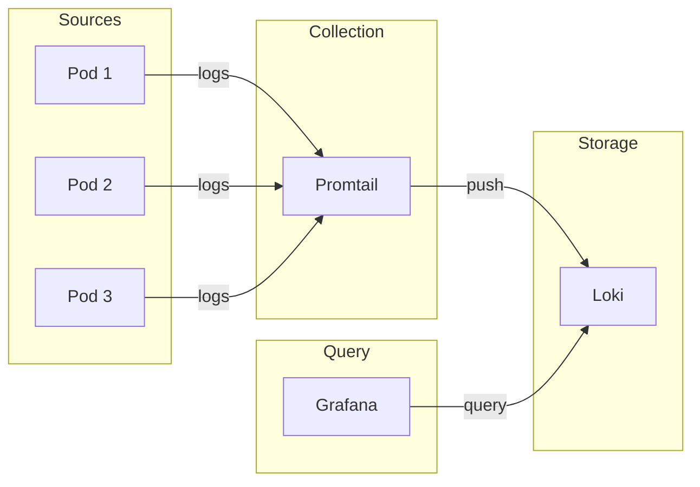

# Loki

Log aggregation system for Kubernetes.

## Overview

| Property | Value |
|----------|-------|
| **Namespace** | `loki` |
| **Type** | HelmRelease |
| **Layer** | Logging (Layer 2) |
| **Dependencies** | Kube-Prometheus-Stack |

## Purpose

Grafana Loki is a horizontally-scalable, highly-available log aggregation system inspired by Prometheus. It indexes metadata about logs rather than the log content, making it cost-effective and efficient.

## Features

- **LogQL** - Prometheus-like query language for logs
- **Label-based** - Index by labels, not full-text
- **Grafana Integration** - Native Grafana datasource
- **Multi-tenant** - Supports multiple tenants
- **Cost-effective** - Only indexes metadata

## Architecture



## Querying Logs

### Via Grafana

1. Open Grafana at `http://grafana.local`
2. Go to Explore
3. Select Loki datasource
4. Use LogQL to query

### LogQL Examples

```logql
# All logs from a namespace
{namespace="n8n"}

# Logs containing error
{namespace="monitoring"} |= "error"

# Logs with regex
{app="traefik"} |~ "status=[45].."

# Rate of errors
rate({namespace="default"} |= "error" [5m])
```

## Storage

Loki stores logs in:

- **Chunks** - Compressed log data
- **Index** - Label metadata

In development, uses local filesystem. In production, can use S3, GCS, or other object storage.

## Verification

```bash
# Check Loki pods
kubectl get pods -n loki

# Check Loki is receiving logs
kubectl logs -n loki deploy/loki
```

## Troubleshooting

### Logs not appearing

```bash
# Check Promtail is running
kubectl get pods -n loki -l app=promtail

# Check Promtail logs
kubectl logs -n loki -l app=promtail
```

### Query timeout

- Reduce time range
- Add more specific label filters
- Check Loki resource limits

## Related

- [Promtail](promtail.md) - Log collection agent
- [Kube-Prometheus-Stack](kube-prometheus-stack.md) - Grafana for visualization
