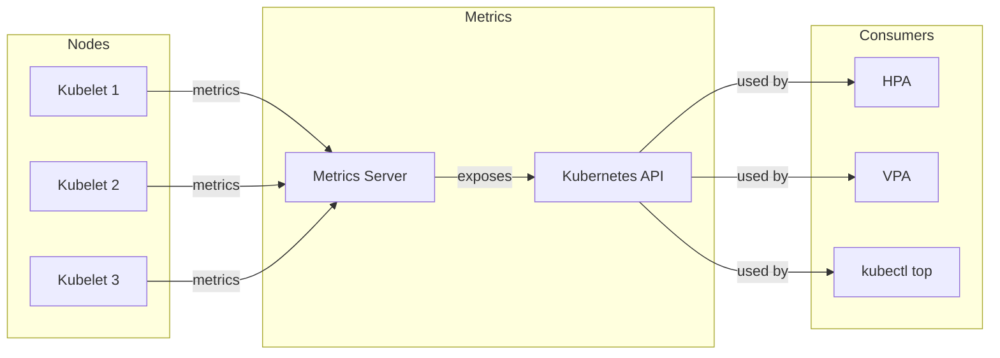

# Metrics Server

Cluster resource metrics aggregator for Kubernetes.

## Overview

| Property | Value |
|----------|-------|
| **Namespace** | `kube-system` |
| **Type** | HelmRelease |
| **Layer** | Foundation (Layer 0) |
| **Dependencies** | None |

## Purpose

Metrics Server collects resource metrics from kubelets and exposes them via the Kubernetes API for use by Horizontal Pod Autoscaler (HPA) and Vertical Pod Autoscaler (VPA).

## Features

- **Resource Metrics** - CPU and memory usage per pod/node
- **HPA Support** - Enables pod autoscaling based on metrics
- **kubectl top** - Enables `kubectl top pods` and `kubectl top nodes`
- **Lightweight** - Minimal resource footprint

## Architecture



## Usage

### View Resource Usage

```bash
# Node metrics
kubectl top nodes

# Pod metrics
kubectl top pods -A

# Pod metrics in specific namespace
kubectl top pods -n <namespace>
```

### HPA Example

```yaml
apiVersion: autoscaling/v2
kind: HorizontalPodAutoscaler
metadata:
  name: my-app
spec:
  scaleTargetRef:
    apiVersion: apps/v1
    kind: Deployment
    name: my-app
  minReplicas: 1
  maxReplicas: 10
  metrics:
    - type: Resource
      resource:
        name: cpu
        target:
          type: Utilization
          averageUtilization: 50
```

## Verification

```bash
# Check metrics server is running
kubectl get pods -n kube-system -l k8s-app=metrics-server

# Test metrics API
kubectl top nodes
kubectl top pods -A
```

## Troubleshooting

### kubectl top returns error

```bash
# Check metrics server logs
kubectl logs -n kube-system deploy/metrics-server

# Check API availability
kubectl get --raw /apis/metrics.k8s.io/v1beta1/nodes
```

### Metrics not available

1. Wait 60 seconds after deployment for initial collection
2. Verify kubelets are healthy
3. Check network connectivity between metrics-server and kubelets

## Related

- [Kube-Prometheus-Stack](kube-prometheus-stack.md) - Advanced metrics
- [Architecture](../architecture.md) - System design
