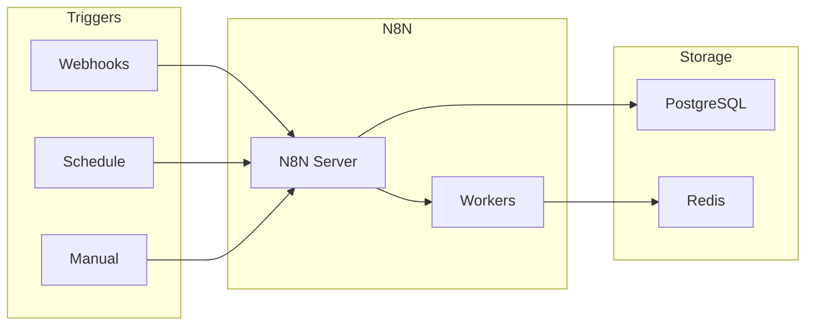

# N8N

Workflow automation platform with visual editor.

## Overview

| Property | Value |
|----------|-------|
| **Namespace** | `n8n` |
| **Type** | HelmRelease |
| **Layer** | Application (Layer 5) |
| **Dependencies** | PostgreSQL Cluster, Redis Sentinel |
| **Access** | `http://n8n.local` |

## Purpose

N8N is a workflow automation tool that allows building complex automations visually, integrating with 400+ services.

## Features

- **Visual Workflow Builder** - Drag-and-drop interface
- **400+ Integrations** - Pre-built connectors
- **Webhook Triggers** - HTTP-triggered workflows
- **Scheduling** - Cron-based execution
- **Code Nodes** - Custom JavaScript/Python
- **Self-hosted** - Full data control

## Architecture



## Access

=== "Local DNS (Recommended)"

    ```
    http://n8n.local
    ```

=== "Port Forwarding"

    ```bash
    kubectl port-forward -n n8n svc/n8n 5678:5678
    ```
    
    Then visit `http://localhost:5678`

## Use Cases

| Use Case | Example |
|----------|---------|
| Data sync | Sync data between systems |
| Notifications | Send alerts based on events |
| ETL | Extract, transform, load data |
| Monitoring | Check service health, alert on issues |
| Automation | Automate repetitive tasks |

## Database

N8N stores:

- Workflow definitions
- Execution history
- Credentials (encrypted)
- User accounts

Database: `n8n` in PostgreSQL cluster

## Configuration

Key environment variables:

| Variable | Description |
|----------|-------------|
| `N8N_ENCRYPTION_KEY` | Credential encryption |
| `DB_TYPE` | `postgresdb` |
| `DB_POSTGRESDB_HOST` | PostgreSQL service |
| `QUEUE_BULL_REDIS_HOST` | Redis for queue |

## Verification

```bash
# Check pod status
kubectl get pods -n n8n

# Check logs
kubectl logs -n n8n deploy/n8n

# Check database connection
kubectl exec -it -n n8n deploy/n8n -- n8n db:migrations:list
```

## Troubleshooting

### Cannot access UI

```bash
# Check pod is running
kubectl get pods -n n8n

# Check service
kubectl get svc -n n8n

# Check ingress
kubectl get ingressroute -n n8n
```

### Workflows not executing

```bash
# Check worker logs
kubectl logs -n n8n deploy/n8n

# Check Redis connection
kubectl exec -it -n n8n deploy/n8n -- redis-cli -h redis-sentinel-master.redis-sentinel ping
```

### Database connection issues

```bash
# Verify PostgreSQL is running
kubectl get cluster -n cnpg-system

# Check N8N database exists
kubectl exec -it postgresql-cluster-1 -n cnpg-system -- psql -U postgres -c "\l" | grep n8n
```

## Related

- [PostgreSQL](postgresql.md) - Data storage
- [Redis](redis.md) - Queue backend
- [Temporal](temporal.md) - Alternative workflow engine
