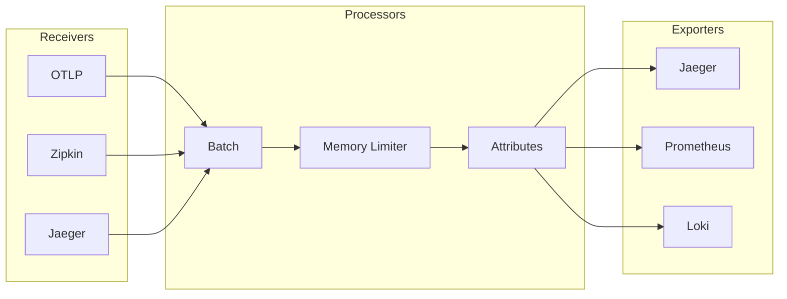

# OpenTelemetry Collector

Unified telemetry collection pipeline for traces, metrics, and logs.

## Overview

| Property | Value |
|----------|-------|
| **Namespace** | `opentelemetry` |
| **Type** | HelmRelease |
| **Layer** | Logging & Tracing (Layer 2) |
| **Dependencies** | Jaeger |

## Purpose

OpenTelemetry Collector receives, processes, and exports telemetry data (traces, metrics, logs) to multiple backends. It acts as a vendor-agnostic middleware.

## Features

- **Vendor Agnostic** - Works with any backend
- **Pipeline Processing** - Transform data in-flight
- **Multiple Exporters** - Send to multiple destinations
- **Protocol Translation** - Convert between formats
- **Batching & Retry** - Reliable delivery

## Architecture



## Configuration

### Receivers

| Receiver | Protocol | Port |
|----------|----------|------|
| OTLP gRPC | gRPC | 4317 |
| OTLP HTTP | HTTP | 4318 |
| Jaeger | Thrift | 14268 |
| Zipkin | HTTP | 9411 |

### Processors

- **Batch** - Group telemetry for efficiency
- **Memory Limiter** - Prevent OOM
- **Attributes** - Add/remove/modify attributes

### Exporters

- **Jaeger** - Traces to Jaeger backend
- **Prometheus** - Metrics (via remote write)
- **Logging** - Debug output

## Sending Data

### OTLP (Recommended)

```bash
# gRPC endpoint
http://opentelemetry-collector.opentelemetry:4317

# HTTP endpoint
http://opentelemetry-collector.opentelemetry:4318
```

### Application Configuration

```yaml
# Environment variables for apps
OTEL_EXPORTER_OTLP_ENDPOINT: "http://opentelemetry-collector.opentelemetry:4317"
OTEL_SERVICE_NAME: "my-service"
```

## Verification

```bash
# Check collector pods
kubectl get pods -n opentelemetry

# View collector logs
kubectl logs -n opentelemetry deploy/opentelemetry-collector

# Check collector metrics
kubectl port-forward -n opentelemetry svc/opentelemetry-collector 8888:8888
# Visit http://localhost:8888/metrics
```

## Troubleshooting

### Data not reaching Jaeger

```bash
# Check collector logs for export errors
kubectl logs -n opentelemetry deploy/opentelemetry-collector | grep -i error

# Verify Jaeger endpoint
kubectl get svc -n jaeger
```

### High memory usage

1. Check batch processor settings
2. Verify memory limiter is configured
3. Reduce concurrent connections

## Related

- [Jaeger](jaeger.md) - Trace storage and UI
- [Kube-Prometheus-Stack](kube-prometheus-stack.md) - Metrics backend
