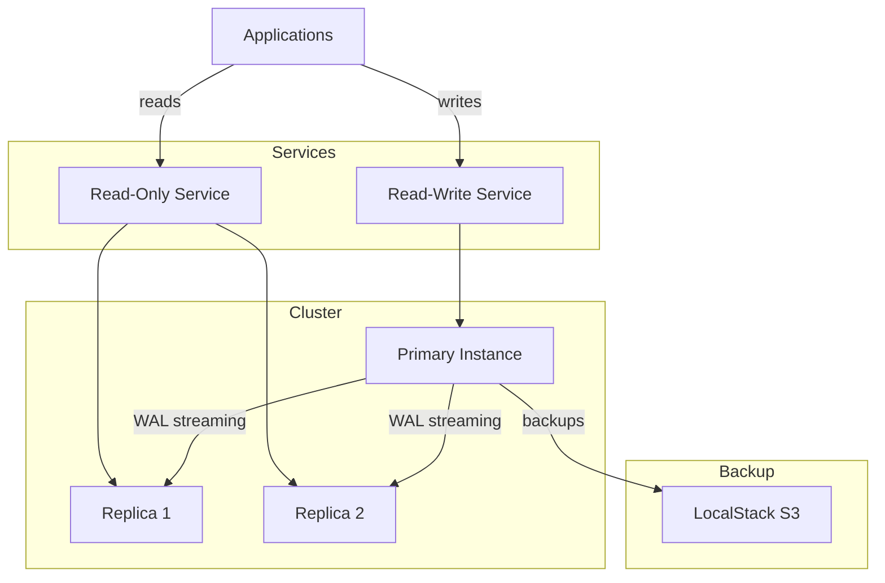

# PostgreSQL Cluster

High-availability PostgreSQL 16 cluster managed by CloudNative PG.

## Overview

| Property | Value |
|----------|-------|
| **Namespace** | `cnpg-system` |
| **Type** | Cluster CRD |
| **Layer** | Database (Layer 4) |
| **Dependencies** | CNPG Operator |
| **Access** | Port 5432 |

## Purpose

The PostgreSQL cluster provides the primary relational database for all applications requiring persistent data storage with ACID guarantees.

## Environment Configuration

| Setting | Dev | Prod |
|---------|-----|------|
| Instances | 1 | 3 (HA) |
| Storage | 10Gi | 20Gi |
| Backup Retention | 7 days | 30 days |
| CPU Request | 250m | 500m |
| Memory Request | 512Mi | 1Gi |

## Pre-configured Databases

| Database | Purpose |
|----------|---------|
| `appdb` | General application database |
| `n8n` | N8N workflow persistence |
| `temporal` | Temporal workflow state |
| `temporal_visibility` | Temporal search/visibility |

## Architecture



## Connection

### Service Endpoints

| Service | DNS Name | Purpose |
|---------|----------|---------|
| Read-Write | `postgresql-cluster-rw.cnpg-system` | Primary for writes |
| Read-Only | `postgresql-cluster-ro.cnpg-system` | Replicas for reads |
| Any | `postgresql-cluster-r.cnpg-system` | Any instance |

### Get Credentials

```bash
# Username
kubectl get secret postgresql-cluster-app -n cnpg-system \
  -o jsonpath='{.data.username}' | base64 -d

# Password
kubectl get secret postgresql-cluster-app -n cnpg-system \
  -o jsonpath='{.data.password}' | base64 -d
```

### Connect via psql

```bash
# Port forward
kubectl port-forward -n cnpg-system svc/postgresql-cluster-rw 5432:5432

# Connect
psql -h localhost -U app -d appdb
```

## Backup & Recovery

### Automated Backups

- **Schedule**: Daily at 2:00 AM UTC
- **Storage**: LocalStack S3
- **Retention**: 7 days (dev), 30 days (prod)

### Manual Backup

```bash
# Trigger backup
kubectl annotate cluster postgresql-cluster -n cnpg-system \
  cnpg.io/immediateBackup=$(date +%Y%m%d%H%M%S)
```

### Point-in-Time Recovery

The cluster supports PITR using WAL archives stored in S3.

## Verification

```bash
# Check cluster status
kubectl get cluster -n cnpg-system

# Describe cluster
kubectl describe cluster postgresql-cluster -n cnpg-system

# Check pods
kubectl get pods -n cnpg-system -l cnpg.io/cluster=postgresql-cluster

# List databases
kubectl exec -it postgresql-cluster-1 -n cnpg-system -- psql -U postgres -c "\l"
```

## Troubleshooting

### Cluster not ready

```bash
# Check cluster events
kubectl describe cluster postgresql-cluster -n cnpg-system

# Check pod logs
kubectl logs postgresql-cluster-1 -n cnpg-system
```

### Connection refused

1. Verify cluster is healthy
2. Check service endpoints exist
3. Verify credentials are correct

```bash
# Check services
kubectl get svc -n cnpg-system
```

### Failover

Automatic failover occurs when:
- Primary becomes unresponsive
- Primary fails health checks
- Manual switchover is triggered

```bash
# Trigger manual switchover
kubectl cnpg promote postgresql-cluster <new-primary> -n cnpg-system
```

## Related

- [CNPG Operator](cnpg-operator.md) - Cluster operator
- [pgAdmin4](pgadmin.md) - Web administration
- [Runbooks](../runbooks.md#postgresql) - Operations guide
