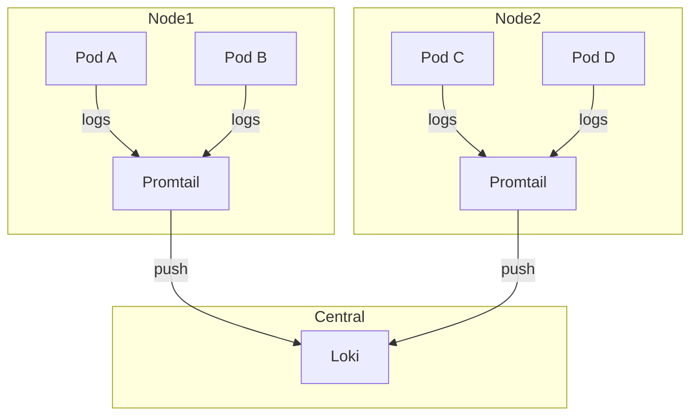

# Promtail

Log shipping agent for Loki.

## Overview

| Property | Value |
|----------|-------|
| **Namespace** | `loki` |
| **Type** | DaemonSet |
| **Layer** | Logging (Layer 2) |
| **Dependencies** | Loki |

## Purpose

Promtail is an agent that ships container logs to Loki. It runs as a DaemonSet, collecting logs from all pods on each node.

## Features

- **Auto-discovery** - Discovers pods via Kubernetes API
- **Label extraction** - Extracts labels from log lines
- **Pipeline stages** - Transform logs before sending
- **Multiline support** - Handle stack traces and multiline logs
- **Efficient** - Low resource footprint

## Architecture



## Log Sources

Promtail collects logs from:

| Source | Path |
|--------|------|
| Container logs | `/var/log/pods/*/*/*.log` |
| Container runtime | `/var/lib/docker/containers/*/*.log` |

## Labels Added

Promtail automatically adds these labels:

- `namespace` - Kubernetes namespace
- `pod` - Pod name
- `container` - Container name
- `node_name` - Node where pod runs
- `app` - From pod labels

## Verification

```bash
# Check Promtail DaemonSet
kubectl get ds -n loki

# Check all Promtail pods
kubectl get pods -n loki -l app=promtail

# View Promtail logs
kubectl logs -n loki -l app=promtail --tail=100
```

## Troubleshooting

### Logs not being collected

```bash
# Check Promtail is on all nodes
kubectl get pods -n loki -l app=promtail -o wide

# Check Promtail config
kubectl get cm -n loki promtail -o yaml

# Check for errors
kubectl logs -n loki -l app=promtail | grep -i error
```

### High memory usage

1. Check log volume
2. Reduce pipeline complexity
3. Increase resource limits if needed

## Related

- [Loki](loki.md) - Log storage
- [Kube-Prometheus-Stack](kube-prometheus-stack.md) - Grafana for querying
