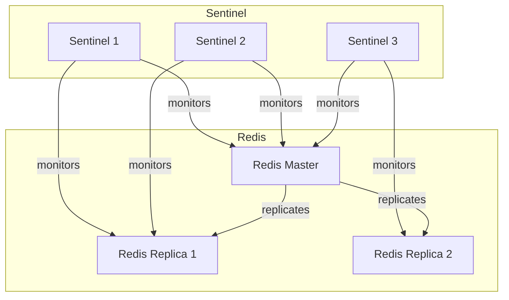

# Redis Sentinel

High-availability Redis with Sentinel for automatic failover.

## Overview

| Property | Value |
|----------|-------|
| **Namespace** | `redis-sentinel` |
| **Type** | HelmRelease |
| **Layer** | Database (Layer 4) |
| **Dependencies** | External Secrets Config |
| **Access** | Port 6379, `http://redis.local` (RedisInsight) |

## Purpose

Redis Sentinel provides a high-availability Redis deployment with automatic failover, used for caching, session storage, and message queuing.

## Features

- **Master-Replica** - One master, multiple replicas
- **Automatic Failover** - Sentinel promotes replicas
- **Authentication** - Password from External Secrets
- **Persistence** - RDB snapshots and AOF logging

## Architecture



## Connection

### Direct Connection

```bash
# Port forward
kubectl port-forward -n redis-sentinel svc/redis-sentinel-master 6379:6379

# Connect with redis-cli
redis-cli -h localhost -p 6379 -a <password>
```

### Application Configuration

```yaml
# Using Sentinel
REDIS_SENTINEL_HOST: "redis-sentinel.redis-sentinel"
REDIS_SENTINEL_PORT: "26379"
REDIS_SENTINEL_MASTER: "mymaster"

# Direct to master (simpler but no failover awareness)
REDIS_HOST: "redis-sentinel-master.redis-sentinel"
REDIS_PORT: "6379"
```

### Get Password

```bash
kubectl get secret redis-sentinel -n redis-sentinel \
  -o jsonpath='{.data.redis-password}' | base64 -d
```

## Environment Configuration

| Setting | Dev | Prod |
|---------|-----|------|
| Replicas | 1 | 2+ |
| Storage | 8Gi | 16Gi |
| Memory | 256Mi | 1Gi |

## Use Cases

| Use Case | Description |
|----------|-------------|
| Caching | Application cache layer |
| Sessions | User session storage |
| Queues | Job queues (N8N) |
| Pub/Sub | Real-time messaging |

## Verification

```bash
# Check pods
kubectl get pods -n redis-sentinel

# Check master
kubectl exec -it redis-sentinel-master-0 -n redis-sentinel -- redis-cli ping

# Check replication
kubectl exec -it redis-sentinel-master-0 -n redis-sentinel -- redis-cli info replication
```

## Troubleshooting

### Connection refused

```bash
# Check pod status
kubectl get pods -n redis-sentinel

# Check service
kubectl get svc -n redis-sentinel

# Check logs
kubectl logs -n redis-sentinel redis-sentinel-master-0
```

### Authentication failed

1. Verify password in secret
2. Check External Secret is synced
3. Verify LocalStack has the secret

```bash
kubectl get externalsecret -n redis-sentinel
```

### Failover not working

```bash
# Check Sentinel logs
kubectl logs -n redis-sentinel -l app.kubernetes.io/component=sentinel

# Check Sentinel status
kubectl exec -it redis-sentinel-node-0 -n redis-sentinel -- redis-cli -p 26379 sentinel masters
```

## Related

- [External Secrets](external-secrets.md) - Password management
- [RedisInsight](redisinsight.md) - Web UI
- [Runbooks](../runbooks.md#redis-sentinel) - Operations guide
