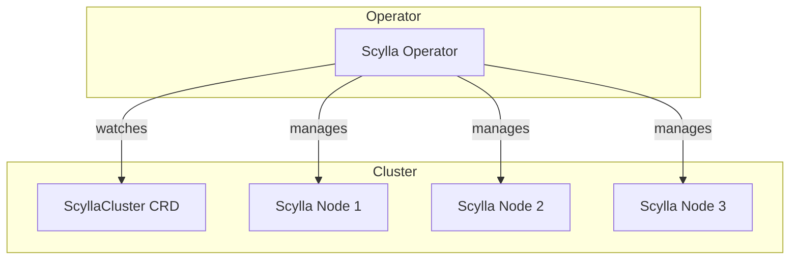

# Scylla Operator

ScyllaDB Kubernetes operator for managing ScyllaDB clusters.

## Overview

| Property | Value |
|----------|-------|
| **Namespace** | `scylla-operator` |
| **Type** | HelmRelease |
| **Layer** | Foundation (Layer 0) |
| **Dependencies** | None |

## Purpose

The Scylla Operator enables running ScyllaDB clusters on Kubernetes with full lifecycle management.

## Features

- **Declarative Clusters** - ScyllaCluster CRD for cluster definition
- **Automatic Scaling** - Add/remove nodes declaratively
- **Rolling Updates** - Zero-downtime version upgrades
- **Rack Awareness** - Topology-aware placement
- **Sidecar Injection** - Automatic sidecar management

## Architecture



## Managed CRDs

| CRD | Purpose |
|-----|---------|
| `ScyllaCluster` | Main cluster definition |
| `NodeConfig` | Node-level configuration |
| `ScyllaOperatorConfig` | Operator settings |

## Verification

```bash
# Check operator pods
kubectl get pods -n scylla-operator

# Check CRDs
kubectl get crd | grep scylla

# View operator logs
kubectl logs -n scylla-operator deploy/scylla-operator
```

## Troubleshooting

### Operator not starting

```bash
# Check pod status
kubectl describe pod -n scylla-operator -l app=scylla-operator

# Check events
kubectl get events -n scylla-operator --sort-by='.lastTimestamp'
```

### ScyllaCluster not being created

```bash
# Check CRDs are installed
kubectl get crd scyllaclusters.scylla.scylladb.com

# Check operator logs
kubectl logs -n scylla-operator deploy/scylla-operator
```

## Related

- [ScyllaDB Cluster](scylladb.md) - Managed database cluster
- [Architecture](../architecture.md) - System design
