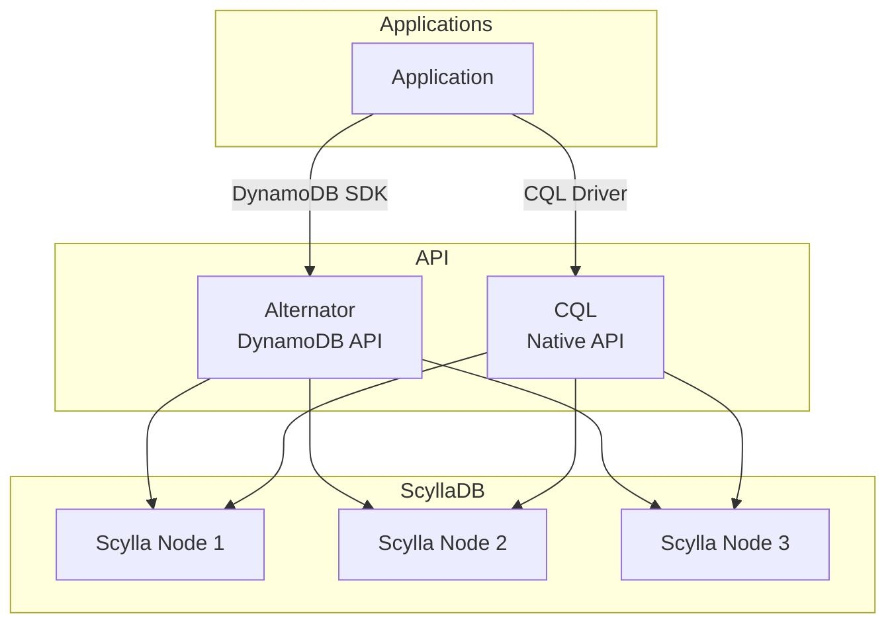

# ScyllaDB Cluster

NoSQL database with DynamoDB-compatible API (Alternator).

## Overview

| Property | Value |
|----------|-------|
| **Namespace** | `scylla` |
| **Type** | ScyllaCluster CRD |
| **Layer** | Database (Layer 4) |
| **Dependencies** | Scylla Operator |
| **Access** | `http://scylla.local` (Alternator API) |

## Purpose

ScyllaDB provides a high-performance NoSQL database with a DynamoDB-compatible API, ideal for chat history, session storage, and high-throughput workloads.

## Features

- **Alternator API** - DynamoDB-compatible interface
- **High Performance** - Discord-proven at trillion+ message scale
- **Native TTL** - Automatic data expiration
- **Linear Scalability** - Add nodes for more capacity
- **Low Latency** - Sub-millisecond response times

## Use Cases

| Use Case | Why ScyllaDB |
|----------|--------------|
| Chat History | High write throughput, TTL for retention |
| Session Storage | Low latency, automatic expiration |
| Time-series | Efficient range queries, compaction |
| Caching | Persistent cache with TTL |

## Architecture



## Access

### Alternator (DynamoDB API)

=== "Local DNS"

    ```
    http://scylla.local
    ```

=== "Port Forward"

    ```bash
    kubectl port-forward -n scylla svc/scylla-client 8000:8000
    ```

### Using AWS SDK

```python
import boto3

dynamodb = boto3.resource(
    'dynamodb',
    endpoint_url='http://scylla.local',
    region_name='us-east-1',
    aws_access_key_id='none',
    aws_secret_access_key='none'
)

# Create table
table = dynamodb.create_table(
    TableName='messages',
    KeySchema=[
        {'AttributeName': 'pk', 'KeyType': 'HASH'},
        {'AttributeName': 'sk', 'KeyType': 'RANGE'}
    ],
    AttributeDefinitions=[
        {'AttributeName': 'pk', 'AttributeType': 'S'},
        {'AttributeName': 'sk', 'AttributeType': 'S'}
    ],
    BillingMode='PAY_PER_REQUEST'
)
```

### CQL (Native)

```bash
# Connect via cqlsh
kubectl exec -it scylla-dc-default-0 -n scylla -- cqlsh
```

## TTL Configuration

Enable TTL on a table:

```python
# DynamoDB API
dynamodb.meta.client.update_time_to_live(
    TableName='messages',
    TimeToLiveSpecification={
        'Enabled': True,
        'AttributeName': 'ttl'
    }
)
```

## Verification

```bash
# Check cluster status
kubectl get scyllacluster -n scylla

# Describe cluster
kubectl describe scyllacluster scylla -n scylla

# Check pods
kubectl get pods -n scylla

# Test Alternator endpoint
curl http://scylla.local/
```

## Troubleshooting

### Cluster not forming

```bash
# Check operator logs
kubectl logs -n scylla-operator deploy/scylla-operator

# Check scylla pod logs
kubectl logs -n scylla scylla-dc-default-0
```

### Alternator not responding

```bash
# Check Alternator is enabled
kubectl describe scyllacluster scylla -n scylla | grep -i alternator

# Check service
kubectl get svc -n scylla
```

### Node not joining

1. Check resource availability
2. Verify network connectivity
3. Check for scheduling issues

```bash
kubectl describe pod -n scylla <pod-name>
```

## Related

- [Scylla Operator](scylla-operator.md) - Cluster operator
- [Architecture](../architecture.md) - System design
