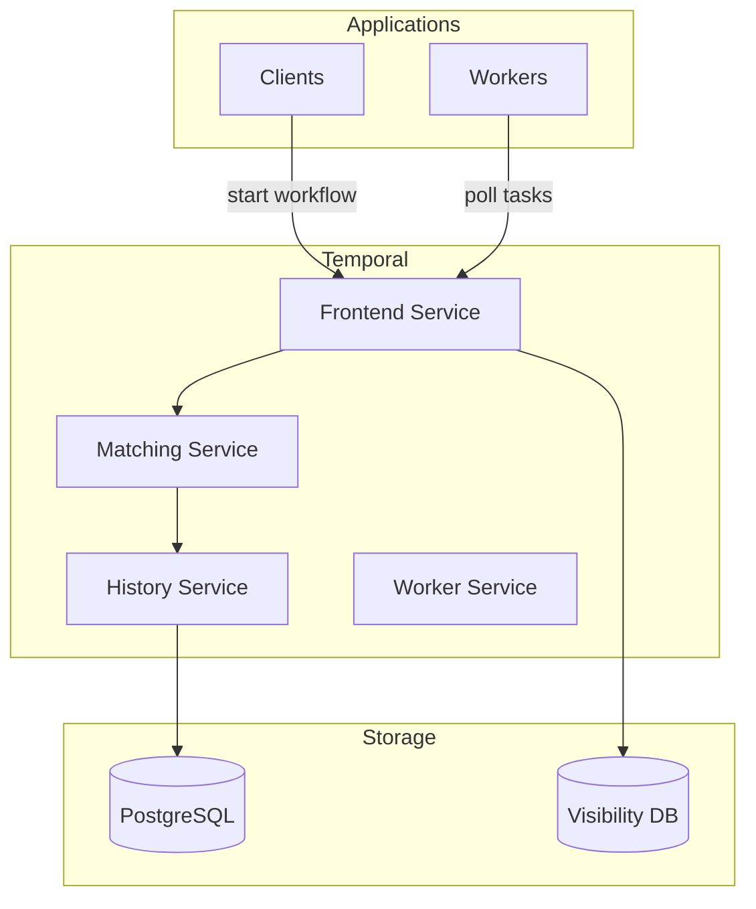

# Temporal

Workflow orchestration platform for durable execution.

## Overview

| Property | Value |
|----------|-------|
| **Namespace** | `temporal` |
| **Type** | HelmRelease |
| **Layer** | Application (Layer 5) |
| **Dependencies** | PostgreSQL Cluster |
| **Access** | `http://temporal.local` |

## Purpose

Temporal provides durable execution for microservices, ensuring workflows complete even through failures, restarts, and deployments.

## Features

- **Durable Execution** - Workflows survive failures
- **Automatic Retries** - Configurable retry policies
- **Long-running Workflows** - Days, weeks, months
- **Versioning** - Safe workflow updates
- **Visibility** - Search and filter workflows
- **Multi-language SDKs** - Go, Java, Python, TypeScript, PHP

## Architecture



## Access

### Web UI

=== "Local DNS (Recommended)"

    ```
    http://temporal.local
    ```

=== "Port Forwarding"

    ```bash
    kubectl port-forward -n temporal svc/temporal-web 8090:8080
    ```

### gRPC Endpoint

```
temporal-frontend.temporal:7233
```

## Databases

| Database | Purpose |
|----------|---------|
| `temporal` | Workflow state and history |
| `temporal_visibility` | Search and filtering |

## Use Cases

| Use Case | Why Temporal |
|----------|--------------|
| Order Processing | Multi-step, long-running |
| Data Pipelines | Retry on failure |
| User Onboarding | Days-long workflows |
| Batch Jobs | Reliable execution |
| Saga Pattern | Distributed transactions |

## Configuration

Key environment variables:

| Variable | Description |
|----------|-------------|
| `DB` | Database type (`postgresql`) |
| `POSTGRES_SEEDS` | PostgreSQL host |
| `DYNAMIC_CONFIG_FILE_PATH` | Dynamic config |

## Worker Example

```go
// Go worker
c, _ := client.Dial(client.Options{
    HostPort: "temporal-frontend.temporal:7233",
})
w := worker.New(c, "my-task-queue", worker.Options{})
w.RegisterWorkflow(MyWorkflow)
w.RegisterActivity(MyActivity)
w.Run(worker.InterruptCh())
```

## Verification

```bash
# Check pods
kubectl get pods -n temporal

# Check services
kubectl get svc -n temporal

# Check frontend
kubectl logs -n temporal deploy/temporal-frontend
```

## Troubleshooting

### UI not loading

```bash
# Check web service
kubectl get pods -n temporal -l app.kubernetes.io/component=web

# Check logs
kubectl logs -n temporal -l app.kubernetes.io/component=web
```

### Workers not connecting

1. Verify frontend service is running
2. Check network policies
3. Verify worker configuration

```bash
# Check frontend logs
kubectl logs -n temporal deploy/temporal-frontend
```

### Workflows stuck

```bash
# Check history service
kubectl logs -n temporal deploy/temporal-history

# Check matching service
kubectl logs -n temporal deploy/temporal-matching
```

## Related

- [PostgreSQL](postgresql.md) - Data storage
- [N8N](n8n.md) - Alternative workflow tool
- [Architecture](../architecture.md) - System design
