# Architecture — Dependency Graph

All **36 enabled services** and their Flux `dependsOn` wiring.
Services with no dependencies start immediately; dependent services wait for their parents to become healthy.

## Full Dependency Graph

```mermaid
flowchart TD
  subgraph Foundation_services["Foundation services"]
    cnpg_operator["CNPG Operator"]
    cilium["Cilium"]
    external_secrets_config["External Secrets Config"]
    external_secrets_operator["External Secrets Operator"]
    grafana_sa_setup["Grafana SA Setup"]
    kube_prometheus_stack["Kube Prometheus Stack"]
    localstack["LocalStack"]
    metrics_server["Metrics Server"]
    scylla_operator["Scylla Operator"]
    traefik["Traefik"]
    traefik_config["Traefik Config"]
    weave_gitops["Weave GitOps"]
  end
  subgraph Node_maintenance["Node maintenance"]
    node_image_gc["Node Image GC"]
  end
  subgraph Event_driven_autoscaling["Event-driven autoscaling"]
    keda["KEDA"]
  end
  subgraph Logging_stack_services["Logging stack services"]
    loki["Loki"]
    promtail["Promtail"]
  end
  subgraph Distributed_tracing_services["Distributed tracing services"]
    jaeger["Jaeger"]
    opentelemetry_collector["OpenTelemetry Collector"]
  end
  subgraph Grafana_Operator["Grafana Operator"]
    grafana_config["Grafana Config"]
    grafana_dashboards["Grafana Dashboards"]
    grafana_operator["Grafana Operator"]
  end
  subgraph Database_services["Database services"]
    postgresql_cluster["PostgreSQL Cluster"]
    redis_sentinel["Redis Sentinel"]
    scylla_cluster["ScyllaDB Cluster"]
  end
  subgraph Application_services["Application services"]
    n8n["N8N"]
    temporal["Temporal"]
  end
  subgraph AI_agent_platform["AI agent platform"]
    agentgateway["AgentGateway"]
    agentgateway_config["AgentGateway Config"]
    code_tools["Code Tools"]
    gateway_api_crds["Gateway API CRDs"]
    ollama["Ollama"]
    kagent["kagent"]
  end
  subgraph Security_and_cost_observability["Security and cost observability"]
    kubescape["Kubescape"]
    opencost["OpenCost"]
  end
  subgraph Database_UI_services["Database UI services"]
    redisinsight["RedisInsight"]
    pgadmin4["pgAdmin4"]
  end
  localstack --> external_secrets_operator
  external_secrets_operator --> external_secrets_config
  localstack --> external_secrets_config
  traefik --> traefik_config
  external_secrets_config --> traefik_config
  external_secrets_config --> kube_prometheus_stack
  kube_prometheus_stack --> grafana_sa_setup
  external_secrets_config --> loki
  kube_prometheus_stack --> loki
  loki --> promtail
  traefik_config --> jaeger
  jaeger --> opentelemetry_collector
  loki --> opentelemetry_collector
  kube_prometheus_stack --> opentelemetry_collector
  kube_prometheus_stack --> grafana_operator
  grafana_operator --> grafana_config
  grafana_config --> grafana_dashboards
  cnpg_operator --> postgresql_cluster
  external_secrets_config --> redis_sentinel
  scylla_operator --> scylla_cluster
  traefik_config --> scylla_cluster
  external_secrets_config --> n8n
  postgresql_cluster --> n8n
  external_secrets_config --> temporal
  postgresql_cluster --> temporal
  ollama --> kagent
  cnpg_operator --> kagent
  external_secrets_config --> kagent
  traefik --> kagent
  grafana_sa_setup --> kagent
  gateway_api_crds --> agentgateway
  kagent --> agentgateway
  traefik --> agentgateway
  external_secrets_config --> agentgateway
  agentgateway --> agentgateway_config
  opentelemetry_collector --> agentgateway_config
  metrics_server --> kubescape
  kube_prometheus_stack --> kubescape
  kube_prometheus_stack --> opencost
  external_secrets_config --> pgadmin4
  postgresql_cluster --> pgadmin4
  redis_sentinel --> redisinsight
```

## Layer Summary

| Layer | Services | Enabled | Disabled |
|---|---|---|---|
| Foundation services | 12 | 12 | — |
| Node maintenance | 1 | 1 | — |
| Event-driven autoscaling | 1 | 1 | — |
| Logging stack services | 2 | 2 | — |
| Distributed tracing services | 2 | 2 | — |
| Grafana Operator | 3 | 3 | — |
| Database management services | 1 | 0 | 1 |
| Database services | 3 | 3 | — |
| Application services | 2 | 2 | — |
| AI agent platform | 6 | 6 | — |
| Security and cost observability | 2 | 2 | — |
| Database UI services | 2 | 2 | — |
| Infrastructure as Code services | 3 | 0 | 3 |

---
*Generated from [service-catalog.json](https://github.com/JiwooL0920/fleet-infra/blob/develop/service-catalog.json) at commit `2d36e22` · catalog sha `4d088b0b3a67b4c4`*