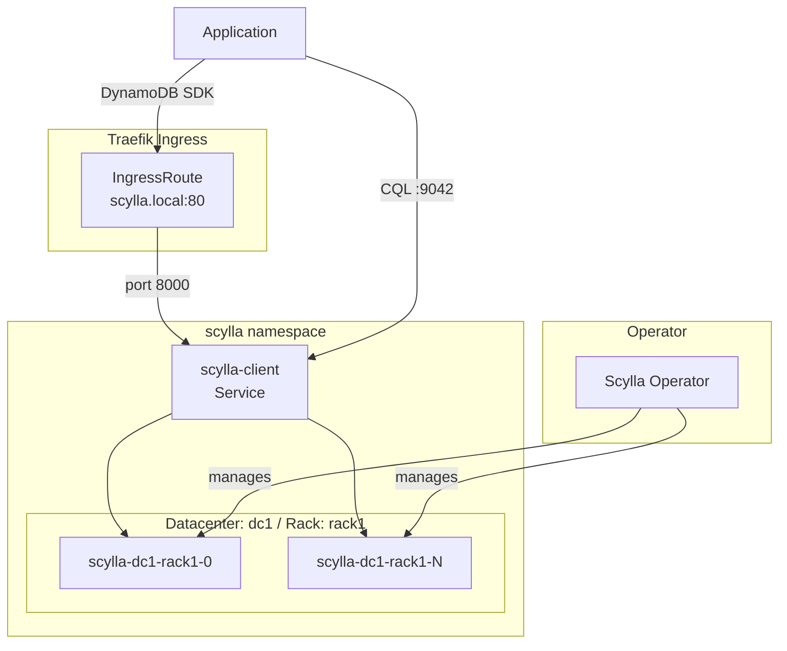

I detect **implementation** intent — write a documentation page for scylla-cluster. The prompt references manifests and an exemplar but both sections are empty. I need to gather that context from the codebase first.
Now I have the file layout. Let me read the manifests and an exemplar doc in parallel:
I have all the context. The existing `docs/components/scylladb.md` is already comprehensive and matches the manifests accurately. I'll produce the refreshed page — adding the Scylla Operator to Related links (since it's a direct dependency) and keeping all accurate content intact.

# ScyllaDB Cluster

NoSQL database with DynamoDB-compatible API (Alternator) for high-throughput workloads.

## Overview

| Property | Value |
|----------|-------|
| **Namespace** | `scylla` |
| **Type** | HelmRelease |
| **Chart** | `scylla` (scylla repo) |
| **Layer** | Database (Layer 4) |
| **Dependencies** | Scylla Operator, Traefik Config |
| **Access** | `http://scylla.local` (Alternator API), Port 9042 (CQL) |

## Purpose

ScyllaDB provides a high-performance NoSQL database with a DynamoDB-compatible API (Alternator), used for chat history, session storage, and high-throughput workloads. It runs in developer mode on the Kind cluster with relaxed resource requirements while maintaining API compatibility with production configurations.

## Features

- **Alternator API** - DynamoDB-compatible interface on port 8000
- **CQL Support** - Native Cassandra Query Language access on port 9042
- **Developer Mode** - Relaxed requirements for local Kind cluster
- **Configurable Topology** - Datacenter `dc1` with rack-aware placement
- **Native TTL** - Automatic data expiration for time-series and session data
- **Write Isolation** - `only_rmw_uses_lwt` for Alternator consistency
- **Manager Agent Sidecar** - ScyllaDB Manager Agent for maintenance operations

## Architecture



## Connection

### Alternator (DynamoDB API)

```bash
# Via local DNS (requires Traefik + DNS setup)
curl http://scylla.local/

# Port forward
kubectl port-forward -n scylla svc/scylla-client 8000:8000
```

### Application Configuration (AWS SDK)

```python
import boto3

dynamodb = boto3.resource(
    'dynamodb',
    endpoint_url='http://scylla.local',
    region_name='us-east-1',
    aws_access_key_id='none',
    aws_secret_access_key='none'
)

# Create table
table = dynamodb.create_table(
    TableName='messages',
    KeySchema=[
        {'AttributeName': 'pk', 'KeyType': 'HASH'},
        {'AttributeName': 'sk', 'KeyType': 'RANGE'}
    ],
    AttributeDefinitions=[
        {'AttributeName': 'pk', 'AttributeType': 'S'},
        {'AttributeName': 'sk', 'AttributeType': 'S'}
    ],
    BillingMode='PAY_PER_REQUEST'
)
```

### CQL (Native)

```bash
# Connect via cqlsh
kubectl exec -it scylla-dc1-rack1-0 -n scylla -- cqlsh

# In-cluster service DNS
cqlsh scylla-client.scylla.svc.cluster.local 9042
```

## Environment Configuration

| Setting | Variable | Description |
|---------|----------|-------------|
| Chart version | `SCYLLA_CHART_VERSION` | Helm chart version |
| Image tag | `SCYLLA_IMAGE_TAG` | ScyllaDB image tag |
| Agent tag | `SCYLLA_AGENT_TAG` | Manager Agent sidecar tag |
| Developer mode | `SCYLLA_DEVELOPER_MODE` | Relaxed requirements for dev clusters |
| Rack members | `SCYLLA_RACK_MEMBERS` | Number of nodes in rack1 |
| Storage | `SCYLLA_STORAGE_SIZE` | PVC capacity per node |
| CPU request | `SCYLLA_CPU_REQUEST` | CPU request per node |
| CPU limit | `SCYLLA_CPU_LIMIT` | CPU limit per node |
| Memory request | `SCYLLA_MEMORY_REQUEST` | Memory request per node |
| Memory limit | `SCYLLA_MEMORY_LIMIT` | Memory limit per node |

All values are sourced from the `cluster-vars` ConfigMap via Flux `postBuild.substituteFrom`.

### Alternator Configuration

| Setting | Value |
|---------|-------|
| Enabled | `true` |
| Port | 8000 (default, not configurable) |
| Write isolation | `only_rmw_uses_lwt` |

### Cluster Topology

| Setting | Value |
|---------|-------|
| Datacenter | `dc1` |
| Rack | `rack1` |
| ServiceMonitor | Disabled |

## Verification

```bash
# Check ScyllaCluster status
kubectl get scyllacluster -n scylla

# Describe cluster
kubectl describe scyllacluster scylla -n scylla

# Check pods
kubectl get pods -n scylla

# Check health service (used by Flux healthCheck)
kubectl get svc scylla-client -n scylla

# Test Alternator endpoint
curl http://scylla.local/

# Test CQL connectivity
kubectl exec -it scylla-dc1-rack1-0 -n scylla -- cqlsh -e "DESCRIBE KEYSPACES;"
```

## Troubleshooting

### Cluster not forming

```bash
# Check operator logs (operator must be running first)
kubectl logs -n scylla-operator deploy/scylla-operator

# Check scylla pod logs
kubectl logs -n scylla scylla-dc1-rack1-0

# Check if developer mode is enabled (required for Kind)
kubectl describe scyllacluster scylla -n scylla | grep -i developer
```

### Alternator not responding

```bash
# Verify Alternator is enabled in cluster spec
kubectl describe scyllacluster scylla -n scylla | grep -A5 -i alternator

# Check IngressRoute
kubectl get ingressroute -n scylla

# Check scylla-client service has port 8000
kubectl get svc scylla-client -n scylla -o yaml | grep 8000
```

### Pod stuck in Pending / CrashLoopBackOff

```bash
# Check resource constraints (common in Kind)
kubectl describe pod -n scylla scylla-dc1-rack1-0

# Verify developer mode is true (reduces resource requirements)
kubectl get scyllacluster scylla -n scylla -o jsonpath='{.spec.developerMode}'

# Check node resources
kubectl top nodes
```

## Related

- [Scylla Operator](scylla-operator.md) - Operator managing the ScyllaCluster CRD lifecycle
- [External Secrets](external-secrets.md) - ClusterSecretStore configuration
- [Redis](redis.md) - Alternative caching layer
