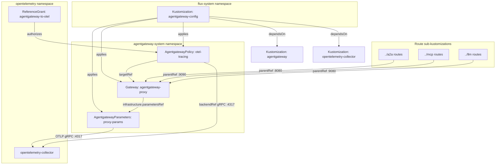
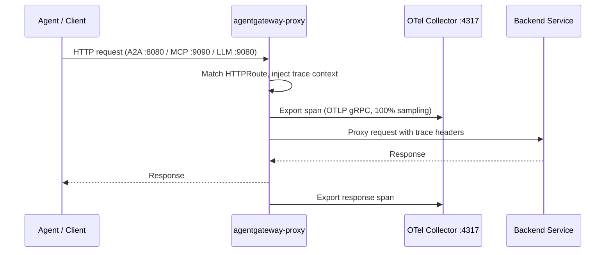

# AgentGateway Config

[AgentGateway](https://agentgateway.dev) is a Kubernetes-native proxy purpose-built for AI agent traffic. It implements the Gateway API specification with a custom `gatewayClassName: agentgateway`, providing protocol-aware routing for the three dominant agent communication patterns: [A2A](https://google.github.io/A2A/) (Agent-to-Agent), [MCP](https://modelcontextprotocol.io/) (Model Context Protocol), and direct LLM inference calls. Unlike general-purpose ingress controllers that treat all HTTP traffic identically, AgentGateway understands agent protocol semantics — streaming SSE for A2A task updates, bidirectional JSON-RPC for MCP tool calls, and chunked inference responses from LLM backends.

This `agentgateway-config` Kustomization is the **configuration layer** that sits atop the AgentGateway operator. The operator (deployed separately as a HelmRelease) installs the CRDs; this Kustomization instantiates the actual Gateway, parameters, policies, and route resources that define the proxy's runtime behavior. The split ensures CRDs exist before any instances are applied — a hard ordering requirement enforced via Flux `dependsOn`.

## Overview

| Property | Value |
|---|---|
| **Namespace** | `agentgateway-config` |
| **Type** | Kustomization |
| **Layer** | AI agent platform |
| **Status** | Enabled |
| **Source** | [`apps/base/agentgateway/config/`](https://github.com/JiwooL0920/flux-infra/tree/develop/apps/base/agentgateway/config/) |

## Dependencies

### Upstream — required before AgentGateway Config starts

| Service | Reason | Status |
|---|---|---|
| `agentgateway` | Flux `dependsOn` | Active |
| `opentelemetry-collector` | Flux `dependsOn` | Active |

### Downstream — services that depend on AgentGateway Config

_No known downstream Flux dependencies._

## Purpose

This Kustomization defines the data-plane configuration for the AI agent platform's unified proxy. It creates a single Gateway with three dedicated listeners — one per protocol class — so that A2A delegation chains, MCP tool invocations, and LLM inference requests each get isolated routing and can be independently scaled or policy-gated. The tracing policy instruments every proxied request with distributed traces exported to the platform's OpenTelemetry Collector, providing full observability across multi-hop agent interactions without requiring individual agent services to implement their own trace propagation.

**Why a dedicated agent proxy over routing through Traefik directly:** Traefik handles north-south ingress from external clients, but agent-to-agent traffic is east-west within the cluster and requires protocol-specific routing decisions (e.g., routing MCP `tools/call` to the correct backend by tool name, or routing A2A tasks by agent card). AgentGateway's Gateway API implementation allows defining per-protocol listeners with distinct port assignments, keeping traffic classes isolated at the network level. Traefik remains responsible for TLS termination and external exposure via IngressRoutes that forward to these internal listener ports.


## Features

| Feature | Detail |
|---|---|
| **Multi-protocol Gateway listeners** | Three dedicated listeners on separate ports — A2A (:8080), MCP (:9090), LLM (:9080) — each allowing routes from all namespaces, enabling protocol-isolated routing for agent workloads deployed anywhere in the cluster. |
| **ClusterIP service with Traefik front** | AgentgatewayParameters sets the proxy service to ClusterIP rather than LoadBalancer; external access is handled by Traefik IngressRoutes, keeping the proxy off the public network and consolidating TLS termination at the ingress layer. |
| **Full-fidelity OTEL tracing** | Proxy-level environment variables configure 100% head sampling (`traceidratio` at 1.0) with traces exported via OTLP gRPC to the in-cluster OpenTelemetry Collector — every agent interaction is traced without application-level instrumentation. |
| **Policy-based tracing attachment** | An AgentgatewayPolicy resource attaches frontend tracing to the Gateway via a cross-namespace backendRef to the OTel Collector, using a ReferenceGrant to authorize the cross-namespace service reference. |
| **Cross-namespace ReferenceGrant** | Explicitly grants the agentgateway-system namespace permission to reference Services in the opentelemetry namespace, satisfying Gateway API's security model for cross-namespace backend references. |
| **Post-build variable substitution** | The Flux Kustomization substitutes variables from the cluster-vars ConfigMap at apply time, allowing environment-specific values (domains, endpoints) to be injected without duplicating manifests per stage. |
| **Gateway health checking** | Flux monitors the Gateway resource's status conditions as a health check, blocking dependent Kustomizations from proceeding until the proxy is fully programmed and accepting routes. |

## Architecture

### AgentGateway Config Deployment Topology



### Request Tracing Flow




## Configuration

All values sourced from [`base/services/environment.env`](https://github.com/JiwooL0920/flux-infra/blob/develop/base/services/environment.env)
(base); per-environment overrides in [`clusters/stages/dev/.../environment.env`](https://github.com/JiwooL0920/flux-infra/blob/develop/clusters/stages/dev/clusters/services-amer/environment.env).

_No environment-specific configuration variables for this service._


## Operations

### Gateway stuck in NotAccepted state after Kustomization applies

**Symptoms:** Flux reports the Kustomization as healthy (YAML applied), but `kubectl get gateway agentgateway-proxy -n agentgateway-system` shows no `Accepted` or `Programmed` conditions, or conditions show `False`. The `agentgateway` controller pod may not be running or may not recognize the Gateway resource.

```bash
kubectl get gateway agentgateway-proxy -n agentgateway-system -o yaml | grep -A 20 'status:'
kubectl get pods -n agentgateway-system -l app.kubernetes.io/name=agentgateway
kubectl logs -n agentgateway-system -l app.kubernetes.io/name=agentgateway --tail=50
kubectl get gatewayclass agentgateway -o yaml | grep -A 10 'status:'
kubectl get crd agentgatewayparameters.agentgateway.dev -o jsonpath='{.metadata.creationTimestamp}'
```

---

### Kustomization fails with "no matches for kind AgentgatewayParameters"

**Symptoms:** Flux Kustomization `agentgateway-config` shows `ReconciliationFailed` with error containing `no matches for kind "AgentgatewayParameters" in version "agentgateway.dev/v1alpha1"`. The `dependsOn` ordering should prevent this, but may occur if the upstream `agentgateway` HelmRelease failed silently.

```bash
kubectl get kustomization agentgateway -n flux-system -o jsonpath='{.status.conditions[*].message}'
kubectl get helmrelease -n agentgateway-system -o wide
kubectl get crd | grep agentgateway
flux reconcile kustomization agentgateway --with-source -n flux-system
kubectl get kustomization agentgateway-config -n flux-system -o jsonpath='{.status.conditions[*].message}'
```

---

### Tracing policy not producing spans in Jaeger

**Symptoms:** Agent traffic flows correctly through the gateway but no traces appear in Jaeger for `agentgateway-proxy` service. The `otel-tracing` AgentgatewayPolicy may not be attached, or the collector endpoint is unreachable from the gateway pod.

```bash
kubectl get agentgatewaypolicy otel-tracing -n agentgateway-system -o yaml | grep -A 10 'status:'
kubectl exec -n agentgateway-system deploy/agentgateway-proxy -- wget -qO- --spider http://opentelemetry-collector.opentelemetry.svc.cluster.local:4317 2>&1 || true
kubectl get referencegrant agentgateway-to-otel -n opentelemetry -o yaml
kubectl get svc opentelemetry-collector -n opentelemetry
kubectl logs -n agentgateway-system -l app.kubernetes.io/name=agentgateway --tail=100 | grep -i 'otel\|trace\|export'
```

---

### Health check timeout causing Kustomization to report not ready

**Symptoms:** `flux get kustomization agentgateway-config` shows `Health check failed after 5m0s timeout` referencing the `agentgateway-proxy` Gateway health check. The Gateway resource exists but its status conditions are not satisfying the Flux health check.

```bash
kubectl get gateway agentgateway-proxy -n agentgateway-system -o jsonpath='{.status.conditions}' | jq .
kubectl get agentgatewayparameters agentgateway-proxy-params -n agentgateway-system -o yaml | grep -A 5 'status:'
kubectl get endpoints -n agentgateway-system
kubectl describe gateway agentgateway-proxy -n agentgateway-system | tail -30
flux reconcile kustomization agentgateway-config -n flux-system
```

---

### ReferenceGrant deleted or misconfigured blocking cross-namespace tracing

**Symptoms:** The `otel-tracing` AgentgatewayPolicy shows a status condition indicating the backend reference is not permitted. Tracing stops working but traffic routing continues normally since tracing is a sidecar concern.

```bash
kubectl get referencegrant -n opentelemetry
kubectl get agentgatewaypolicy otel-tracing -n agentgateway-system -o jsonpath='{.status}' | jq .
kubectl get referencegrant agentgateway-to-otel -n opentelemetry -o yaml
flux reconcile kustomization agentgateway-config -n flux-system
kubectl get referencegrant agentgateway-to-otel -n opentelemetry -o jsonpath='{.spec}' | jq .
```

---


## Related


- [`apps/base/agentgateway/config/`](https://github.com/JiwooL0920/flux-infra/tree/develop/apps/base/agentgateway/config/) — Kubernetes manifests
- [`base/services/agentgateway-config.yaml`](https://github.com/JiwooL0920/flux-infra/blob/develop/base/services/agentgateway-config.yaml) — Flux Kustomization
- [`base/services/environment.env`](https://github.com/JiwooL0920/flux-infra/blob/develop/base/services/environment.env) — environment variables

---
*Generated from [service-catalog.json](https://github.com/JiwooL0920/flux-infra/blob/develop/service-catalog.json) at commit `63517fb` · catalog sha `bbff61e079f91214`*