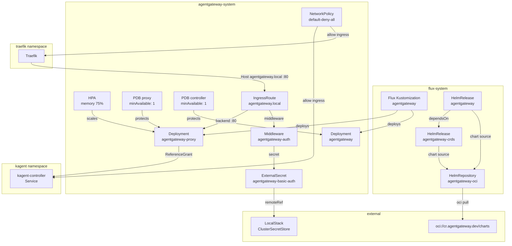
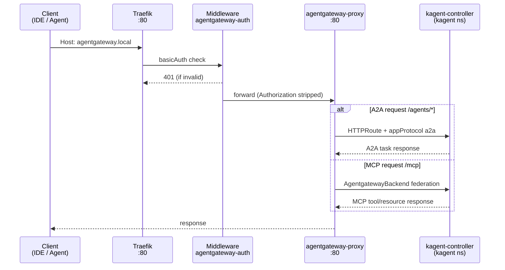

# AgentGateway

[AgentGateway](https://agentgateway.dev) is a Kubernetes-native gateway purpose-built for AI agent communication protocols. It implements the [Gateway API](https://gateway-api.sigs.k8s.io/) specification with extensions for two emerging standards: **A2A** (Agent-to-Agent), Google's protocol for inter-agent discovery and task delegation, and **MCP** (Model Context Protocol), Anthropic's protocol for connecting LLMs to external tool servers.

What distinguishes AgentGateway from generic API gateways (Kong, Ambassador, raw Traefik) is protocol awareness. It understands agent card discovery, A2A task lifecycle semantics, and MCP tool/resource negotiation natively — enabling routing decisions based on agent capabilities rather than just URL paths. It ships as a split-architecture deployment: a **controller** that reconciles Gateway API resources (GatewayClass, Gateway, HTTPRoute) and custom AgentGateway CRDs, and a **proxy** data plane that handles actual request routing to backend agent services.

The project uses Gateway API as its configuration surface, meaning agent routing is declared via standard HTTPRoute resources annotated with protocol-specific metadata rather than proprietary CRDs for basic routing. AgentGateway-specific CRDs (AgentgatewayBackend, AgentgatewayPolicy, AgentgatewayParameters) extend this for MCP federation and agent-specific traffic policy.

## Overview

| Property | Value |
|---|---|
| **Namespace** | `agentgateway-system` |
| **Type** | HelmRelease (chart: `agentgateway` vv1.3.0-alpha.1) |
| **Layer** | AI agent platform |
| **Status** | Enabled |
| **Source** | [`apps/base/agentgateway/base/`](https://github.com/JiwooL0920/flux-infra/tree/develop/apps/base/agentgateway/base/) |

## Dependencies

### Upstream — required before AgentGateway starts

| Service | Reason | Status |
|---|---|---|
| `gateway-api-crds` | Flux `dependsOn` | Active |
| `kagent` | Flux `dependsOn` | Active |
| `traefik` | Flux `dependsOn` | Active |
| `external-secrets-config` | Flux `dependsOn` | Active |

### Downstream — services that depend on AgentGateway

| Service | Dependency type | Reason |
|---|---|---|
| `agentgateway-config` | Flux `dependsOn` | Requires AgentGateway |

## Purpose

AgentGateway is the platform's unified ingress point for all AI agent traffic. It sits between external clients (IDEs, other agent platforms, CLI tools) and the internal kagent-controller, providing two concrete functions:

1. **A2A routing** — External agents discover and delegate tasks to kagent-managed agents via the A2A protocol. AgentGateway resolves agent cards and routes task requests to the correct kagent-controller Service using cross-namespace HTTPRoute references.

2. **MCP federation** — Multiple MCP tool servers running behind kagent are aggregated into a single `/mcp` endpoint. Clients connect once to AgentGateway and gain access to all federated tools without needing to know individual server locations.

The downstream `agentgateway-config` Kustomization applies the actual Gateway, route, and backend CRD instances that wire these capabilities to specific kagent services.

**Why a dedicated agent gateway over routing directly through Traefik:** Traefik handles HTTP/TLS termination and basic path routing well, but it has no awareness of A2A agent cards or MCP tool negotiation. Routing agent traffic directly through Traefik would require encoding all agent discovery logic in application code within kagent itself. AgentGateway externalizes this into infrastructure — agents register via standard Gateway API resources and the gateway handles discovery, load balancing, and protocol negotiation at the network layer.

**Why Gateway API over Ingress:** Gateway API's ReferenceGrant model enables secure cross-namespace routing (agentgateway-system → kagent namespace) without cluster-wide permissions. The experimental features flag enables appProtocol-based routing, which AgentGateway uses to distinguish A2A from standard HTTP traffic on the same port.

## Features

| Feature | Detail |
|---|---|
| **Split CRD installation** | CRDs (AgentgatewayBackend, AgentgatewayPolicy, AgentgatewayParameters) are installed via a separate HelmRelease with CreateReplace upgrade strategy, ensuring CRD availability before the controller starts reconciling |
| **Controller + proxy split architecture** | Controller reconciles Gateway API and AgentGateway CRDs; proxy handles data-plane traffic — each has independent healthChecks in the Flux Kustomization |
| **Gateway API experimental features** | KGW_ENABLE_GATEWAY_API_EXPERIMENTAL_FEATURES=true enables appProtocol-based routing required for A2A protocol discrimination on HTTPRoute backends |
| **BasicAuth via ExternalSecret** | Traefik Middleware pulls htpasswd credentials from LocalStack via ClusterSecretStore; removeHeader=true strips the Authorization header before forwarding to the proxy |
| **Default-deny NetworkPolicy** | All ingress/egress denied by default; explicit policies allow ingress from traefik, kagent, and monitoring namespaces, and egress to kagent, ollama, monitoring, and kube-system DNS (UDP+TCP 53) |
| **Memory-based HPA for proxy** | Proxy scales 1–3 replicas on 75% memory utilization with 300s stabilization window; memory-based because LLM relay workloads are I/O-bound, not CPU-bound |
| **PodDisruptionBudgets** | minAvailable=1 on both proxy and controller ensures A2A and MCP routing survive voluntary disruptions during rolling upgrades |
| **Cross-namespace ReferenceGrant** | Grants agentgateway-system permission to reference Services in the kagent namespace, required by Gateway API security model for HTTPRoute backend references |

## Architecture

### Deployment Topology

### Request Routing Flow

## Configuration

All values sourced from [`base/services/environment.env`](https://github.com/JiwooL0920/flux-infra/blob/develop/base/services/environment.env)
(base); per-environment overrides in [`clusters/stages/dev/.../environment.env`](https://github.com/JiwooL0920/flux-infra/blob/develop/clusters/stages/dev/clusters/services-amer/environment.env).

| Parameter | Dev | Prod |
|---|---|---|
| `AGENTGATEWAY_CHART_VERSION` | `v1.3.0-alpha.1` | `v1.3.0-alpha.1` |
| `AGENTGATEWAY_CPU_LIMIT` | `500m` | `500m` |
| `AGENTGATEWAY_CPU_REQUEST` | `100m` | `100m` |
| `AGENTGATEWAY_MEMORY_LIMIT` | `512Mi` | `512Mi` |
| `AGENTGATEWAY_MEMORY_REQUEST` | `256Mi` | `256Mi` |
| `AGENTGATEWAY_REPLICAS` | `1` | `1` |

## Operations

<!-- TODO: Add operations in service-insights/agentgateway.yaml → operations field -->

## Related

- [`apps/base/agentgateway/base/`](https://github.com/JiwooL0920/flux-infra/tree/develop/apps/base/agentgateway/base/) — Kubernetes manifests
- [`base/services/agentgateway.yaml`](https://github.com/JiwooL0920/flux-infra/blob/develop/base/services/agentgateway.yaml) — Flux Kustomization
- [`base/services/environment.env`](https://github.com/JiwooL0920/flux-infra/blob/develop/base/services/environment.env) — environment variables

---
*Generated from [service-catalog.json](https://github.com/JiwooL0920/flux-infra/blob/develop/service-catalog.json) at commit `198a018` · catalog sha `13ff1d9ca5d91ec4`*