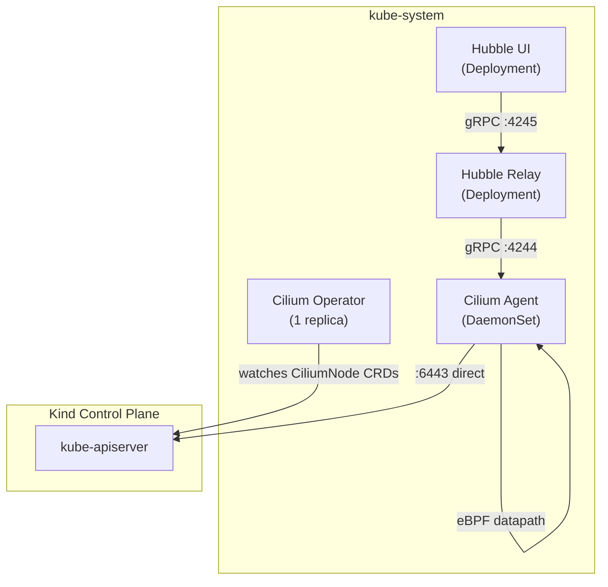
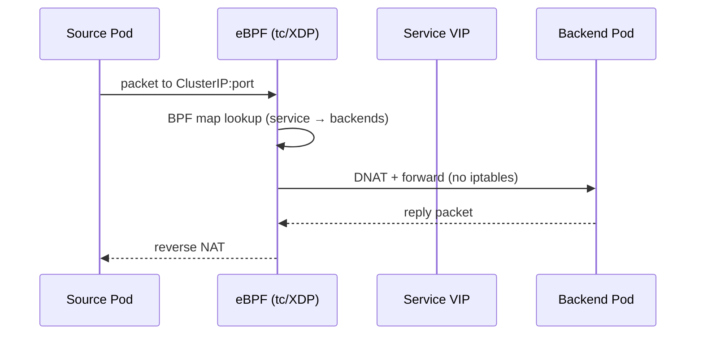

# Cilium

[Cilium](https://cilium.io) ([GitHub](https://github.com/cilium/cilium)) is an eBPF-based networking, observability, and security platform for Kubernetes. Unlike traditional CNI plugins that rely on iptables or userspace proxies for packet processing, Cilium attaches eBPF programs directly to the Linux kernel's networking data path — bypassing the entire netfilter/iptables stack for service routing, load balancing, and network policy enforcement. This yields lower latency, higher throughput, and O(1) rule evaluation regardless of the number of services or policies.

What distinguishes Cilium from other eBPF-capable CNIs (Calico eBPF mode, Antrea) is its integrated observability layer — Hubble — which provides real-time L3/L4/L7 flow visibility without injecting sidecars or running tcpdump. Hubble observes packets at the eBPF hook points already in the data path, meaning observability comes at near-zero marginal cost. Combined with identity-based security (pods are identified by labels, not IPs), Cilium provides a unified networking + security + observability stack in a single DaemonSet.

Cilium is a CNCF Graduated project, widely adopted in production clusters at scale (Google GKE Dataplane V2, AWS EKS Anywhere, Azure AKS).

## Overview

| Property | Value |
|---|---|
| **Namespace** | `kube-system` |
| **Type** | HelmRelease (chart: `cilium` v1.17.2) |
| **Layer** | Foundation services |
| **Status** | Enabled |
| **Source** | [`apps/base/cilium/`](https://github.com/JiwooL0920/fleet-infra/tree/develop/apps/base/cilium/) |

## Dependencies

### Upstream — required before Cilium starts

_No upstream Flux dependencies — starts immediately._

### Downstream — services that depend on Cilium

_No known downstream Flux dependencies._

## Purpose

Cilium replaces both the default Kind CNI (kindnet) and kube-proxy in this platform, serving as the sole networking data path for all pod-to-pod, pod-to-service, and external traffic. It provides three concrete capabilities the platform depends on:

1. **eBPF kube-proxy replacement** — All ClusterIP, NodePort, and LoadBalancer service routing is handled by eBPF maps rather than iptables chains, eliminating the O(n) iptables rule scaling that degrades performance as service count grows.
2. **Hubble network observability** — Real-time flow logs and a topology UI for debugging connectivity issues between platform services (kagent workers, Loki, Grafana, Traefik ingress paths) without deploying additional monitoring infrastructure.
3. **Network policy enforcement** — L3/L4/L7 policy engine available for future segmentation of multi-tenant workloads and security-agent analysis of inter-service communication patterns.

**Why Cilium over kindnet + kube-proxy (the Kind default):** kindnet provides flat L3 connectivity with no policy enforcement, no observability, and relies entirely on kube-proxy's iptables rules for service routing. As this platform runs 25+ services with complex dependency chains, iptables rule count becomes a debugging and performance concern. Cilium consolidates CNI + kube-proxy + network observability into a single component with a single operational surface.

**Why Cilium over Calico:** Calico's eBPF dataplane is a separate opt-in mode that requires additional configuration and lacks an integrated observability UI equivalent to Hubble. For a platform that prioritizes network visibility alongside security scanning (Kubescape), Cilium's integrated Hubble stack reduces operational complexity.

## Features

| Feature | Detail |
|---|---|
| **kube-proxy replacement** | eBPF programs handle all service load balancing and NAT directly in the kernel, configured via `kubeProxyReplacement: true`; the cluster runs with kube-proxy disabled entirely. |
| **Hubble relay** | A centralized gRPC aggregator (`hubble.relay.enabled: true`) that collects per-node flow events from Cilium agents and exposes them via a unified API for CLI queries and the UI. |
| **Hubble UI** | A web-based service dependency map (`hubble.ui.enabled: true`) showing real-time traffic flows between namespaces and services, accessible in-cluster for debugging connectivity. |
| **Kubernetes-native IPAM** | Pod IP allocation delegated to the Kubernetes node CIDR allocator (`ipam.mode: kubernetes`) rather than Cilium's own allocator, ensuring compatibility with Kind's pre-allocated PodCIDRs. |
| **Kind-specific cgroup configuration** | Disables automatic cgroup filesystem mounting (`cgroup.autoMount.enabled: false`) and explicitly sets the host cgroup root to `/sys/fs/cgroup`, required because Kind nodes run as containers with pre-mounted cgroup v2 hierarchies. |
| **Explicit API server endpoint** | Configured with `k8sServiceHost` pointing to the Kind control plane container name and port 6443, bypassing the ClusterIP service for API server connectivity — necessary because Cilium itself provides the service routing that would otherwise resolve the kubernetes service. |

## Architecture

### Cilium Deployment Topology

### Packet Flow — kube-proxy Replacement

## Configuration

All values sourced from [`base/services/environment.env`](https://github.com/JiwooL0920/fleet-infra/blob/develop/base/services/environment.env)
(base); per-environment overrides in [`clusters/stages/dev/.../environment.env`](https://github.com/JiwooL0920/fleet-infra/blob/develop/clusters/stages/dev/clusters/services-amer/environment.env).

| Parameter | Dev | Prod |
|---|---|---|
| `CILIUM_CHART_VERSION` | `1.17.2` | `1.17.2` |

## Operations

<!-- TODO: Add operations in service-insights/cilium.yaml → operations field -->

## Related

- [`apps/base/cilium/`](https://github.com/JiwooL0920/fleet-infra/tree/develop/apps/base/cilium/) — Kubernetes manifests
- [`base/services/cilium.yaml`](https://github.com/JiwooL0920/fleet-infra/blob/develop/base/services/cilium.yaml) — Flux Kustomization
- [`base/services/environment.env`](https://github.com/JiwooL0920/fleet-infra/blob/develop/base/services/environment.env) — environment variables

---
*Generated from [service-catalog.json](https://github.com/JiwooL0920/fleet-infra/blob/develop/service-catalog.json) at commit `09eeed6` · catalog sha `4d088b0b3a67b4c4`*