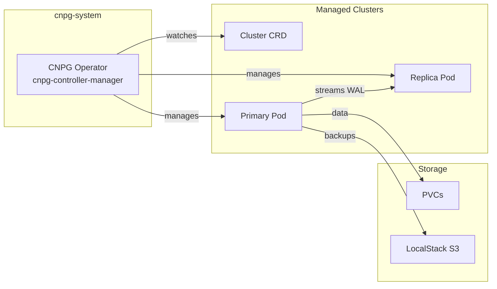

I detect **implementation** intent - writing a documentation page with all context already provided in the prompt file. No exploration needed.

# CNPG Operator

CloudNativePG operator for declarative PostgreSQL lifecycle management on Kubernetes.

## Overview

| Property | Value |
|----------|-------|
| **Namespace** | `cnpg-system` |
| **Type** | HelmRelease |
| **Layer** | Foundation (Layer 0) |
| **Dependencies** | None |
| **Chart** | `cloudnative-pg` v`${CNPG_OPERATOR_CHART_VERSION}` |

## Purpose

The CloudNativePG (CNPG) operator manages PostgreSQL clusters as native Kubernetes resources. It provides automated failover, backup scheduling, and rolling updates — enabling enterprise-grade database operations without manual intervention.

## Features

- **Declarative Management** — PostgreSQL clusters defined as `Cluster` CRDs
- **Automated Failover** — Automatic promotion of replicas on primary failure
- **Point-in-Time Recovery** — Restore to any point via WAL archiving
- **Backup Scheduling** — Automated backups to S3-compatible storage (LocalStack)
- **In-Place Updates** — Instance manager hot-reloads without pod restart
- **Rolling Updates** — Zero-downtime upgrades of PostgreSQL versions
- **Connection Pooling** — Built-in PgBouncer support
- **Monitoring** — PodMonitor enabled for Prometheus metrics scraping
- **Label Inheritance** — Propagates `environment`, `workload`, `app` labels to managed resources

## Architecture



## Configuration

### Operator Settings

| Setting | Value |
|---------|-------|
| Image | `ghcr.io/cloudnative-pg/cloudnative-pg:1.26.0` |
| Replicas | 1 |
| Pull Policy | Always |
| Service Account | `cnpg-manager` |
| In-Place Updates | Enabled |
| Inherited Labels | `environment`, `workload`, `app` |
| Inherited Annotations | `categories` |

### Flux Kustomization

| Setting | Value |
|---------|-------|
| Interval | 5m |
| Retry Interval | 1m |
| Timeout | 3m |
| Prune | true |
| Wait | true |

Variable substitution is sourced from the `cluster-vars` ConfigMap.

## Environment Configuration

| Setting | Dev | Prod |
|---------|-----|------|
| Replicas | 1 | 1 |
| CPU Request | `${CNPG_OPERATOR_CPU_REQUEST}` | `${CNPG_OPERATOR_CPU_REQUEST}` |
| CPU Limit | `${CNPG_OPERATOR_CPU_LIMIT}` | `${CNPG_OPERATOR_CPU_LIMIT}` |
| Memory Request | `${CNPG_OPERATOR_MEMORY_REQUEST}` | `${CNPG_OPERATOR_MEMORY_REQUEST}` |
| Memory Limit | `${CNPG_OPERATOR_MEMORY_LIMIT}` | `${CNPG_OPERATOR_MEMORY_LIMIT}` |

Resource values are injected from `cluster-vars` per environment.

## Managed Resources

The operator creates and manages per `Cluster` CRD:

| Resource | Purpose |
|----------|---------|
| PostgreSQL Pods | Primary and replica instances |
| Services | Read-write (`-rw`) and read-only (`-ro`) endpoints |
| Secrets | Superuser, app user, and replication credentials |
| ConfigMaps | PostgreSQL configuration (`postgresql.conf`) |
| PVCs | Persistent data storage per instance |
| Jobs | Backup and recovery operations |

## Verification

```bash
# Check operator pod
kubectl get pods -n cnpg-system

# Check operator deployment health
kubectl get deploy cnpg-operator-cloudnative-pg -n cnpg-system

# Check operator logs
kubectl logs -n cnpg-system deploy/cnpg-operator-cloudnative-pg

# Verify CRDs are installed
kubectl get crd | grep cnpg

# List managed clusters
kubectl get clusters -A
```

## Troubleshooting

### Operator not starting

```bash
# Check pod status and events
kubectl describe pod -n cnpg-system -l app.kubernetes.io/name=cloudnative-pg

# Check namespace events
kubectl get events -n cnpg-system --sort-by='.lastTimestamp'

# Check resource constraints
kubectl top pod -n cnpg-system
```

### CRDs not recognized

```bash
# Verify CRDs installed
kubectl get crd | grep cnpg

# Check HelmRelease status
kubectl get helmrelease cnpg-operator -n flux-system

# Force reconciliation
flux reconcile helmrelease cnpg-operator -n flux-system
```

### Cluster not being reconciled

```bash
# Check operator logs for errors
kubectl logs -n cnpg-system deploy/cnpg-operator-cloudnative-pg --tail=50

# Check cluster status
kubectl describe cluster <cluster-name> -n <namespace>

# Verify operator is watching the namespace
kubectl get events -n <namespace> --field-selector reason=Creating
```

## Related

- [PostgreSQL Cluster](postgresql.md) — Managed database instances
- [Architecture](../architecture.md) — System design and dependency graph
