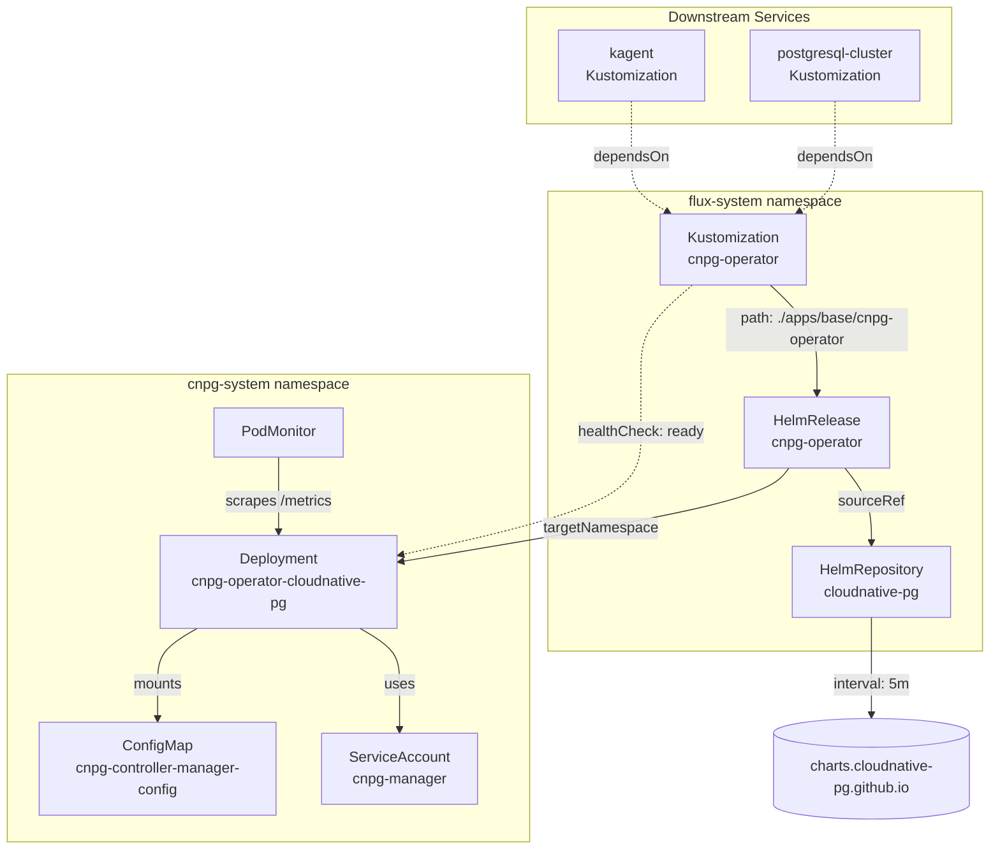

# CNPG Operator

[CloudNative-PG](https://cloudnative-pg.io) ([GitHub](https://github.com/cloudnative-pg/cloudnative-pg)) is a Kubernetes operator purpose-built for managing the full lifecycle of PostgreSQL clusters. Unlike generic database operators (KubeDB, Zalando Postgres Operator, CrunchyData PGO), CNPG was designed from scratch for Kubernetes-native PostgreSQL — no legacy abstractions from pre-container eras. It handles provisioning, high availability via streaming replication, automated failover, continuous backup to object storage, and rolling upgrades without external tooling like Patroni or Stolon.

What distinguishes CNPG from alternatives: it implements the PostgreSQL instance manager as a single binary injected into the database pod (no sidecar orchestrator), supports declarative database/role provisioning via Kubernetes CRDs, and integrates natively with the Kubernetes scheduler for pod disruption budgets, topology spread, and node affinity. The operator itself is stateless — all cluster state lives in the managed PostgreSQL pods and their PVCs.

CNPG follows the Kubernetes operator pattern: a controller loop watches `Cluster`, `Backup`, `ScheduledBackup`, and `Pooler` custom resources, reconciling desired state against actual state. This makes it fully GitOps-compatible — cluster topology changes are just YAML diffs that Flux applies like any other resource.

## Overview

| Property | Value |
|---|---|
| **Namespace** | `cnpg-system` |
| **Type** | HelmRelease (chart: `cloudnative-pg` v0.24.0) |
| **Layer** | Foundation services |
| **Chart** | [`cloudnative-pg`](https://cloudnative-pg.github.io/charts) v0.24.0 |
| **Status** | Enabled |
| **Source** | [`apps/base/cnpg-operator/`](https://github.com/JiwooL0920/flux-infra/tree/develop/apps/base/cnpg-operator/) |

## Dependencies

### Upstream — required before CNPG Operator starts

_No upstream Flux dependencies — starts immediately._

### Downstream — services that depend on CNPG Operator

| Service | Dependency type | Reason |
|---|---|---|
| `postgresql-cluster` | Flux `dependsOn` | Requires CNPG Operator |
| `kagent` | Flux `dependsOn` | Requires CNPG Operator |

## Purpose

CNPG Operator is the foundation-layer controller that manages the platform's shared PostgreSQL cluster. It watches for `Cluster` CRDs (deployed by the downstream `postgresql-cluster` service) and reconciles the actual database instances — handling pod scheduling, replication topology, automated failover, and backup orchestration.

In this platform, it underpins every stateful workload that needs relational storage: n8n workflows, Temporal execution history and visibility, Grafana dashboards, kagent state, and application databases. The operator runs as a single deployment in `cnpg-system` and is intentionally dependency-free (no `dependsOn`) so it starts immediately on cluster bootstrap, ready to reconcile database clusters as soon as they're applied.


## Features

| Feature | Detail |
|---|---|
| **In-place instance manager updates** | Enabled via `ENABLE_INSTANCE_MANAGER_INPLACE_UPDATES` — allows the operator to hot-patch the instance manager binary inside running PostgreSQL pods without requiring a full pod restart, reducing update disruption for minor operator upgrades. |
| **Label and annotation inheritance** | Configured to propagate `environment`, `workload`, and `app` labels plus `categories` annotations from Cluster CRDs down to managed pods, enabling consistent observability grouping and cost attribution across all database instances. |
| **PodMonitor metrics exposure** | Operator metrics are scraped via a Prometheus PodMonitor, exposing reconciliation latency, queue depth, and managed cluster health without requiring a separate ServiceMonitor or manual scrape config. |
| **Install and upgrade remediation** | HelmRelease configured with 3 retries and 10-minute timeouts for both install and upgrade operations, preventing transient failures (CRD registration races, webhook cert provisioning) from leaving the operator in a degraded state. |
| **Flux health gating** | Kustomization includes a healthCheck on the operator Deployment — downstream services (postgresql-cluster, kagent) will not begin reconciliation until the operator pods are fully ready, preventing CRD-not-found errors during initial bootstrap. |

## Architecture

### Operator Deployment Topology & Downstream Relationship




## Configuration

All values sourced from [`base/services/environment.env`](https://github.com/JiwooL0920/flux-infra/blob/develop/base/services/environment.env)
(base); per-environment overrides in [`clusters/stages/dev/.../environment.env`](https://github.com/JiwooL0920/flux-infra/blob/develop/clusters/stages/dev/clusters/services-amer/environment.env).

| Parameter | Dev | Prod |
|---|---|---|
| `CNPG_OPERATOR_CHART_VERSION` | `0.24.0` | `0.24.0` |
| `CNPG_OPERATOR_CPU_LIMIT` | `200m` | `1000m` |
| `CNPG_OPERATOR_CPU_REQUEST` | `200m` | `200m` |
| `CNPG_OPERATOR_MEMORY_LIMIT` | `128Mi` | `512Mi` |
| `CNPG_OPERATOR_MEMORY_REQUEST` | `128Mi` | `256Mi` |


## Operations

### Operator pod CrashLoopBackOff after upgrade

**Symptoms:** `cnpg-operator-cloudnative-pg` deployment in `cnpg-system` shows pods in CrashLoopBackOff. Flux Kustomization `cnpg-operator` reports `Health check failed` and downstream services (`postgresql-cluster`) are blocked. Alert: `KubePodCrashLooping`.

```bash
kubectl -n cnpg-system logs deploy/cnpg-operator-cloudnative-pg --previous | tail -50
kubectl -n cnpg-system describe deploy cnpg-operator-cloudnative-pg
kubectl get crd clusters.postgresql.cnpg.io -o jsonpath='{.status.storedVersions}'
kubectl -n flux-system get helmrelease cnpg-operator -o jsonpath='{.status.conditions[*].message}'
# If CRD version mismatch — force CRD update from chart:
kubectl -n flux-system annotate helmrelease cnpg-operator reconcile.fluxcd.io/requestedAt=$(date +%s) --overwrite
```

---

### Webhook certificate not ready — admission failures

**Symptoms:** New Cluster CRs or updates to existing clusters are rejected with `Internal error occurred: failed calling webhook "mcluster.cnpg.io"` or `connection refused` to the webhook service. Operator pod itself is Running.

```bash
kubectl -n cnpg-system get validatingwebhookconfigurations -l app.kubernetes.io/name=cloudnative-pg
kubectl -n cnpg-system get secret cnpg-webhook-cert -o jsonpath='{.data.tls\.crt}' | base64 -d | openssl x509 -noout -dates
kubectl -n cnpg-system rollout restart deploy/cnpg-operator-cloudnative-pg
# Wait for webhook cert regeneration:
kubectl -n cnpg-system wait --for=condition=Available deploy/cnpg-operator-cloudnative-pg --timeout=120s
kubectl get validatingwebhookconfigurations -l app.kubernetes.io/name=cloudnative-pg -o jsonpath='{.items[0].webhooks[0].clientConfig.caBundle}' | wc -c
```

---

### HelmRelease stuck in upgrade — Flux timeout

**Symptoms:** `kubectl -n flux-system get helmrelease cnpg-operator` shows `upgrade retries exhausted` or `Helm upgrade failed: timed out waiting for the condition`. The operator deployment may be partially rolled out with mixed old/new pods.

```bash
kubectl -n flux-system describe helmrelease cnpg-operator | grep -A5 'Last Applied'
kubectl -n cnpg-system rollout status deploy/cnpg-operator-cloudnative-pg --timeout=30s
kubectl -n cnpg-system get events --sort-by='.lastTimestamp' | tail -20
# If stuck on resource quota or scheduling:
kubectl -n cnpg-system describe pod -l app.kubernetes.io/name=cloudnative-pg | grep -A3 'Conditions'
# Force Flux to retry:
kubectl -n flux-system annotate helmrelease cnpg-operator reconcile.fluxcd.io/requestedAt=$(date +%s) --overwrite
```

---

### Operator not reconciling managed clusters

**Symptoms:** PostgreSQL Cluster CR shows stale `.status.phase` (e.g. stuck in `Setting up primary`). Operator pod is Running but cluster pods are not being created or updated. No recent events on the Cluster resource.

```bash
kubectl -n cnpg-system logs deploy/cnpg-operator-cloudnative-pg --since=10m | grep -i 'error\|reconcil'
kubectl -n cnpg-system top pod -l app.kubernetes.io/name=cloudnative-pg
# Check if operator leader election is healthy:
kubectl -n cnpg-system get lease cnpg-controller-manager -o jsonpath='{.spec.holderIdentity}'
# Check RBAC — operator needs cluster-wide permissions:
kubectl auth can-i list clusters.postgresql.cnpg.io --as=system:serviceaccount:cnpg-system:cnpg-manager
# If leader lease is stale, restart to force re-election:
kubectl -n cnpg-system rollout restart deploy/cnpg-operator-cloudnative-pg
```

---

### ConfigMap substitution not applied — raw variable placeholders in resources

**Symptoms:** Operator resources show literal `${CNPG_OPERATOR_CPU_LIMIT}` strings instead of resolved values. Pods fail to schedule due to invalid resource specifications.

```bash
kubectl -n flux-system get configmap cluster-vars -o yaml | grep CNPG_OPERATOR
kubectl -n flux-system get kustomization cnpg-operator -o jsonpath='{.status.conditions[*].message}'
# Verify substituteFrom reference is valid:
kubectl -n flux-system get kustomization cnpg-operator -o jsonpath='{.spec.postBuild.substituteFrom}'
# Force re-reconciliation of the Kustomization:
kubectl -n flux-system annotate kustomization cnpg-operator reconcile.fluxcd.io/requestedAt=$(date +%s) --overwrite
```
**See also:** docs/adr/004-single-shared-postgresql-cluster.md

---


## Related


- [`apps/base/cnpg-operator/`](https://github.com/JiwooL0920/flux-infra/tree/develop/apps/base/cnpg-operator/) — Kubernetes manifests
- [`base/services/cnpg-operator.yaml`](https://github.com/JiwooL0920/flux-infra/blob/develop/base/services/cnpg-operator.yaml) — Flux Kustomization
- [`base/services/environment.env`](https://github.com/JiwooL0920/flux-infra/blob/develop/base/services/environment.env) — environment variables

---
*Generated from [service-catalog.json](https://github.com/JiwooL0920/flux-infra/blob/develop/service-catalog.json) at commit `165b485` · catalog sha `4d088b0b3a67b4c4`*