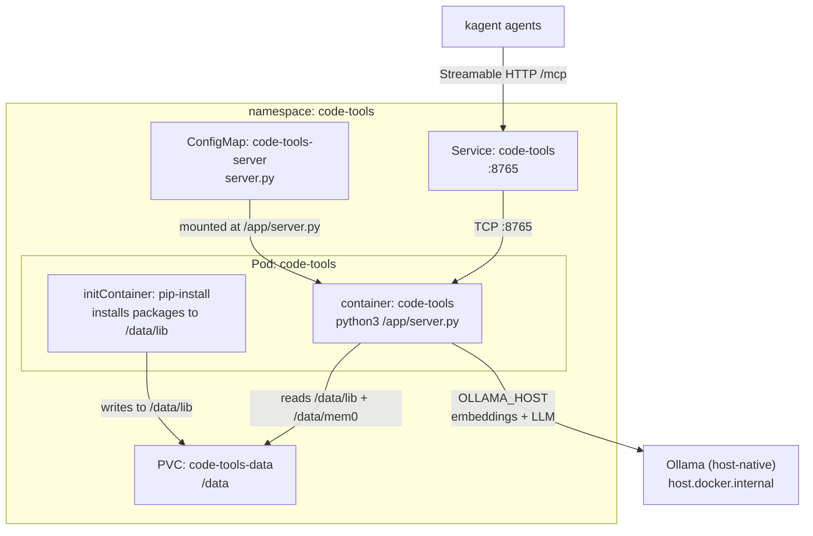
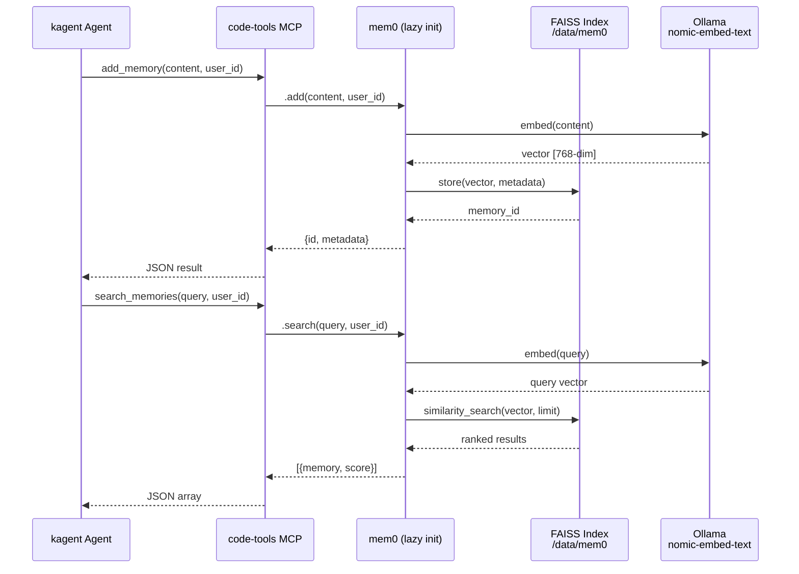

# Code Tools

[FastMCP](https://github.com/jlowin/fastmcp) is a Python framework for building Model Context Protocol (MCP) servers — the emerging standard for exposing tools to LLM agents. MCP defines a typed RPC layer where an agent discovers available tools, calls them with structured arguments, and receives structured results. FastMCP simplifies this by letting you decorate plain Python functions as tools and handling transport negotiation, schema generation, and error propagation automatically.

What distinguishes MCP from ad-hoc function-calling integrations: it is transport-agnostic (stdio, SSE, Streamable HTTP), supports tool discovery at runtime, and provides a standardized protocol that any compliant agent can consume without custom client code. This means a single MCP server can serve multiple agent frameworks simultaneously.

code-tools is a custom FastMCP server deployed as a single-replica Deployment. Its server script is maintained inline as a ConfigMap — the entire application logic lives in the Kubernetes manifests, making it trivially auditable and versionable through GitOps without a separate container image build pipeline.

## Overview

| Property | Value |
|---|---|
| **Namespace** | `code-tools` |
| **Type** | Deployment |
| **Layer** | AI agent platform |
| **Status** | Enabled |
| **Source** | [`apps/base/code-tools/`](https://github.com/JiwooL0920/flux-infra/tree/develop/apps/base/code-tools/) |

## Dependencies

### Upstream — required before Code Tools starts

_No upstream Flux dependencies — starts immediately._

### Downstream — services that depend on Code Tools

_No known downstream Flux dependencies._

## Purpose

code-tools is the shared tool backend for kagent agents in this platform. It exposes six tools over Streamable HTTP that give agents runtime capabilities they cannot perform inline: executing arbitrary Python in a sandboxed subprocess, making outbound HTTP requests to arbitrary URLs, retrieving wall-clock time, and persisting/retrieving semantic memories across agent sessions.

The memory subsystem uses mem0 with a FAISS vector store backed by a PVC, with embeddings generated by Ollama's nomic-embed-text model running on the host. This gives agents persistent, semantically-searchable memory that survives pod restarts and agent session boundaries — enabling multi-session context continuity without relying on ever-growing prompt histories.

**Why a dedicated MCP server over embedding tools directly in each agent:** kagent agents are stateless by design — they receive a task, execute it, and terminate. Giving every agent its own code execution environment and memory store would mean duplicated state, no cross-agent memory sharing, and no central audit point. A shared MCP server centralizes tool execution, persists memory in one place, and lets any agent (regardless of model or prompt) access the same capabilities through a standard protocol.

**Why ConfigMap-inline code over a built container image:** The server is ~340 lines of Python with four pip dependencies. Building and pushing a container image for every tool change adds CI latency and registry maintenance for negligible benefit. The ConfigMap approach means a `git push` to the manifests is the entire deployment pipeline — Flux reconciles the ConfigMap, the Deployment rolls, and the new tools are live. The trade-off is that the initContainer must install packages on first boot (~2-3 min cold start), but subsequent restarts use the PVC-cached `/data/lib`.

**Why FAISS over a dedicated vector database (Qdrant, Milvus, Weaviate):** The memory workload is small-scale — a single user's agent memories, not millions of documents. FAISS provides zero-dependency vector search that persists to a flat file on the PVC. No additional StatefulSet, no cluster coordination, no backup complexity. If memory scale grows beyond what a single FAISS index handles efficiently, migration to a dedicated vector store is straightforward since mem0 abstracts the backend.


## Features

| Feature | Detail |
|---|---|
| **Subprocess-sandboxed code execution** | Python code runs in a forked subprocess with configurable timeout (max 120s) and on-demand pip package installation, isolating agent-generated code from the MCP server process itself. |
| **Dynamic package installation with PVC caching** | The initContainer pre-installs core dependencies (fastmcp, httpx, mem0ai) to /data/lib on a persistent volume; runtime pip installs from execute_python are also cached there, eliminating repeated downloads across pod restarts. |
| **Persistent semantic memory via mem0 + FAISS** | Memories are vectorized using Ollama nomic-embed-text (768-dim), stored in a FAISS index on the PVC at /data/mem0, and queryable via semantic search — giving agents cross-session recall without external database infrastructure. |
| **Streamable HTTP MCP transport** | The server exposes tools at /mcp on port 8765 using the Streamable HTTP transport, compatible with kagent's RemoteMCPServer protocol for bidirectional tool invocation over a single HTTP connection. |
| **Lazy memory initialization** | The mem0/FAISS backend initializes only on first memory tool invocation, not at server startup — keeping cold-start latency low for agents that only need code execution or HTTP tools. |
| **ConfigMap-as-code deployment** | The entire server application is a single Python file stored in a ConfigMap and mounted at /app/server.py, enabling tool modifications through GitOps manifest changes without container image rebuilds. |

## Architecture

### code-tools Pod Topology



### Memory Tool Flow




## Configuration

All values sourced from [`base/services/environment.env`](https://github.com/JiwooL0920/flux-infra/blob/develop/base/services/environment.env)
(base); per-environment overrides in [`clusters/stages/dev/.../environment.env`](https://github.com/JiwooL0920/flux-infra/blob/develop/clusters/stages/dev/clusters/services-amer/environment.env).

| Parameter | Dev | Prod |
|---|---|---|
| `CODE_TOOLS_CPU_LIMIT` | `1000m` | `1000m` |
| `CODE_TOOLS_CPU_REQUEST` | `100m` | `100m` |
| `CODE_TOOLS_DATA_STORAGE_SIZE` | `2Gi` | `2Gi` |
| `CODE_TOOLS_EMBED_MODEL` | `nomic-embed-text` | `nomic-embed-text` |
| `CODE_TOOLS_MEMORY_LIMIT` | `1Gi` | `1Gi` |
| `CODE_TOOLS_MEMORY_REQUEST` | `256Mi` | `256Mi` |
| `CODE_TOOLS_OLLAMA_MODEL` | `qwen2.5:14b-kagent` | `qwen2.5:14b-kagent` |


## Operations

### Pod stuck in Init phase — pip install timeout

**Symptoms:** Pod shows `Init:0/1` for >5 minutes. `kubectl describe pod` shows initContainer `pip-install` still running or OOMKilled. Network-restricted environments may show pip timeout errors in init logs.

```bash
kubectl -n code-tools logs -l app.kubernetes.io/name=code-tools -c pip-install --tail=50
kubectl -n code-tools describe pod -l app.kubernetes.io/name=code-tools | grep -A5 'Init Containers'
kubectl -n code-tools get pvc code-tools-data -o jsonpath='{.status.phase}'
# If PVC not bound, check storage class availability:
kubectl get pv | grep code-tools
# If pip consistently fails, exec into a debug pod to test outbound connectivity:
kubectl -n code-tools run debug --rm -it --image=python:3.11-slim -- pip install --dry-run fastmcp
```

---

### MCP server unreachable from kagent

**Symptoms:** Kagent agent logs show connection refused or timeout when invoking code-tools. The `RemoteMCPServer` resource shows unhealthy status. Service endpoint list may be empty.

```bash
kubectl -n code-tools get endpoints code-tools
kubectl -n code-tools get pods -l app.kubernetes.io/name=code-tools -o wide
kubectl -n code-tools logs -l app.kubernetes.io/name=code-tools --tail=30
# Verify the server is listening on port 8765:
kubectl -n code-tools exec deploy/code-tools -- ss -tlnp | grep 8765
# Test MCP endpoint from within the cluster:
kubectl -n code-tools run curl-test --rm -it --image=curlimages/curl -- curl -s http://code-tools.code-tools.svc:8765/mcp
```

---

### Memory tools failing — Ollama connection refused

**Symptoms:** `add_memory` or `search_memories` returns `ConnectionRefusedError` or `httpx.ConnectError`. execute_python and make_http_request still work normally since they don't depend on Ollama.

```bash
kubectl -n code-tools logs -l app.kubernetes.io/name=code-tools --tail=20 | grep -i ollama
# Verify OLLAMA_HOST env var resolves correctly:
kubectl -n code-tools exec deploy/code-tools -- python3 -c "import os; print(os.environ.get('OLLAMA_HOST'))"
# Test Ollama connectivity from the pod:
kubectl -n code-tools exec deploy/code-tools -- python3 -c "import httpx; print(httpx.get(os.environ['OLLAMA_HOST']+'/api/tags').status_code)"
# If using host.docker.internal (native Ollama), verify host networking:
kubectl -n code-tools exec deploy/code-tools -- getent hosts host.docker.internal
# Check if Ollama process is running on the host:
curl -s http://localhost:11434/api/tags | jq '.models[].name'
```

---

### FAISS index corruption — search returns errors

**Symptoms:** `search_memories` or `list_memories` returns `RuntimeError` or `faiss` deserialization errors. `add_memory` may also fail if the index file is locked or corrupted. Pod logs show mem0 initialization failure.

```bash
kubectl -n code-tools logs -l app.kubernetes.io/name=code-tools --tail=50 | grep -i 'faiss\|mem0\|index'
# Check PVC contents and index file sizes:
kubectl -n code-tools exec deploy/code-tools -- ls -la /data/mem0/
# If index is corrupted, backup and reset (memories will be lost):
kubectl -n code-tools exec deploy/code-tools -- cp -r /data/mem0 /data/mem0-backup-$(date +%s)
kubectl -n code-tools exec deploy/code-tools -- rm -rf /data/mem0/kagent_memories*
# Restart pod to reinitialize mem0 with fresh index:
kubectl -n code-tools rollout restart deploy/code-tools
```

---

### execute_python tool hanging — zombie subprocess

**Symptoms:** Agent tool calls to `execute_python` never return. Pod CPU usage spikes. Subsequent calls also hang because the subprocess pool is exhausted or the event loop is blocked.

```bash
kubectl -n code-tools top pod -l app.kubernetes.io/name=code-tools
# Check for zombie or long-running python subprocesses:
kubectl -n code-tools exec deploy/code-tools -- ps aux | grep python
# Kill stuck subprocesses manually:
kubectl -n code-tools exec deploy/code-tools -- pkill -f 'python3 /tmp/tmp'
# If pod is unresponsive, force restart:
kubectl -n code-tools delete pod -l app.kubernetes.io/name=code-tools --force --grace-period=0
# Check if the timeout mechanism is working (should cap at 120s):
kubectl -n code-tools logs -l app.kubernetes.io/name=code-tools --tail=100 | grep -i timeout
```

---


## Related


- [`apps/base/code-tools/`](https://github.com/JiwooL0920/flux-infra/tree/develop/apps/base/code-tools/) — Kubernetes manifests
- [`base/services/code-tools.yaml`](https://github.com/JiwooL0920/flux-infra/blob/develop/base/services/code-tools.yaml) — Flux Kustomization
- [`base/services/environment.env`](https://github.com/JiwooL0920/flux-infra/blob/develop/base/services/environment.env) — environment variables

---
*Generated from [service-catalog.json](https://github.com/JiwooL0920/flux-infra/blob/develop/service-catalog.json) at commit `b34ec5b` · catalog sha `3ae810da5633a72b`*