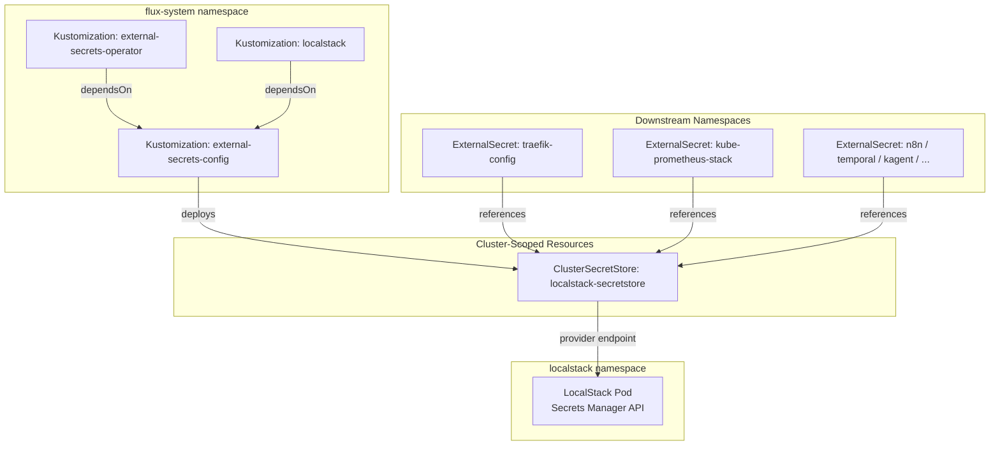

# External Secrets Config

[External Secrets Operator](https://external-secrets.io) (ESO) is a Kubernetes operator that synchronizes secrets from external providers (AWS Secrets Manager, HashiCorp Vault, Azure Key Vault, GCP Secret Manager, and others) into native Kubernetes Secrets. It decouples secret lifecycle management from application deployment — secrets are declared as `ExternalSecret` custom resources that reference a `SecretStore` or `ClusterSecretStore`, and the operator continuously reconciles the desired state against the external provider.

A **ClusterSecretStore** is the cluster-wide variant of ESO's provider connection. Unlike namespace-scoped `SecretStore` resources, a single `ClusterSecretStore` can serve `ExternalSecret` resources in any namespace, eliminating the need to duplicate provider credentials across every namespace that needs secrets.

This `external-secrets-config` service is not the operator itself — it is the **configuration layer** that deploys the `ClusterSecretStore` resource connecting ESO to the platform's secrets backend. It exists as a separate Flux Kustomization so that the operator CRDs and controller can be fully healthy before any custom resources are applied.

## Overview

| Property | Value |
|---|---|
| **Namespace** | `external-secrets-config` |
| **Type** | Kustomization |
| **Layer** | Foundation services |
| **Status** | Enabled |
| **Source** | [`apps/base/external-secrets-config/`](https://github.com/JiwooL0920/fleet-infra/tree/develop/apps/base/external-secrets-config/) |

## Dependencies

### Upstream — required before External Secrets Config starts

| Service | Reason | Status |
|---|---|---|
| `external-secrets-operator` | Flux `dependsOn` | Active |
| `localstack` | Flux `dependsOn` | Active |

### Downstream — services that depend on External Secrets Config

| Service | Dependency type | Reason |
|---|---|---|
| `traefik-config` | Flux `dependsOn` | Requires External Secrets Config |
| `kube-prometheus-stack` | Flux `dependsOn` | Requires External Secrets Config |
| `loki` | Flux `dependsOn` | Requires External Secrets Config |
| `redis-sentinel` | Flux `dependsOn` | Requires External Secrets Config |
| `n8n` | Flux `dependsOn` | Requires External Secrets Config |
| `temporal` | Flux `dependsOn` | Requires External Secrets Config |
| `kagent` | Flux `dependsOn` | Requires External Secrets Config |
| `agentgateway` | Flux `dependsOn` | Requires External Secrets Config |
| `pgadmin4` | Flux `dependsOn` | Requires External Secrets Config |

## Purpose

This service deploys a single `ClusterSecretStore` named `localstack-secretstore` that connects the External Secrets Operator to LocalStack's Secrets Manager API. Every downstream service that needs credentials — databases, monitoring stacks, application services — declares an `ExternalSecret` that references this store. By gating readiness on a health check against the `ClusterSecretStore`, Flux guarantees that no downstream service attempts secret synchronization before the provider connection is verified healthy.

Nine services depend on this configuration being reconciled and healthy before they can start: traefik-config, kube-prometheus-stack, loki, redis-sentinel, n8n, temporal, kagent, agentgateway, and pgadmin4.

**Why a separate Kustomization from the operator:** CRD installation and controller startup must complete before any CR can be applied. Splitting config from operator allows Flux's `dependsOn` to enforce this ordering without relying on retry loops or apply-time errors. The operator Kustomization handles CRDs and the controller Deployment; this Kustomization handles the `ClusterSecretStore` CR that depends on those CRDs existing.

**Why ClusterSecretStore over namespace-scoped SecretStores:** With 9+ consuming namespaces, replicating provider credentials into each namespace creates operational overhead and secret sprawl. A single `ClusterSecretStore` provides one point of configuration for the LocalStack endpoint, and any namespace can reference it without needing its own copy of the provider connection.

**Why LocalStack as the secrets backend:** In a development/homelab context, LocalStack provides an AWS-compatible Secrets Manager API without cloud costs or external network dependencies. Secrets are auto-seeded via LocalStack init hooks on startup, making the cluster fully self-bootstrapping with no manual secret initialization required.

## Features

| Feature | Detail |
|---|---|
| **Cluster-wide secret store** | Deploys a ClusterSecretStore accessible from any namespace, eliminating per-namespace provider credential duplication. |
| **Health-gated readiness** | Flux health check on the ClusterSecretStore resource blocks all 9 downstream services until the provider connection is verified healthy. |
| **Variable substitution** | Uses postBuild substituteFrom with the cluster-vars ConfigMap, allowing environment-specific endpoint configuration without manifest duplication. |
| **Ordered dependency chain** | Depends on both external-secrets-operator (CRDs and controller) and localstack (secrets backend with pre-seeded data), ensuring the store is only created when both prerequisites are operational. |
| **Wait semantics** | Configured with wait=true and 5m timeout, meaning Flux will not report this Kustomization as ready until the ClusterSecretStore passes its health check. |

## Architecture

### Secret Distribution Topology

## Configuration

All values sourced from [`base/services/environment.env`](https://github.com/JiwooL0920/fleet-infra/blob/develop/base/services/environment.env)
(base); per-environment overrides in [`clusters/stages/dev/.../environment.env`](https://github.com/JiwooL0920/fleet-infra/blob/develop/clusters/stages/dev/clusters/services-amer/environment.env).

_No environment-specific configuration variables for this service._

## Operations

<!-- TODO: Add operations in service-insights/external-secrets-config.yaml → operations field -->

## Related

- [`apps/base/external-secrets-config/`](https://github.com/JiwooL0920/fleet-infra/tree/develop/apps/base/external-secrets-config/) — Kubernetes manifests
- [`base/services/external-secrets-config.yaml`](https://github.com/JiwooL0920/fleet-infra/blob/develop/base/services/external-secrets-config.yaml) — Flux Kustomization
- [`base/services/environment.env`](https://github.com/JiwooL0920/fleet-infra/blob/develop/base/services/environment.env) — environment variables

---
*Generated from [service-catalog.json](https://github.com/JiwooL0920/fleet-infra/blob/develop/service-catalog.json) at commit `09eeed6` · catalog sha `4d088b0b3a67b4c4`*