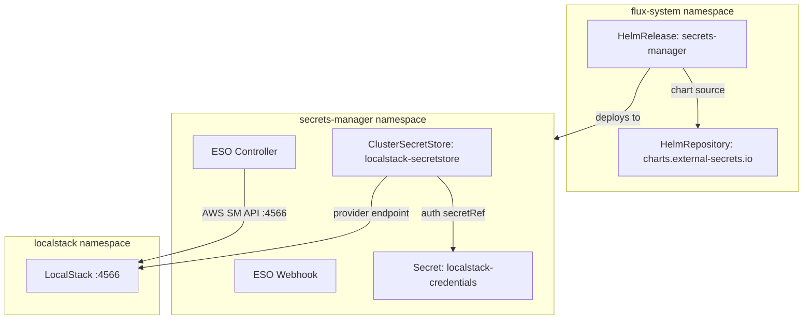
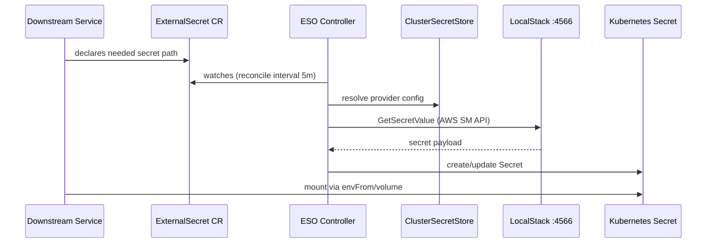

# External Secrets Operator

[External Secrets Operator](https://external-secrets.io) ([GitHub](https://github.com/external-secrets/external-secrets)) is a Kubernetes operator that synchronizes secrets from external secret management systems into native Kubernetes `Secret` objects. Unlike alternatives that require sidecar injection (Vault Agent) or custom volume drivers (Secrets Store CSI), ESO operates as a reconciliation controller — it watches `ExternalSecret` custom resources, fetches the referenced secret data from a configured provider, and materializes it as a standard `Secret` that any pod can consume via `envFrom` or volume mounts.

The operator introduces three key CRDs: `SecretStore` / `ClusterSecretStore` (provider connection configuration), `ExternalSecret` (declarative mapping from external path to K8s Secret), and `PushSecret` (reverse sync from K8s into the external provider). This CRD-based model makes secret consumption fully GitOps-compatible — teams declare what secrets they need without embedding credentials in manifests or Helm values.

ESO supports a wide matrix of backends (AWS Secrets Manager, GCP Secret Manager, Azure Key Vault, HashiCorp Vault, 1Password, and others) through a pluggable provider architecture. The same `ExternalSecret` manifest can target different backends by swapping only the `SecretStore` reference, enabling environment portability without manifest changes.

## Overview

| Property | Value |
|---|---|
| **Namespace** | `secrets-manager` |
| **Type** | HelmRelease (chart: `external-secrets` v0.10.7) |
| **Layer** | Foundation services |
| **Chart** | [`external-secrets`](https://charts.external-secrets.io) v0.10.7 |
| **Status** | Enabled |
| **Source** | [`apps/base/external-secrets-operator/`](https://github.com/JiwooL0920/flux-infra/tree/develop/apps/base/external-secrets-operator/) |

## Dependencies

### Upstream — required before External Secrets Operator starts

| Service | Reason | Status |
|---|---|---|
| `localstack` | Flux `dependsOn` | Active |

### Downstream — services that depend on External Secrets Operator

| Service | Dependency type | Reason |
|---|---|---|
| `external-secrets-config` | Flux `dependsOn` | Requires External Secrets Operator |
| `crossplane-config` | Flux `dependsOn` | Requires External Secrets Operator |

## Purpose

External Secrets Operator is the platform's secret materialization layer. It bridges the gap between LocalStack's AWS Secrets Manager emulation (the authoritative secret store for this cluster) and the Kubernetes `Secret` objects that application workloads actually mount. Every service that needs credentials — database passwords, API keys, admin tokens — declares an `ExternalSecret` that the operator reconciles into a native Secret, eliminating manual `kubectl create secret` operations and ensuring secrets regenerate automatically on cluster rebuild.

The operator also enables the `PushSecret` flow used by services like CNPG that generate credentials at runtime and need to push them back into the secret store for consumption by other services.

**Why External Secrets Operator over alternatives:** The primary requirement was production portability — the same `ExternalSecret` manifests must work against LocalStack in development and a real AWS Secrets Manager in production, with only the `ClusterSecretStore` differing between environments. SOPS and Sealed Secrets both commit encrypted material to Git (non-portable, environment-specific keys). The Secrets Store CSI Driver requires sidecar injection and doesn't support the push-secret pattern needed for CNPG credential propagation. ESO's reconciliation model also means secrets self-heal on drift — if a Secret is accidentally deleted, the operator recreates it within the reconciliation interval.


## Features

| Feature | Detail |
|---|---|
| **ClusterSecretStore with LocalStack backend** | A cluster-scoped store targeting LocalStack's Secrets Manager API at port 4566, authenticated via a static K8s Secret with test credentials — enabling all namespaces to reference a single provider without per-namespace configuration. |
| **Explicit endpoint override for non-AWS environments** | The controller is configured with AWS_SECRETSMANAGER_ENDPOINT and AWS_STS_ENDPOINT environment variables pointing to LocalStack's in-cluster service, with EC2 metadata and SDK config loading disabled to prevent accidental real-AWS calls. |
| **CRD auto-installation** | The Helm chart deploys all ESO CRDs (ExternalSecret, SecretStore, ClusterSecretStore, PushSecret) as part of the release, ensuring the API types exist before downstream kustomizations attempt to create instances. |
| **Webhook with independent scaling** | The validating/mutating webhook runs as a separate deployment with its own replica count and resource budget, decoupling admission latency from the main controller's reconciliation load. |
| **Install and upgrade remediation** | Both install and upgrade operations are configured with 3 retries and a 10-minute timeout, tolerating transient failures during LocalStack startup without manual intervention. |

## Architecture

### Deployment Topology



### Secret Reconciliation Flow




## Configuration

All values sourced from [`base/services/environment.env`](https://github.com/JiwooL0920/flux-infra/blob/develop/base/services/environment.env)
(base); per-environment overrides in [`clusters/stages/dev/.../environment.env`](https://github.com/JiwooL0920/flux-infra/blob/develop/clusters/stages/dev/clusters/services-amer/environment.env).

| Parameter | Dev | Prod |
|---|---|---|
| `EXTERNAL_SECRETS_CHART_VERSION` | `0.10.7` | `0.10.7` |
| `EXTERNAL_SECRETS_CPU_LIMIT` | `100m` | `500m` |
| `EXTERNAL_SECRETS_CPU_REQUEST` | `100m` | `100m` |
| `EXTERNAL_SECRETS_MEMORY_LIMIT` | `128Mi` | `512Mi` |
| `EXTERNAL_SECRETS_MEMORY_REQUEST` | `128Mi` | `256Mi` |
| `EXTERNAL_SECRETS_WEBHOOK_REPLICA_COUNT` | `1` | `2` |


## Operations

### ClusterSecretStore not ready — provider unreachable

**Symptoms:** `kubectl get clustersecretstore localstack-secretstore` shows `SecretStoreNotReady` condition. ExternalSecrets referencing this store show `SecretSyncedError` with message containing `could not get provider client` or `connection refused`.

```bash
kubectl get clustersecretstore localstack-secretstore -o yaml | grep -A5 conditions
kubectl -n secrets-manager logs deployment/secrets-manager-external-secrets --tail=50 | grep -i error
kubectl -n localstack get pods -o wide
kubectl -n secrets-manager run curl-test --rm -it --image=curlimages/curl -- curl -s http://localstack.localstack.svc.cluster.local:4566/_localstack/health
kubectl -n secrets-manager get secret localstack-credentials -o jsonpath='{.data}' | base64 -d
```
**See also:** docs/adr/005-localstack-external-secrets.md

---

### HelmRelease stuck in install — CRD ordering race

**Symptoms:** `kubectl -n flux-system get helmrelease secrets-manager` shows `install retries exhausted` or `upgrade retries exhausted`. Helm install logs show webhook connection refused or CRD not found errors during first deployment on a fresh cluster.

```bash
kubectl -n flux-system get helmrelease secrets-manager -o yaml | grep -A10 'conditions:'
kubectl -n flux-system describe helmrelease secrets-manager | tail -30
kubectl get crd | grep external-secrets
kubectl -n flux-system suspend helmrelease secrets-manager
kubectl -n flux-system resume helmrelease secrets-manager
kubectl -n flux-system get helmrelease secrets-manager -w
```

---

### Webhook pod failing — TLS certificate not generated

**Symptoms:** ExternalSecret creation fails with `Internal error occurred: failed calling webhook`. Webhook pods are running but returning 503. Events show `x509: certificate signed by unknown authority`.

```bash
kubectl -n secrets-manager get pods -l app.kubernetes.io/component=webhook
kubectl -n secrets-manager logs -l app.kubernetes.io/component=webhook --tail=30
kubectl get validatingwebhookconfigurations | grep external-secrets
kubectl get validatingwebhookconfiguration externalsecret-validate -o yaml | grep caBundle | head -1
kubectl -n secrets-manager delete pods -l app.kubernetes.io/component=webhook
kubectl -n secrets-manager rollout status deployment/secrets-manager-external-secrets-webhook --timeout=120s
```

---

### ExternalSecrets not syncing — secret missing in LocalStack

**Symptoms:** Individual `ExternalSecret` resources show `SecretSyncedError` with `ResourceNotFoundException` or `Secrets Manager can't find the specified secret`. The ClusterSecretStore itself shows Ready.

```bash
kubectl get externalsecret -A | grep -v Synced
kubectl describe externalsecret <name> -n <namespace> | grep -A5 'Status:'
kubectl -n secrets-manager run aws-check --rm -it --image=amazon/aws-cli --env=AWS_ACCESS_KEY_ID=test --env=AWS_SECRET_ACCESS_KEY=test --env=AWS_DEFAULT_REGION=us-east-1 -- --endpoint-url=http://localstack.localstack.svc.cluster.local:4566 secretsmanager list-secrets
kubectl -n localstack logs -l app.kubernetes.io/name=localstack --tail=100 | grep -i 'init\|startup\|script'
```
**See also:** docs/adr/005-localstack-external-secrets.md

---

### Operator pod OOMKilled under high ExternalSecret count

**Symptoms:** Controller pod restarts with `OOMKilled` reason. `kubectl -n secrets-manager top pods` shows memory approaching the configured limit. Large number of ExternalSecrets (50+) triggering concurrent reconciliation.

```bash
kubectl -n secrets-manager get pods -l app.kubernetes.io/component=controller -o jsonpath='{.items[*].status.containerStatuses[*].lastState}'
kubectl -n secrets-manager top pods
kubectl get externalsecret -A --no-headers | wc -l
kubectl -n secrets-manager describe pod -l app.kubernetes.io/component=controller | grep -A3 'Last State'
kubectl -n flux-system get configmap cluster-vars -o yaml | grep EXTERNAL_SECRETS_MEMORY
```

---


## Related


- [`apps/base/external-secrets-operator/`](https://github.com/JiwooL0920/flux-infra/tree/develop/apps/base/external-secrets-operator/) — Kubernetes manifests
- [`base/services/external-secrets-operator.yaml`](https://github.com/JiwooL0920/flux-infra/blob/develop/base/services/external-secrets-operator.yaml) — Flux Kustomization
- [`base/services/environment.env`](https://github.com/JiwooL0920/flux-infra/blob/develop/base/services/environment.env) — environment variables

---
*Generated from [service-catalog.json](https://github.com/JiwooL0920/flux-infra/blob/develop/service-catalog.json) at commit `ba85b93` · catalog sha `71f0757401278c36`*