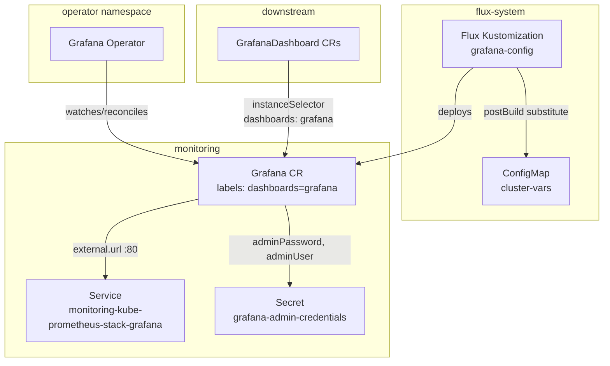

# Grafana Config

The [Grafana Operator](https://grafana.github.io/grafana-operator/) ([GitHub](https://github.com/grafana/grafana-operator)) is a Kubernetes operator that manages Grafana instances and their associated resources (dashboards, datasources, folders) declaratively via Custom Resources. Unlike directly configuring Grafana through its HTTP API or provisioning files, the operator reconciles desired state continuously — if a dashboard is deleted manually in the UI, the operator restores it on the next reconciliation cycle.

The `Grafana` CRD is the operator's entry point: it registers a Grafana instance (either operator-managed or externally deployed) so that other CRDs (`GrafanaDashboard`, `GrafanaDatasource`) can target it. The operator supports two modes — **deployment mode** (it deploys and manages the Grafana pod lifecycle) and **external mode** (it connects to a pre-existing Grafana instance). This service uses external mode, pointing the operator at a Grafana already deployed by kube-prometheus-stack.

## Overview

| Property | Value |
|---|---|
| **Namespace** | `grafana-config` |
| **Type** | Kustomization |
| **Layer** | Grafana Operator |
| **Status** | Enabled |
| **Source** | [`apps/base/grafana-config/`](https://github.com/JiwooL0920/fleet-infra/tree/develop/apps/base/grafana-config/) |

## Dependencies

### Upstream — required before Grafana Config starts

| Service | Reason | Status |
|---|---|---|
| `grafana-operator` | Flux `dependsOn` | Active |

### Downstream — services that depend on Grafana Config

| Service | Dependency type | Reason |
|---|---|---|
| `grafana-dashboards` | Flux `dependsOn` | Requires Grafana Config |

## Purpose

`grafana-config` registers the platform's existing kube-prometheus-stack Grafana instance with the Grafana Operator. This creates the bridge that allows downstream `GrafanaDashboard` custom resources to be reconciled into the running Grafana without touching its Helm values or provisioning ConfigMaps.

Without this CR, the operator has no target instance — dashboard CRDs would have nothing to reconcile against. This service sits between `grafana-operator` (which provides the controller) and `grafana-dashboards` (which provides the dashboard definitions), acting as the instance discovery layer.

**Why external mode over operator-managed deployment:** kube-prometheus-stack already deploys a fully configured Grafana with authentication, persistence, and datasource wiring baked into its Helm chart. Re-deploying Grafana through the operator would duplicate that work and lose the tight integration with Prometheus/Alertmanager that the stack provides. External mode gives the operator dashboard management capabilities while leaving instance lifecycle to the Helm chart that already handles it well.

## Features

| Feature | Detail |
|---|---|
| **External instance registration** | Uses `spec.external.url` to connect to the kube-prometheus-stack Grafana service at `monitoring-kube-prometheus-stack-grafana.monitoring.svc:80`, avoiding a duplicate Grafana deployment. |
| **Instance selector label** | The `dashboards: grafana` label on the CR acts as a target selector — downstream `GrafanaDashboard` resources use `instanceSelector.matchLabels` to bind to this specific instance. |
| **Secret-based admin authentication** | Admin credentials are sourced from the `grafana-admin-credentials` Secret via `spec.external.adminPassword` and `spec.external.adminUser`, keeping credentials out of the CR spec. |
| **PostBuild variable substitution** | The Flux Kustomization injects variables from the `cluster-vars` ConfigMap at deploy time, enabling environment-specific overrides without duplicating manifests per cluster. |

## Architecture

### Grafana Operator Instance Registration Topology

## Configuration

All values sourced from [`base/services/environment.env`](https://github.com/JiwooL0920/fleet-infra/blob/develop/base/services/environment.env)
(base); per-environment overrides in [`clusters/stages/dev/.../environment.env`](https://github.com/JiwooL0920/fleet-infra/blob/develop/clusters/stages/dev/clusters/services-amer/environment.env).

_No environment-specific configuration variables for this service._

## Operations

<!-- TODO: Add operations in service-insights/grafana-config.yaml → operations field -->

## Related

- [`apps/base/grafana-config/`](https://github.com/JiwooL0920/fleet-infra/tree/develop/apps/base/grafana-config/) — Kubernetes manifests
- [`base/services/grafana-config.yaml`](https://github.com/JiwooL0920/fleet-infra/blob/develop/base/services/grafana-config.yaml) — Flux Kustomization
- [`base/services/environment.env`](https://github.com/JiwooL0920/fleet-infra/blob/develop/base/services/environment.env) — environment variables

---
*Generated from [service-catalog.json](https://github.com/JiwooL0920/fleet-infra/blob/develop/service-catalog.json) at commit `2d36e22` · catalog sha `4d088b0b3a67b4c4`*