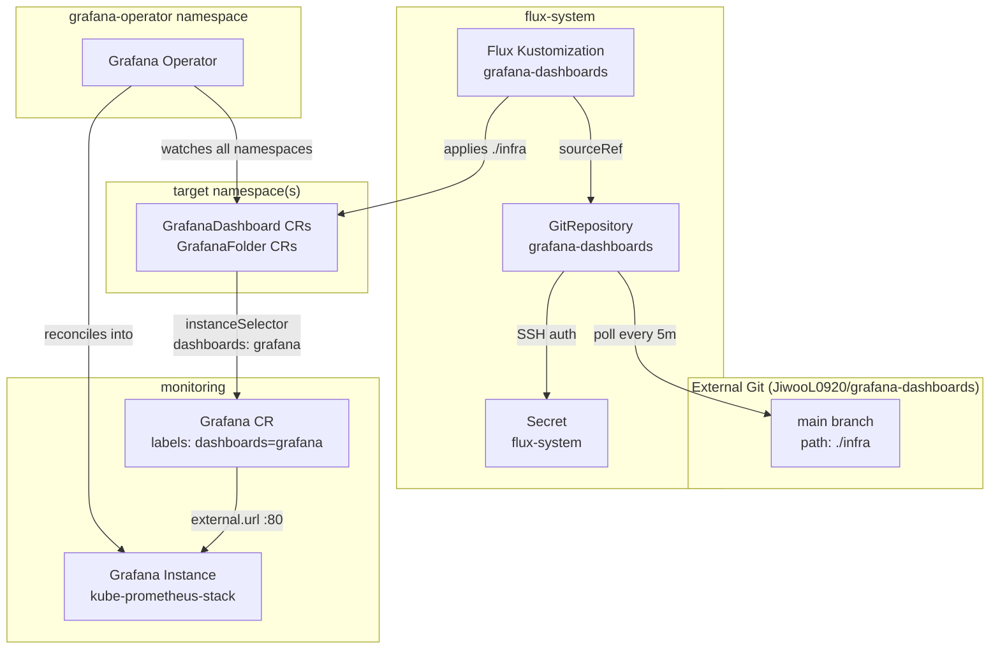

# Grafana Dashboards

[Grafana Operator](https://grafana.github.io/grafana-operator/) manages Grafana resources (dashboards, datasources, folders) declaratively via Kubernetes CRDs. Rather than provisioning dashboards through ConfigMaps, API calls, or sidecar-based file watchers, the operator continuously reconciles `GrafanaDashboard` custom resources into a target Grafana instance — providing drift correction, lifecycle management, and native GitOps integration.

This service is the **content layer** of the dashboard-as-code pipeline. While `grafana-operator` provides the controller and `grafana-config` registers the target instance, `grafana-dashboards` supplies the actual dashboard and folder definitions from a dedicated external Git repository. Flux polls this repository independently, meaning dashboard authors can iterate on visualizations without touching the main infrastructure repo or triggering unrelated reconciliation across the platform.

## Overview

| Property | Value |
|---|---|
| **Namespace** | `grafana-dashboards` |
| **Type** | Kustomization |
| **Layer** | Grafana Operator |
| **Status** | Enabled |
| **Source** | [`infra/`](https://github.com/JiwooL0920/fleet-infra/tree/develop/infra/) |

## Dependencies

### Upstream — required before Grafana Dashboards starts

| Service | Reason | Status |
|---|---|---|
| `grafana-config` | Flux `dependsOn` | Active |

### Downstream — services that depend on Grafana Dashboards

_No known downstream Flux dependencies._

## Purpose

`grafana-dashboards` decouples dashboard content from infrastructure lifecycle. It pulls `GrafanaDashboard` and `GrafanaFolder` CRDs from a separate Git repository (`JiwooL0920/grafana-dashboards`) at a 5-minute polling interval, deploying them into the cluster where the Grafana Operator reconciles them into the running Grafana instance.

This separation means dashboard changes (new panels, updated queries, folder reorganization) flow through their own Git history, PR review, and deployment cycle — independent of Helm chart bumps, operator upgrades, or dependency chain changes in the main fleet-infra repo. The result is faster iteration for observability content without risk to platform stability.

**Why a separate Git repository over inline manifests in fleet-infra:** Dashboard JSON is verbose (hundreds to thousands of lines per dashboard) and changes frequently as monitoring needs evolve. Embedding them in the infrastructure repo would pollute its Git history with large diffs unrelated to infrastructure changes, trigger unnecessary Flux reconciliation of the entire services tree, and force dashboard authors to understand the fleet-infra dependency model just to update a Prometheus query. A dedicated repo with its own `GitRepository` source isolates the blast radius and enables a tighter feedback loop — push a dashboard change, see it in Grafana within 5 minutes.

## Features

| Feature | Detail |
|---|---|
| **Dedicated GitRepository source** | Declares its own `GitRepository` CR pointing to `ssh://git@github.com/JiwooL0920/grafana-dashboards` rather than sharing the `flux-system` source used by all other services. This gives dashboards an independent polling interval and revision tracking. |
| **High-frequency polling** | Configured with a 5-minute `spec.interval` on both the GitRepository and Kustomization — significantly shorter than the 1-hour interval used by the operator and config layers. Dashboard updates propagate to Grafana within minutes of merge. |
| **Path-scoped Kustomization** | The Flux Kustomization targets only `./infra` within the external repository, allowing the dashboard repo to contain other content (documentation, Grafonnet source, CI configs) without affecting what gets applied to the cluster. |
| **Prune-enabled lifecycle management** | `spec.prune: true` ensures that deleting a dashboard manifest from the Git repository removes the corresponding `GrafanaDashboard` CR from the cluster, which the operator then removes from Grafana. No orphaned dashboards accumulate over time. |
| **SSH authentication via shared secret** | Uses the `flux-system` Secret (the same deploy key bootstrapped during Flux installation) for Git authentication, avoiding additional credential management for the external repository. |
| **Dependency-gated deployment** | `dependsOn: grafana-config` ensures the Grafana instance CR (with its `dashboards: grafana` selector label) exists before dashboard CRDs are applied. Without this gate, dashboards would fail to reconcile as the operator would have no target instance. |

## Architecture

### Dashboard-as-Code Deployment Pipeline

## Configuration

All values sourced from [`base/services/environment.env`](https://github.com/JiwooL0920/fleet-infra/blob/develop/base/services/environment.env)
(base); per-environment overrides in [`clusters/stages/dev/.../environment.env`](https://github.com/JiwooL0920/fleet-infra/blob/develop/clusters/stages/dev/clusters/services-amer/environment.env).

_No environment-specific configuration variables for this service._

## Operations

<!-- TODO: Add operations in service-insights/grafana-dashboards.yaml → operations field -->

## Related

- [`infra/`](https://github.com/JiwooL0920/fleet-infra/tree/develop/infra/) — Kubernetes manifests
- [`base/services/grafana-dashboards.yaml`](https://github.com/JiwooL0920/fleet-infra/blob/develop/base/services/grafana-dashboards.yaml) — Flux Kustomization
- [`base/services/environment.env`](https://github.com/JiwooL0920/fleet-infra/blob/develop/base/services/environment.env) — environment variables

---
*Generated from [service-catalog.json](https://github.com/JiwooL0920/fleet-infra/blob/develop/service-catalog.json) at commit `09eeed6` · catalog sha `4d088b0b3a67b4c4`*