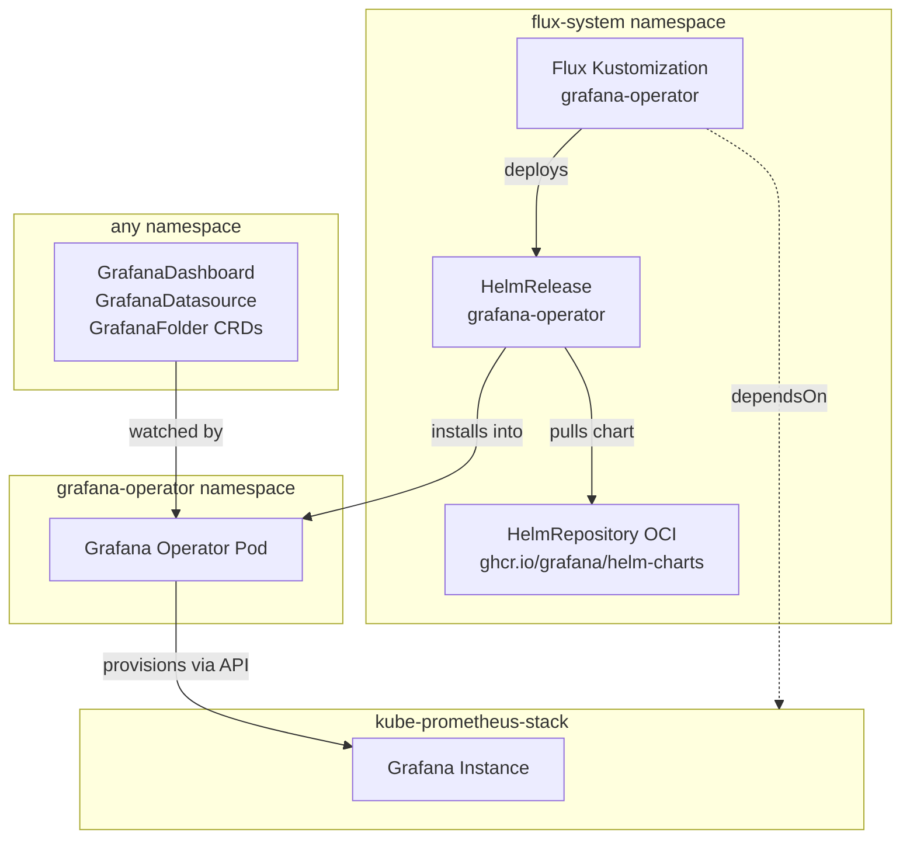
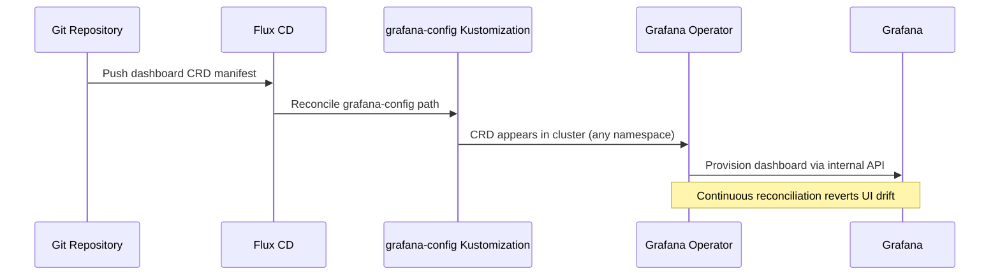

# Grafana Operator

[Grafana Operator](https://grafana.github.io/grafana-operator/) ([GitHub](https://github.com/grafana/grafana-operator)) is a Kubernetes operator that manages Grafana instances, dashboards, datasources, and folders through Custom Resource Definitions. Unlike file-based provisioning or API-driven CI/CD pipelines, the operator introduces a reconciliation loop that continuously ensures the declared state in Git matches the live state in Grafana — correcting drift from manual UI edits without requiring pod restarts.

The operator defines CRDs (`GrafanaDashboard`, `GrafanaDatasource`, `GrafanaFolder`) that are standard Kubernetes resources, meaning they participate in the same GitOps lifecycle as every other manifest in the cluster. Flux deploys them, `kubectl` inspects them, and RBAC controls who can create them — no separate Grafana API tokens or provisioning sidecars required.

## Overview

| Property | Value |
|---|---|
| **Namespace** | `grafana-operator` |
| **Type** | HelmRelease (chart: `grafana-operator` vv5.15.1) |
| **Layer** | Grafana Operator |
| **Chart** | [`grafana-operator`](oci://ghcr.io/grafana/helm-charts) vv5.15.1 |
| **Status** | Enabled |
| **Source** | [`apps/base/grafana-operator/`](https://github.com/JiwooL0920/flux-infra/tree/develop/apps/base/grafana-operator/) |

## Dependencies

### Upstream — required before Grafana Operator starts

| Service | Reason | Status |
|---|---|---|
| `kube-prometheus-stack` | Flux `dependsOn` | Active |

### Downstream — services that depend on Grafana Operator

| Service | Dependency type | Reason |
|---|---|---|
| `grafana-config` | Flux `dependsOn` | Requires Grafana Operator |

## Purpose

Grafana Operator is the bridge between this platform's Git-managed observability definitions and the Grafana instance running inside kube-prometheus-stack. It watches for dashboard and datasource CRDs committed to the repository (delivered via the downstream `grafana-config` service), reconciles them into the running Grafana, and reverts any manual drift — completing the GitOps loop for the entire observability layer.


## Features

| Feature | Detail |
|---|---|
| **Cluster-wide CRD watching** | Configured with `namespaceScope: false`, allowing GrafanaDashboard and GrafanaDatasource resources to be placed in any namespace alongside the services they monitor, rather than requiring all definitions to live in the operator's namespace. |
| **Install and upgrade remediation** | Both install and upgrade phases are configured with 3 automatic retries, providing resilience against transient failures during Helm chart deployment without requiring manual intervention. |
| **Bounded resource allocation** | Explicit resource requests and limits are set to prevent the operator from consuming unbounded memory during large reconciliation sweeps across many namespaces. |
| **OCI-based chart distribution** | The Helm chart is sourced from an OCI registry rather than a traditional HTTP Helm repository, leveraging container registry infrastructure for chart storage and distribution. |

## Architecture

### Grafana Operator Reconciliation Topology



### Dashboard-as-Code GitOps Flow




## Configuration

All values sourced from [`base/services/environment.env`](https://github.com/JiwooL0920/flux-infra/blob/develop/base/services/environment.env)
(base); per-environment overrides in [`clusters/stages/dev/.../environment.env`](https://github.com/JiwooL0920/flux-infra/blob/develop/clusters/stages/dev/clusters/services-amer/environment.env).

_No environment-specific configuration variables for this service._


## Operations

### HelmRelease stuck in "install retries exhausted"

**Symptoms:** `flux get helmreleases -n flux-system grafana-operator` shows `False` ready status with message "install retries exhausted". Events show `HelmChart` reconciliation failing or image pull errors.

```bash
kubectl get helmrelease grafana-operator -n flux-system -o yaml | grep -A5 'status:'
kubectl get events -n flux-system --field-selector involvedObject.name=grafana-operator --sort-by=.lastTimestamp
kubectl get helmchart -n flux-system | grep grafana-operator
# Check if OCI registry is reachable from cluster
kubectl run oci-test --rm -it --image=curlimages/curl -- curl -s https://ghcr.io/v2/grafana/helm-charts/grafana-operator/tags/list
# Force retry after fixing the root cause
flux suspend helmrelease grafana-operator -n flux-system
flux resume helmrelease grafana-operator -n flux-system
```

---

### Operator pod OOMKilled under CRD load

**Symptoms:** Pod restarts with reason `OOMKilled` visible in `kubectl describe pod`. Increasing restart count. Dashboards stop reconciling during restart cycles. `kubectl top pod -n grafana-operator` shows memory approaching the 256Mi limit.

```bash
kubectl get pods -n grafana-operator -o wide
kubectl describe pod -n grafana-operator -l app.kubernetes.io/name=grafana-operator | grep -A3 "Last State"
kubectl top pod -n grafana-operator
# Check how many CRDs the operator is watching
kubectl get grafanadashboards -A --no-headers | wc -l
kubectl get grafanadatasources -A --no-headers | wc -l
# If CRD count is high, memory limit needs increasing in HelmRelease values
kubectl logs -n grafana-operator -l app.kubernetes.io/name=grafana-operator --previous --tail=50
```

---

### Dashboards not appearing in Grafana after CRD creation

**Symptoms:** `GrafanaDashboard` CRs exist and show no error in their status, but dashboards are missing from the Grafana UI. Operator logs show "no matching Grafana instances found" or instanceSelector mismatch warnings.

```bash
kubectl get grafanadashboards -A -o custom-columns=NAME:.metadata.name,SYNCED:.status.conditions[0].status,MSG:.status.conditions[0].message
# Check operator logs for selector mismatch
kubectl logs -n grafana-operator -l app.kubernetes.io/name=grafana-operator --tail=100 | grep -i "instance"
# Verify Grafana instance labels match the instanceSelector in dashboards
kubectl get grafana -A --show-labels
# Compare with dashboard instanceSelector
kubectl get grafanadashboards -A -o jsonpath='{range .items[*]}{.metadata.name}{"\t"}{.spec.instanceSelector}{"\n"}{end}'
# Verify operator has RBAC to read CRDs in target namespace
kubectl auth can-i get grafanadashboards --as=system:serviceaccount:grafana-operator:grafana-operator -A
```
**See also:** docs/adr/012-grafana-operator-dashboard-as-code.md

---

### CRD version conflict after operator upgrade

**Symptoms:** After upgrading the operator chart, existing `GrafanaDashboard` CRs show validation errors. `kubectl apply` on dashboard manifests fails with "unknown field" or schema validation errors. Operator logs show "failed to reconcile" with conversion webhook errors.

```bash
kubectl get crd grafanadashboards.grafana.integreatly.org -o jsonpath='{.spec.versions[*].name}'
kubectl get crd grafanadashboards.grafana.integreatly.org -o jsonpath='{.status.storedVersions[*]}'
# Check if operator registered its webhook
kubectl get validatingwebhookconfigurations | grep grafana
kubectl get mutatingwebhookconfigurations | grep grafana
# Inspect a failing CRD for schema issues
kubectl get grafanadashboards -A -o yaml | head -80
# If CRDs are stale, force Flux to reapply the chart (which bundles updated CRDs)
flux reconcile helmrelease grafana-operator -n flux-system --force
```

---

### Operator cannot reach Grafana API endpoint

**Symptoms:** Operator logs show repeated "connection refused" or "context deadline exceeded" errors when attempting to sync dashboards. CRD status shows "failed to get Grafana instance" or HTTP 503. Grafana pod itself is healthy but operator cannot connect.

```bash
kubectl logs -n grafana-operator -l app.kubernetes.io/name=grafana-operator --tail=50 | grep -iE "refused|timeout|503"
# Verify Grafana service is resolvable from operator namespace
kubectl run dns-test --rm -it --image=busybox -n grafana-operator -- nslookup kube-prometheus-stack-grafana.kube-prometheus-stack.svc.cluster.local
# Check network policies that might block cross-namespace traffic
kubectl get networkpolicies -n kube-prometheus-stack
kubectl get ciliumnetworkpolicies -n kube-prometheus-stack
# Verify Grafana admin credentials secret exists and is referenced correctly
kubectl get grafana -A -o jsonpath='{range .items[*]}{.metadata.name}{"\t"}{.spec.external.adminPassword}{"\n"}{end}'
```

---


## Related


- [`apps/base/grafana-operator/`](https://github.com/JiwooL0920/flux-infra/tree/develop/apps/base/grafana-operator/) — Kubernetes manifests
- [`base/services/grafana-operator.yaml`](https://github.com/JiwooL0920/flux-infra/blob/develop/base/services/grafana-operator.yaml) — Flux Kustomization
- [`base/services/environment.env`](https://github.com/JiwooL0920/flux-infra/blob/develop/base/services/environment.env) — environment variables

---
*Generated from [service-catalog.json](https://github.com/JiwooL0920/flux-infra/blob/develop/service-catalog.json) at commit `8c38bcd` · catalog sha `e8611a61080e81c8`*