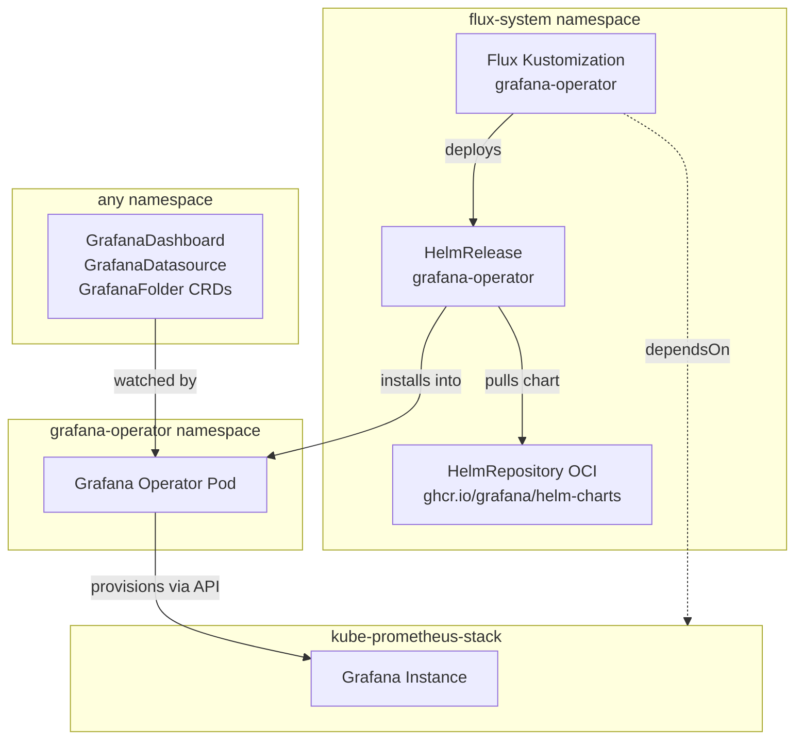
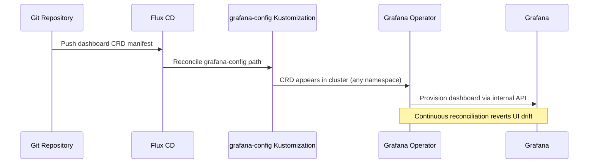

# Grafana Operator

[Grafana Operator](https://grafana.github.io/grafana-operator/) ([GitHub](https://github.com/grafana/grafana-operator)) is a Kubernetes operator that manages Grafana instances, dashboards, datasources, and folders through Custom Resource Definitions. Unlike file-based provisioning or API-driven CI/CD pipelines, the operator introduces a reconciliation loop that continuously ensures the declared state in Git matches the live state in Grafana — correcting drift from manual UI edits without requiring pod restarts.

The operator defines CRDs (`GrafanaDashboard`, `GrafanaDatasource`, `GrafanaFolder`) that are standard Kubernetes resources, meaning they participate in the same GitOps lifecycle as every other manifest in the cluster. Flux deploys them, `kubectl` inspects them, and RBAC controls who can create them — no separate Grafana API tokens or provisioning sidecars required.

## Overview

| Property | Value |
|---|---|
| **Namespace** | `grafana-operator` |
| **Type** | HelmRelease (chart: `grafana-operator` vv5.15.1) |
| **Layer** | Grafana Operator |
| **Chart** | [`grafana-operator`](oci://ghcr.io/grafana/helm-charts) vv5.15.1 |
| **Status** | Enabled |
| **Source** | [`apps/base/grafana-operator/`](https://github.com/JiwooL0920/flux-infra/tree/develop/apps/base/grafana-operator/) |

## Dependencies

### Upstream — required before Grafana Operator starts

| Service | Reason | Status |
|---|---|---|
| `kube-prometheus-stack` | Flux `dependsOn` | Active |

### Downstream — services that depend on Grafana Operator

| Service | Dependency type | Reason |
|---|---|---|
| `grafana-config` | Flux `dependsOn` | Requires Grafana Operator |

## Purpose

Grafana Operator is the bridge between this platform's Git-managed observability definitions and the Grafana instance running inside kube-prometheus-stack. It watches for dashboard and datasource CRDs committed to the repository (delivered via the downstream `grafana-config` service), reconciles them into the running Grafana, and reverts any manual drift — completing the GitOps loop for the entire observability layer.

## Features

| Feature | Detail |
|---|---|
| **Cluster-wide CRD watching** | Configured with `namespaceScope: false`, allowing GrafanaDashboard and GrafanaDatasource resources to be placed in any namespace alongside the services they monitor, rather than requiring all definitions to live in the operator's namespace. |
| **Install and upgrade remediation** | Both install and upgrade phases are configured with 3 automatic retries, providing resilience against transient failures during Helm chart deployment without requiring manual intervention. |
| **Bounded resource allocation** | Explicit resource requests and limits are set to prevent the operator from consuming unbounded memory during large reconciliation sweeps across many namespaces. |
| **OCI-based chart distribution** | The Helm chart is sourced from an OCI registry rather than a traditional HTTP Helm repository, leveraging container registry infrastructure for chart storage and distribution. |

## Architecture

### Grafana Operator Reconciliation Topology

### Dashboard-as-Code GitOps Flow

## Configuration

All values sourced from [`base/services/environment.env`](https://github.com/JiwooL0920/flux-infra/blob/develop/base/services/environment.env)
(base); per-environment overrides in [`clusters/stages/dev/.../environment.env`](https://github.com/JiwooL0920/flux-infra/blob/develop/clusters/stages/dev/clusters/services-amer/environment.env).

_No environment-specific configuration variables for this service._

## Operations

<!-- TODO: Add operations in service-insights/grafana-operator.yaml → operations field -->

## Related

- [`apps/base/grafana-operator/`](https://github.com/JiwooL0920/flux-infra/tree/develop/apps/base/grafana-operator/) — Kubernetes manifests
- [`base/services/grafana-operator.yaml`](https://github.com/JiwooL0920/flux-infra/blob/develop/base/services/grafana-operator.yaml) — Flux Kustomization
- [`base/services/environment.env`](https://github.com/JiwooL0920/flux-infra/blob/develop/base/services/environment.env) — environment variables

---
*Generated from [service-catalog.json](https://github.com/JiwooL0920/flux-infra/blob/develop/service-catalog.json) at commit `2d36e22` · catalog sha `4d088b0b3a67b4c4`*