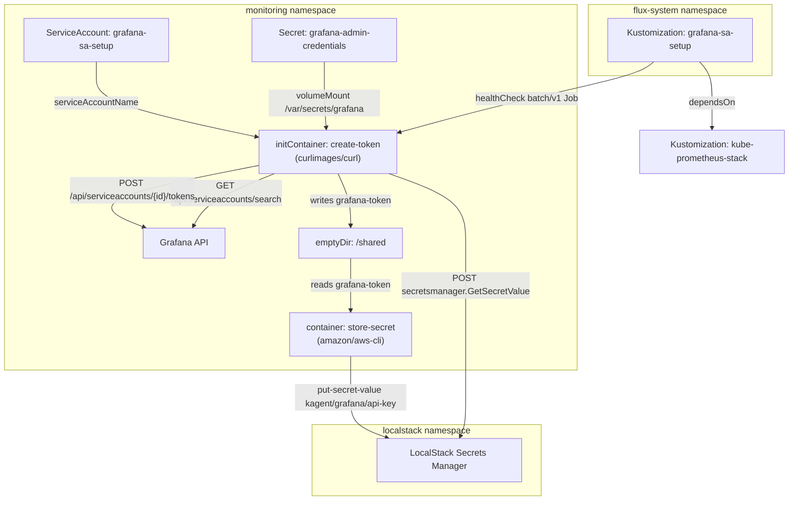
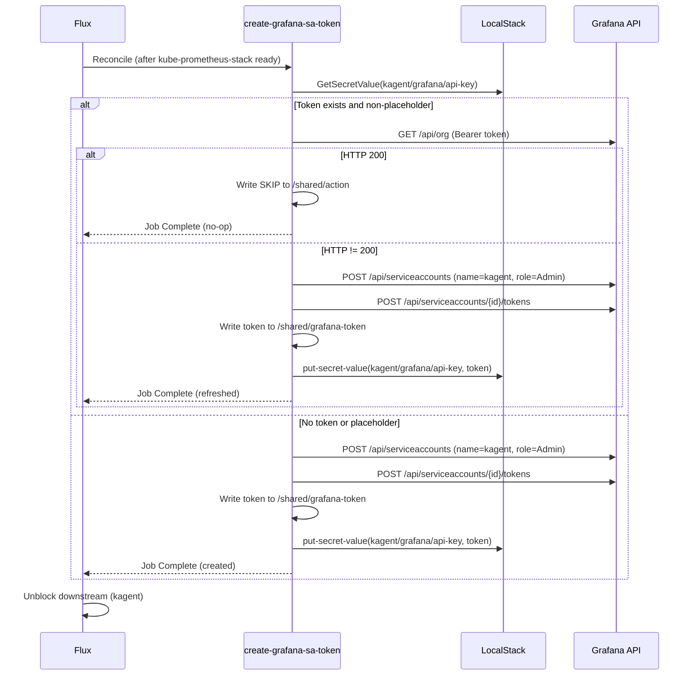

# Grafana SA Setup

Grafana exposes a [Service Accounts API](https://grafana.com/docs/grafana/latest/developers/http_api/serviceaccount/) that issues scoped API tokens independent of any human user. Unlike basic auth or personal API keys tied to a user session, service account tokens survive password rotations, can be individually revoked, and carry explicit role bindings (Viewer, Editor, Admin). They are the recommended machine-to-machine authentication path for any automation that needs to query dashboards, manage alerts, or provision data sources programmatically.

However, Grafana's service account database is internal and ephemeral in default Helm deployments — tokens do not survive a pod restart unless backed by persistent storage. This creates a bootstrap problem: downstream services that depend on a valid Grafana token cannot simply mount a static secret, because the token becomes invalid every time Grafana's state resets.

`grafana-sa-setup` solves this with a self-healing Kubernetes Job that validates, creates, and externalizes a Grafana SA token into a secrets manager where other services can consume it through the standard ExternalSecrets flow.

## Overview

| Property | Value |
|---|---|
| **Namespace** | `grafana-sa-setup` |
| **Type** | Job |
| **Layer** | Foundation services |
| **Status** | Enabled |
| **Source** | [`apps/base/grafana-sa-setup/`](https://github.com/JiwooL0920/flux-infra/tree/develop/apps/base/grafana-sa-setup/) |

## Dependencies

### Upstream — required before Grafana SA Setup starts

| Service | Reason | Status |
|---|---|---|
| `kube-prometheus-stack` | Flux `dependsOn` | Active |

### Downstream — services that depend on Grafana SA Setup

| Service | Dependency type | Reason |
|---|---|---|
| `kagent` | Flux `dependsOn` | Requires Grafana SA Setup |

## Purpose

This Job exists to bridge Grafana's ephemeral service account store with the platform's secrets distribution layer. Specifically, it ensures that `kagent` always has a valid Grafana API token available — even after cluster restarts wipe Grafana's internal SA database.

The Job runs after `kube-prometheus-stack` brings Grafana online, creates (or validates) a service account named `kagent` with Admin role, generates a token, and writes it to LocalStack Secrets Manager at `kagent/grafana/api-key`. From there, ExternalSecrets syncs the value into a Kubernetes Secret that kagent mounts at runtime. The entire chain is automatic and requires no manual intervention after initial deployment.

**Why a Job instead of Grafana's declarative provisioning (`provisioning/access-control/`):** Grafana's file-based provisioning supports service accounts since v9.1, but it does not expose the generated token — it only ensures the account exists. There is no declarative way to extract the token value and push it elsewhere. A Job with API calls is the only path that both creates the account and captures the token for external storage.

**Why not a persistent Grafana database:** Persisting Grafana's SQLite/PostgreSQL state would make tokens survive restarts, but adds operational complexity (PVCs, backup/restore, migration) for a component whose dashboards and data sources are already provisioned declaratively. Treating Grafana as stateless with a token-bootstrap Job is simpler and aligns with the GitOps philosophy of reproducible state.


## Features

| Feature | Detail |
|---|---|
| **Idempotent token validation** | Fetches the current token from LocalStack and validates it against Grafana's API before attempting creation, avoiding unnecessary token churn on routine reconciliations |
| **Self-healing via TTL and Flux reconciliation** | ttlSecondsAfterFinished deletes the completed Job after 300s; Flux recreates it on next interval, guaranteeing the token is refreshed after any cluster restart that invalidates Grafana's SA database |
| **Init container / main container handoff** | Token generation (curl against Grafana API) runs in an initContainer, passing the result to the main container (aws-cli for LocalStack storage) via a shared emptyDir volume at /shared |
| **Least-privilege RBAC** | A dedicated ServiceAccount with a Role scoped to a single verb (get) on a single Secret (grafana-admin-credentials) in the monitoring namespace — no cluster-wide permissions |
| **Flux health gating** | The Flux Kustomization declares a healthCheck on the Job resource, blocking downstream dependents (kagent) from reconciling until the token is confirmed stored |

## Architecture

### Job Execution Topology



### Token Bootstrap Flow




## Configuration

All values sourced from [`base/services/environment.env`](https://github.com/JiwooL0920/flux-infra/blob/develop/base/services/environment.env)
(base); per-environment overrides in [`clusters/stages/dev/.../environment.env`](https://github.com/JiwooL0920/flux-infra/blob/develop/clusters/stages/dev/clusters/services-amer/environment.env).

_No environment-specific configuration variables for this service._


## Operations

### Job fails because Grafana is not yet healthy

**Symptoms:** Job pod in `Init:Error` or `Init:CrashLoopBackOff`. Init container logs show `curl: (7) Failed to connect to kube-prometheus-stack-grafana.monitoring.svc.cluster.local port 80` or HTTP 503 responses. Flux Kustomization `grafana-sa-setup` shows `Health check failed`.

```bash
kubectl get pods -n monitoring -l app.kubernetes.io/name=grafana
kubectl logs -n monitoring job/create-grafana-sa-token -c create-token --previous
kubectl get kustomization kube-prometheus-stack -n flux-system -o jsonpath='{.status.conditions[*].message}'
kubectl rollout status deployment/kube-prometheus-stack-grafana -n monitoring --timeout=120s
kubectl delete job create-grafana-sa-token -n monitoring && flux reconcile kustomization grafana-sa-setup
```

---

### Token created but LocalStack PutSecretValue fails

**Symptoms:** Init container exits 0 but main container (`store-secret`) fails with AWS CLI errors such as `Could not connect to the endpoint URL` or `An error occurred (ResourceNotFoundException)`. Job shows 1/1 init containers completed but pod status is `Error`.

```bash
kubectl logs -n monitoring job/create-grafana-sa-token -c store-secret
kubectl get pods -n localstack -l app.kubernetes.io/name=localstack
kubectl exec -n localstack deploy/localstack -- awslocal secretsmanager describe-secret --secret-id kagent/grafana/api-key --region us-east-1
kubectl exec -n localstack deploy/localstack -- awslocal secretsmanager create-secret --name kagent/grafana/api-key --secret-string placeholder-run-grafana-sa-setup --region us-east-1
kubectl delete job create-grafana-sa-token -n monitoring && flux reconcile kustomization grafana-sa-setup
```

---

### grafana-admin-credentials Secret missing

**Symptoms:** Pod stuck in `Pending` or `ContainerCreating` with event `MountVolume.SetUp failed for volume "grafana-admin-creds"`. The Secret `grafana-admin-credentials` does not exist in the `monitoring` namespace.

```bash
kubectl get secret grafana-admin-credentials -n monitoring
kubectl get helmrelease kube-prometheus-stack -n flux-system -o jsonpath='{.status.conditions[*].message}'
kubectl get pods -n monitoring -l app.kubernetes.io/instance=kube-prometheus-stack
flux reconcile helmrelease kube-prometheus-stack -n flux-system
```

---

### Job completed but kagent still cannot authenticate to Grafana

**Symptoms:** kagent logs show `401 Unauthorized` when calling Grafana API. The Job shows `Completed` status. ExternalSecret in kagent's namespace may be out of sync or holding a stale token.

```bash
kubectl get externalsecret -A | grep grafana
kubectl exec -n localstack deploy/localstack -- awslocal secretsmanager get-secret-value --secret-id kagent/grafana/api-key --region us-east-1 --query SecretString --output text
curl -sf -H "Authorization: Bearer $(kubectl exec -n localstack deploy/localstack -- awslocal secretsmanager get-secret-value --secret-id kagent/grafana/api-key --region us-east-1 --query SecretString --output text)" http://localhost:$(kubectl get svc kube-prometheus-stack-grafana -n monitoring -o jsonpath='{.spec.ports[0].port}')/api/org
kubectl delete job create-grafana-sa-token -n monitoring && flux reconcile kustomization grafana-sa-setup
kubectl annotate externalsecret -n flux-system kagent-grafana-sa-token force-sync=$(date +%s) --overwrite
```

---

### Job exceeds backoffLimit with intermittent Grafana API errors

**Symptoms:** Job status shows `Failed` with reason `BackoffLimitExceeded`. Multiple pod attempts visible with `kubectl get pods -n monitoring -l job-name=create-grafana-sa-token`. Logs show mixed success/failure on Grafana API calls (HTTP 500, connection resets).

```bash
kubectl get pods -n monitoring -l job-name=create-grafana-sa-token --sort-by=.metadata.creationTimestamp
kubectl logs -n monitoring -l job-name=create-grafana-sa-token -c create-token --tail=50
kubectl get events -n monitoring --field-selector involvedObject.name=create-grafana-sa-token --sort-by=.lastTimestamp
kubectl top pods -n monitoring -l app.kubernetes.io/name=grafana
kubectl delete job create-grafana-sa-token -n monitoring && flux reconcile kustomization grafana-sa-setup
```

---


## Related


- [`apps/base/grafana-sa-setup/`](https://github.com/JiwooL0920/flux-infra/tree/develop/apps/base/grafana-sa-setup/) — Kubernetes manifests
- [`base/services/grafana-sa-setup.yaml`](https://github.com/JiwooL0920/flux-infra/blob/develop/base/services/grafana-sa-setup.yaml) — Flux Kustomization
- [`base/services/environment.env`](https://github.com/JiwooL0920/flux-infra/blob/develop/base/services/environment.env) — environment variables

---
*Generated from [service-catalog.json](https://github.com/JiwooL0920/flux-infra/blob/develop/service-catalog.json) at commit `0c31410` · catalog sha `71f0757401278c36`*