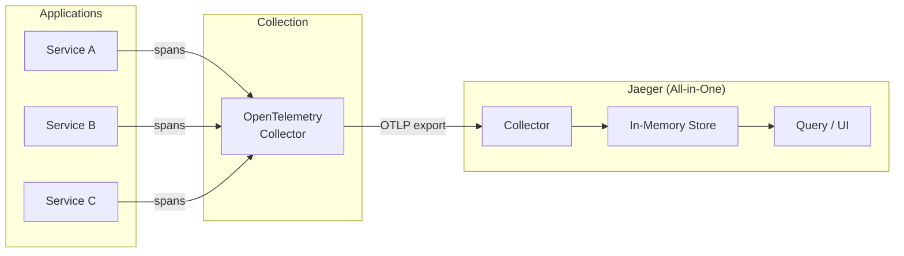

# Jaeger

Distributed tracing backend for microservices observability.

## Overview

| Property | Value |
|----------|-------|
| **Namespace** | `jaeger` |
| **Type** | HelmRelease |
| **Layer** | Logging & Tracing (Layer 2) |
| **Dependencies** | Traefik Config |
| **Access** | `http://jaeger.local` (UI on port 16686) |

## Purpose

Jaeger provides end-to-end distributed tracing for monitoring and troubleshooting microservices. It collects trace data via OpenTelemetry, enabling root cause analysis and service dependency visualization across the platform.

## Features

- **All-in-One Deployment** — Single binary with collector, query, and UI
- **OTLP Ingestion** — Native OpenTelemetry Protocol support enabled
- **In-Memory Storage** — No external datastore dependencies
- **Distributed Tracing** — Track requests across service boundaries
- **Service Topology** — Visualize inter-service dependencies

## Architecture



## Connection

### Local DNS (Recommended)

```
http://jaeger.local
```

Routed via Traefik IngressRoute on the `web` entrypoint.

### Port Forwarding

```bash
kubectl port-forward -n jaeger svc/jaeger-query 16686:16686
```

Then visit `http://localhost:16686`.

### Application Configuration

```yaml
# OTLP gRPC endpoint (for OpenTelemetry SDK/Collector export)
OTEL_EXPORTER_OTLP_ENDPOINT: "http://jaeger-collector.jaeger:4317"

# OTLP HTTP endpoint
OTEL_EXPORTER_OTLP_ENDPOINT: "http://jaeger-collector.jaeger:4318"
```

## Environment Configuration

| Setting | Dev | Prod |
|---------|-----|------|
| Replicas | 1 | 1 |
| Storage | In-memory | In-memory |
| CPU Request | `${JAEGER_CPU_REQUEST}` | `${JAEGER_CPU_REQUEST}` |
| CPU Limit | `${JAEGER_CPU_LIMIT}` | `${JAEGER_CPU_LIMIT}` |
| Memory Request | `${JAEGER_MEMORY_REQUEST}` | `${JAEGER_MEMORY_REQUEST}` |
| Memory Limit | `${JAEGER_MEMORY_LIMIT}` | `${JAEGER_MEMORY_LIMIT}` |

Resource values are substituted from the `cluster-vars` ConfigMap at reconciliation time.

## Verification

```bash
# Check Jaeger pod
kubectl get pods -n jaeger

# Check services
kubectl get svc -n jaeger

# Verify OTLP collector is accepting traces
kubectl logs -n jaeger deploy/jaeger

# Test UI connectivity
curl -s -o /dev/null -w "%{http_code}" http://jaeger.local
```

## Troubleshooting

### No traces appearing

1. Verify applications are instrumented with OpenTelemetry SDK
2. Check OpenTelemetry Collector is running and exporting to Jaeger
3. Confirm OTLP is enabled on the Jaeger collector

```bash
# Check OTEL collector logs for export errors
kubectl logs -n opentelemetry deploy/opentelemetry-collector

# Verify Jaeger collector is listening on OTLP ports
kubectl get svc -n jaeger jaeger-collector -o yaml
```

### Pod not starting

```bash
# Check pod events
kubectl describe pod -n jaeger -l app.kubernetes.io/name=jaeger

# Check resource constraints
kubectl top pods -n jaeger

# Check HelmRelease status
kubectl get helmrelease -n flux-system jaeger
```

### UI not accessible via jaeger.local

```bash
# Check IngressRoute
kubectl get ingressroute -n jaeger jaeger-ui

# Verify Traefik is routing
kubectl logs -n traefik deploy/traefik | grep jaeger

# Check jaeger-query service
kubectl get svc -n jaeger jaeger-query
kubectl get endpoints -n jaeger jaeger-query
```

## Related

- [OpenTelemetry](opentelemetry.md) — Trace collection and forwarding
- [Traefik](traefik.md) — Ingress routing for UI access
- [Kube-Prometheus-Stack](kube-prometheus-stack.md) — Metrics correlation
