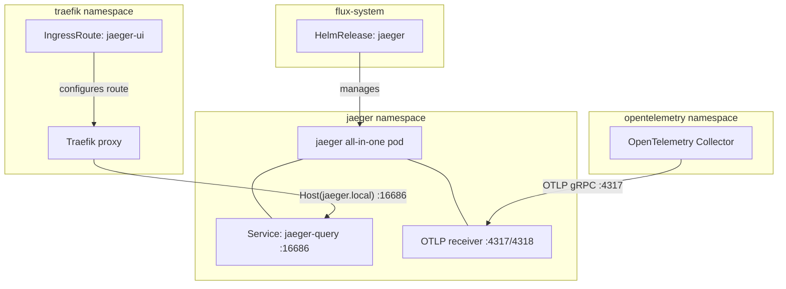

# Jaeger

[Jaeger](https://www.jaegertracing.io/) ([GitHub](https://github.com/jaegertracing/jaeger)) is a distributed tracing platform originally developed at Uber and donated to the CNCF (graduated project). It implements the OpenTracing standard and natively supports OpenTelemetry's OTLP protocol for trace ingestion. What distinguishes Jaeger from alternatives (Zipkin, Tempo, X-Ray): it provides a purpose-built query engine for trace search with deep dependency graph analysis, adaptive sampling strategies, and a flexible storage backend architecture that scales from in-memory (development) to Cassandra/Elasticsearch (production).

Jaeger's all-in-one deployment mode bundles the collector, query frontend, and ingestion pipeline into a single binary — eliminating the operational overhead of running separate components when throughput requirements are modest. This mode is architecturally identical to the distributed deployment; only the process boundary differs.

## Overview

| Property | Value |
|---|---|
| **Namespace** | `jaeger` |
| **Type** | HelmRelease (chart: `jaeger` v3.3.1) |
| **Layer** | Distributed tracing services |
| **Chart** | [`jaeger`](https://jaegertracing.github.io/helm-charts) v3.3.1 |
| **Status** | Enabled |
| **Source** | [`apps/base/jaeger/`](https://github.com/JiwooL0920/fleet-infra/tree/develop/apps/base/jaeger/) |

## Dependencies

### Upstream — required before Jaeger starts

| Service | Reason | Status |
|---|---|---|
| `traefik-config` | Flux `dependsOn` | Active |

### Downstream — services that depend on Jaeger

| Service | Dependency type | Reason |
|---|---|---|
| `opentelemetry-collector` | Flux `dependsOn` | Requires Jaeger |

## Purpose

Jaeger serves as the trace storage and visualization backend for the platform's observability stack. It receives distributed traces exclusively through the OpenTelemetry Collector (which normalizes OTLP, legacy Jaeger, and Zipkin formats upstream) and provides the query UI for trace inspection, service dependency mapping, and latency analysis.

Deployed in all-in-one mode with ephemeral in-memory storage, it prioritizes operational simplicity over trace durability — traces exist for debugging active issues, not long-term retention. This is appropriate for a development/homelab environment where the cost of persistent trace storage (Elasticsearch or Cassandra clusters) far exceeds the value of historical trace data.

**Why Jaeger over Grafana Tempo:** Tempo is append-only with object storage (S3/GCS) and integrates tightly with Grafana's trace-to-logs workflow, but requires an external object store and has no standalone query UI — all queries route through Grafana. Jaeger provides a self-contained query interface, supports in-memory mode for zero-dependency development deployments, and its all-in-one binary has lower baseline resource consumption than Tempo + MinIO + Grafana.

**Why in-memory over Badger/persistent storage:** The platform treats traces as ephemeral debugging signals, not audit records. In-memory eliminates PVC management, compaction overhead, and storage capacity planning. The trade-off — traces lost on pod restart — is acceptable given the development context and the fact that the OTel Collector's debug exporter can provide immediate signal visibility independent of Jaeger availability.

## Features

| Feature | Detail |
|---|---|
| **All-in-one deployment** | Single binary runs collector, query, and agent functions — all separate component deployments explicitly disabled to avoid resource duplication |
| **In-memory trace storage** | All persistence backends (Cassandra, Elasticsearch, Kafka) disabled; traces stored in process memory with implicit eviction under memory pressure |
| **OTLP ingestion enabled** | COLLECTOR_OTLP_ENABLED env var activates native OTLP gRPC/HTTP receivers, allowing the OpenTelemetry Collector to export traces without protocol translation |
| **External data store provisioning disabled** | provisionDataStore set to false for all backends — prevents the Helm chart from deploying StatefulSets for Cassandra, Elasticsearch, or Kafka alongside Jaeger |
| **Traefik IngressRoute exposure** | Query UI exposed at jaeger.local via Traefik CRD IngressRoute on the web entrypoint, routing to jaeger-query service on port 16686 |

## Architecture

### Trace ingestion topology

## Configuration

All values sourced from [`base/services/environment.env`](https://github.com/JiwooL0920/fleet-infra/blob/develop/base/services/environment.env)
(base); per-environment overrides in [`clusters/stages/dev/.../environment.env`](https://github.com/JiwooL0920/fleet-infra/blob/develop/clusters/stages/dev/clusters/services-amer/environment.env).

| Parameter | Dev | Prod |
|---|---|---|
| `JAEGER_CHART_VERSION` | `3.3.1` | `3.3.1` |
| `JAEGER_CPU_LIMIT` | `500m` | `500m` |
| `JAEGER_CPU_REQUEST` | `100m` | `100m` |
| `JAEGER_MEMORY_LIMIT` | `512Mi` | `512Mi` |
| `JAEGER_MEMORY_REQUEST` | `256Mi` | `256Mi` |

## Operations

<!-- TODO: Add operations in service-insights/jaeger.yaml → operations field -->

## Related

- [`apps/base/jaeger/`](https://github.com/JiwooL0920/fleet-infra/tree/develop/apps/base/jaeger/) — Kubernetes manifests
- [`base/services/jaeger.yaml`](https://github.com/JiwooL0920/fleet-infra/blob/develop/base/services/jaeger.yaml) — Flux Kustomization
- [`base/services/environment.env`](https://github.com/JiwooL0920/fleet-infra/blob/develop/base/services/environment.env) — environment variables

---
*Generated from [service-catalog.json](https://github.com/JiwooL0920/fleet-infra/blob/develop/service-catalog.json) at commit `2d36e22` · catalog sha `4d088b0b3a67b4c4`*