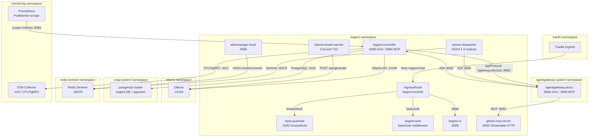
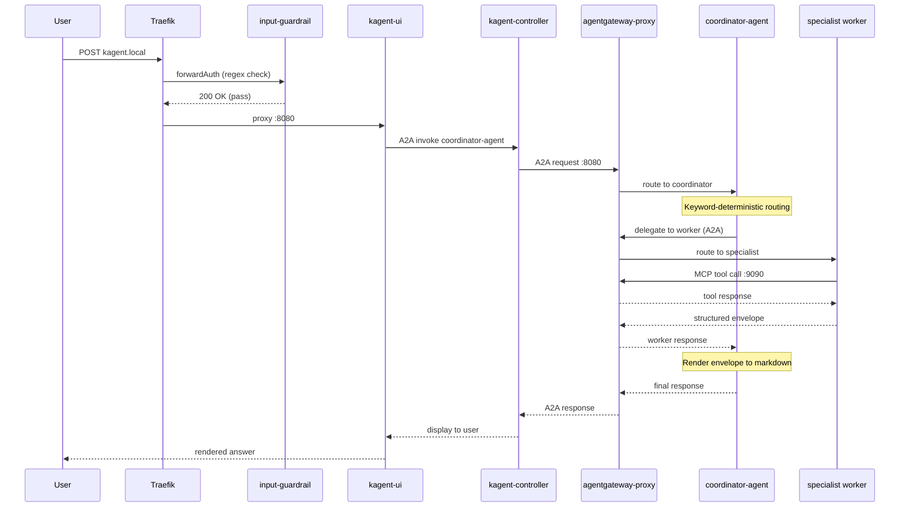

# kagent

[kagent](https://kagent.dev) ([GitHub](https://github.com/kagent-dev/kagent)) is a CNCF Sandbox project that brings AI agent lifecycle management to Kubernetes as a first-class concern. Rather than treating agents as application-layer abstractions managed by Python frameworks (LangGraph, CrewAI, AutoGen), kagent defines agents, model configurations, and tool servers as Custom Resources — reconciled by a controller that handles instantiation, health, context compaction, and inter-agent communication natively within the Kubernetes control plane.

The platform's core CRDs are `Agent` (declarative agent specification including model, tools, system prompt, and A2A skills), `ModelConfig` (LLM provider settings — model name, context window, temperature, provider endpoint), and `RemoteMCPServer` (tool endpoint registration using the Model Context Protocol). The kagent-controller watches these CRDs and manages agent runtime lifecycle, while the optional kagent-ui provides a conversation interface for human operators.

What distinguishes kagent from general-purpose agent frameworks: agents are Kubernetes-native objects subject to standard GitOps workflows (Flux/ArgoCD), RBAC, network policies, and observability pipelines. There is no out-of-band agent registry or framework-specific state store — the cluster API server *is* the source of truth. This enables infrastructure teams to manage AI agents with the same tooling they use for any other workload: `kubectl`, Helm, Kustomize, and policy engines.

kagent supports the A2A (Agent-to-Agent) protocol for inter-agent delegation and MCP (Model Context Protocol) for tool integration, making it composable with ecosystem tooling like AgentGateway for traffic management, policy enforcement, and observability across agent-to-agent and agent-to-tool boundaries.

## Overview

| Property | Value |
|---|---|
| **Namespace** | `kagent` |
| **Type** | Kustomization |
| **Layer** | AI agent platform |
| **Status** | Enabled |
| **Source** | [`apps/base/kagent/`](https://github.com/JiwooL0920/flux-infra/tree/develop/apps/base/kagent/) |

## Dependencies

### Upstream — required before kagent starts

| Service | Reason | Status |
|---|---|---|
| `ollama` | Flux `dependsOn` | Active |
| `cnpg-operator` | Flux `dependsOn` | Active |
| `external-secrets-config` | Flux `dependsOn` | Active |
| `traefik` | Flux `dependsOn` | Active |
| `grafana-sa-setup` | Flux `dependsOn` | Active |

### Downstream — services that depend on kagent

| Service | Dependency type | Reason |
|---|---|---|
| `agentgateway` | Flux `dependsOn` | Requires kagent |

## Purpose

kagent is the platform's AI operations layer — a multi-agent system that provides natural-language access to cluster state, observability data, cost analysis, and GitOps-driven infrastructure changes. It replaces ad-hoc kubectl/Helm/Grafana context-switching with a single conversational interface backed by specialized agents, each scoped to a narrow operational domain with least-privilege tool access.

Concretely, kagent powers: cluster diagnostics (pod status, events, logs, Flux sync state), fleet-wide observability (cross-cluster Prometheus/Loki aggregation), cost analysis and right-sizing (OpenCost integration), automated incident response (Alertmanager → triage → investigation → diagnosis → reporting pipeline), and GitOps change proposals (draft PRs for infrastructure modifications). All write operations flow through Git — no agent applies changes directly to the cluster.

**Why kagent over LangGraph/CrewAI/AutoGen:** Those frameworks run agents as application processes with framework-specific state, requiring custom deployment, scaling, and monitoring infrastructure. kagent's CRD model means agents are reconciled by the same Flux pipeline that manages every other workload — no separate agent orchestration layer to maintain. Agent definitions live in Git alongside the infrastructure they operate on, enabling atomic rollback of both the agent configuration and the infrastructure it manages.

**Why not a single monolithic agent:** A single agent with all tools loaded simultaneously causes context window bloat (30+ tools confuse routing), creates security risk (one prompt injection accesses all tools), and prevents model-size optimization (planning tasks need larger models than simple tool-calling). The orchestrator-worker split allows the coordinator to use a high-quality reasoning model while workers use faster, smaller models optimized for tool execution.

## Features

| Feature | Detail |
|---|---|
| **Orchestrator-worker multi-agent architecture** | coordinator-agent routes queries to 5 specialist workers (cluster-agent, observability-agent, git-agent, finops-agent, code-agent) using keyword-deterministic rules — not LLM intent classification. A separate incident-orchestrator sequences a 3-stage pipeline (investigation → diagnosis → reporting) for automated incident response. All agents are declared as `Agent` CRs with explicit tool allowlists and A2A skill advertisements. |
| **Go runtime with model warming** | All agents use `runtime: go` for ~2s cold-start (vs ~15s Python default). A CronJob (`ollama-model-warmer`) pings Ollama every 10 minutes with `keep_alive=15m` to keep both qwen2.5:72b and qwen2.5:14b-kagent resident in VRAM, reducing warm-start TTFR from ~90s to ~10-15s for the large model. |
| **Tool federation via AgentGateway** | `RemoteMCPServer` CRs point at AgentGateway proxy endpoints (`:9090/mcp/k8s`, `:9090/mcp/helm`) which fan out to per-cluster backend MCP servers. Tools are returned with cluster-prefixed names (e.g. `k8s-tools-services-amer_k8s_get_resources`), and each agent's `toolNames` allowlist filters to only its permitted subset. This enables multi-cluster tool routing without per-agent endpoint configuration. |
| **Multi-tier input guardrail chain** | Requests pass through 4 defense layers before reaching agents: (1) Traefik forwardAuth to `input-guardrail` — a stateless Python regex engine matching credential leaks, prompt injection, and jailbreak patterns in <5ms p99; (2) basicAuth identity gate via ExternalSecret-managed htpasswd; (3) coordinator-agent's prompt-level refusal backstop; (4) AgentGateway A2A policy for inter-agent injection on the A2A path. |
| **Event-driven incident response pipeline** | `alertmanager-hook` receives Alertmanager webhooks and writes critical alerts to a Redis Sentinel stream (`incident:events`, DB 4). KEDA scales `stream-dispatcher` replicas (1–5) based on pending entry count in consumer group `dispatch-group`. The dispatcher invokes triage-agent via A2A, which classifies/deduplicates alerts and escalates confirmed incidents to `incident-orchestrator` for the full investigation → diagnosis → reporting pipeline. |
| **Context compaction with per-agent token budgets** | Each agent declares a `tokenThreshold` (coordinator: 12K, cluster-agent: 24K, fleet agents: 16K) that triggers automatic conversation compaction. A summarizer using `fast-model-config` compresses older context while retaining the most recent N events (`eventRetentionSize`). This prevents context window exhaustion during long diagnostic sessions without losing critical state. |
| **GitOps-only write enforcement with approval gates** | git-agent is the sole mutation path — it reads current state, creates a feature branch (`agent/*`), commits changes, and opens a draft PR. Write tools (`create_branch`, `create_or_update_file`, `push_files`, `create_pull_request`) require explicit human approval via `requireApproval`. The `merge_pull_request` tool is intentionally excluded from the agent's toolset — humans always merge. |
| **Tiered model configuration** | Two `ModelConfig` CRs provide model-appropriate sizing: `default-model-config` (qwen2.5:72b, 16K context, used by coordinator and git-agent for complex reasoning) and `fast-model-config` (qwen2.5:14b-kagent, 8K context, used by all tool-calling workers and as the compaction summarizer). Temperature is pinned at 0.1 for deterministic tool-calling behavior. |
| **Prometheus operational alerting** | `PrometheusRule` kagent-operational defines 5 alerts: `KagentOllamaRequestSurge` (>10 invocations/min sustained 5m), `KagentAgentLoopDetected` (>5 invocations in 60s — critical), `KagentEdgeRejectionSurge` (>5 forwardAuth 403s/min), `KagentAgentToolCountExceeded` (>18 tools per agent — god-agent anti-pattern), and `KagentLLMTokenBudgetExceeded` (>1M tokens/hour through agentgateway). |
| **OpenTelemetry distributed tracing** | kagent-controller exports traces via OTLP/gRPC to the cluster's OpenTelemetry Collector (`opentelemetry-collector.opentelemetry.svc.cluster.local:4317`). Environment variables `OTEL_SERVICE_NAME` and `OTEL_RESOURCE_ATTRIBUTES` are set per-component (controller, stream-dispatcher, alertmanager-hook) for service-level trace attribution in Jaeger. |
| **NetworkPolicy micro-segmentation** | Seven NetworkPolicy resources enforce least-privilege network access: intra-namespace communication, ingress from agentgateway-system (ports 8083/8084/80), traefik (UI access), and monitoring (Prometheus scraping); egress to agentgateway-system (MCP federation), infrastructure namespaces (cnpg-system, redis-sentinel, monitoring, opentelemetry), and kube-system DNS (UDP/TCP 53). |

## Architecture

### kagent Namespace Deployment Topology

### Multi-Agent Request Flow

## Configuration

All values sourced from [`base/services/environment.env`](https://github.com/JiwooL0920/flux-infra/blob/develop/base/services/environment.env)
(base); per-environment overrides in [`clusters/stages/dev/.../environment.env`](https://github.com/JiwooL0920/flux-infra/blob/develop/clusters/stages/dev/clusters/services-amer/environment.env).

| Parameter | Dev | Prod |
|---|---|---|
| `KAGENT_CHART_VERSION` | `0.9.5` | `0.9.5` |
| `KAGENT_CONTROLLER_CPU_LIMIT` | `500m` | `1000m` |
| `KAGENT_CONTROLLER_CPU_REQUEST` | `100m` | `100m` |
| `KAGENT_CONTROLLER_MEMORY_LIMIT` | `2Gi` | `512Mi` |
| `KAGENT_CONTROLLER_MEMORY_REQUEST` | `256Mi` | `128Mi` |
| `KAGENT_CONTROLLER_REPLICAS` | `1` | `1` |
| `KAGENT_UI_CPU_LIMIT` | `250m` | `500m` |
| `KAGENT_UI_CPU_REQUEST` | `100m` | `100m` |
| `KAGENT_UI_MEMORY_LIMIT` | `512Mi` | `1Gi` |
| `KAGENT_UI_MEMORY_REQUEST` | `256Mi` | `256Mi` |
| `KAGENT_UI_REPLICAS` | `1` | `1` |

## Operations

<!-- TODO: Add operations in service-insights/kagent.yaml → operations field -->

## Related

- [`apps/base/kagent/`](https://github.com/JiwooL0920/flux-infra/tree/develop/apps/base/kagent/) — Kubernetes manifests
- [`base/services/kagent.yaml`](https://github.com/JiwooL0920/flux-infra/blob/develop/base/services/kagent.yaml) — Flux Kustomization
- [`base/services/environment.env`](https://github.com/JiwooL0920/flux-infra/blob/develop/base/services/environment.env) — environment variables

---
*Generated from [service-catalog.json](https://github.com/JiwooL0920/flux-infra/blob/develop/service-catalog.json) at commit `255ed07` · catalog sha `e8611a61080e81c8`*