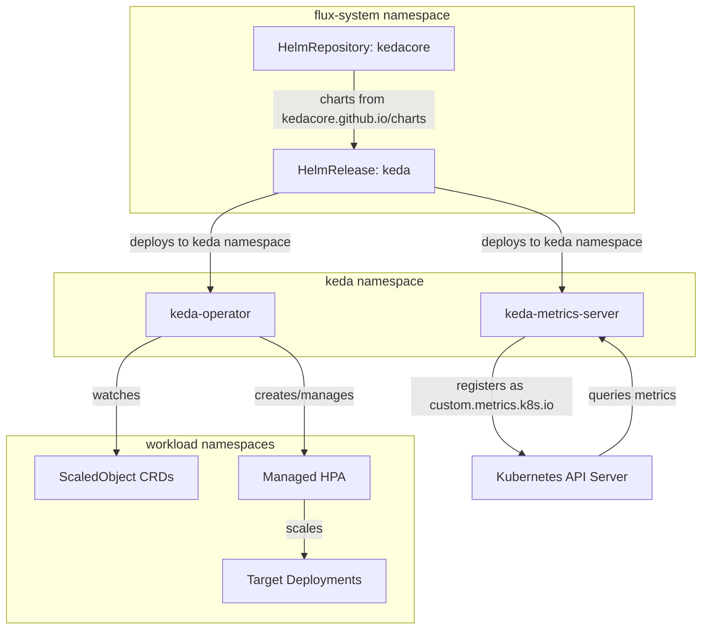
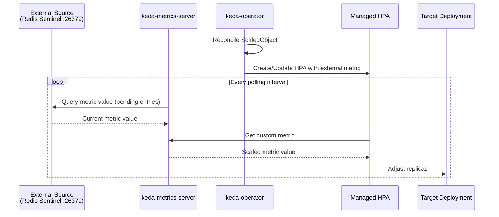

# KEDA

[KEDA](https://keda.sh) ([GitHub](https://github.com/kedacore/keda)) is a Kubernetes-native event-driven autoscaler that extends the Horizontal Pod Autoscaler (HPA) with external signal awareness. Unlike vanilla HPA — which is limited to CPU and memory metrics from metrics-server — KEDA registers itself as a Kubernetes custom metrics API server and translates signals from 60+ external sources (message queues, databases, Prometheus, cron schedules) into HPA-compatible metrics. This lets workloads scale based on business-relevant signals rather than proxy indicators.

What distinguishes KEDA from writing custom metrics adapters or deploying Knative: it is purely an autoscaling control plane with no data-plane overhead. It installs two lightweight components — an operator that reconciles `ScaledObject`/`ScaledJob` CRDs into managed HPA resources, and a metrics server that serves the aggregated custom metrics API. Workloads remain standard Deployments or Jobs; KEDA simply adjusts their replica count. This makes it fully GitOps-compatible — scaling policy is declared as YAML alongside the workload it governs.

KEDA is a CNCF Graduated project with broad production adoption. Its "scale to zero" capability — unique among Kubernetes autoscalers — allows idle workloads to consume no resources until an event arrives, making it particularly valuable in development environments and for bursty batch workloads.

## Overview

| Property | Value |
|---|---|
| **Namespace** | `keda` |
| **Type** | HelmRelease (chart: `keda` v2.16.1) |
| **Layer** | Event-driven autoscaling |
| **Status** | Enabled |
| **Source** | [`apps/base/keda/`](https://github.com/JiwooL0920/fleet-infra/tree/develop/apps/base/keda/) |

## Dependencies

### Upstream — required before KEDA starts

_No upstream Flux dependencies — starts immediately._

### Downstream — services that depend on KEDA

_No known downstream Flux dependencies._

## Purpose

KEDA is the platform's event-driven scaling layer, enabling workloads to autoscale based on external signals that standard HPA cannot observe. Its primary consumers are queue-driven workers that must scale proportionally to backlog depth rather than CPU utilization.

The concrete use cases in this cluster: scaling Temporal task-queue workers based on pending activity count, scaling n8n workflow executors based on queued executions, and scaling kagent's stream-dispatcher pods based on Redis Sentinel stream pending entry count (using the `redis-sentinel-streams` scaler against the Sentinel endpoint on port 26379). Without KEDA, these workloads would either run at fixed replica counts (wasting resources when idle, starving when busy) or require bespoke controller code per scaling signal.

**Why KEDA over custom metrics adapters or Knative:** A custom metrics adapter requires per-source development and ongoing maintenance — each new scaling signal means new adapter code. KEDA provides pre-built, community-maintained scalers for every signal source this platform uses (Prometheus, Redis Streams via Sentinel, cron, PostgreSQL). Knative was rejected because it imposes a full serverless runtime (Knative Serving, networking layer) when the requirement is simply "scale existing Deployments based on external metrics." KEDA adds two pods and a CRD set; Knative adds an entire request-routing and revision-management stack. The operational complexity delta is not justified when workloads are long-running services, not request-scoped functions.

## Features

| Feature | Detail |
|---|---|
| **Dual-component architecture** | Separate operator (CRD reconciliation, HPA lifecycle management) and metrics server (aggregated custom metrics API) deployed as independent pods for fault isolation. |
| **Install and upgrade remediation** | Both install and upgrade phases configured with 3 automatic retries, preventing transient Helm failures from leaving the release in a degraded state. |
| **Resource-bounded operator** | Operator pod runs with explicit CPU and memory requests/limits, preventing unbounded resource consumption during high ScaledObject churn. |
| **Namespace isolation** | KEDA components deploy into a dedicated namespace while the HelmRelease is managed from flux-system, separating workload-facing CRDs from GitOps control plane resources. |
| **Scale-to-zero capable** | Operator supports scaling target deployments to zero replicas when no events are pending, eliminating idle resource consumption for bursty workloads in development. |

## Architecture

### KEDA Deployment Topology

### Event-Driven Scaling Flow

## Configuration

All values sourced from [`base/services/environment.env`](https://github.com/JiwooL0920/fleet-infra/blob/develop/base/services/environment.env)
(base); per-environment overrides in [`clusters/stages/dev/.../environment.env`](https://github.com/JiwooL0920/fleet-infra/blob/develop/clusters/stages/dev/clusters/services-amer/environment.env).

| Parameter | Dev | Prod |
|---|---|---|
| `KEDA_CHART_VERSION` | `2.16.1` | `2.16.1` |

## Operations

<!-- TODO: Add operations in service-insights/keda.yaml → operations field -->

## Related

- [`apps/base/keda/`](https://github.com/JiwooL0920/fleet-infra/tree/develop/apps/base/keda/) — Kubernetes manifests
- [`base/services/keda.yaml`](https://github.com/JiwooL0920/fleet-infra/blob/develop/base/services/keda.yaml) — Flux Kustomization
- [`base/services/environment.env`](https://github.com/JiwooL0920/fleet-infra/blob/develop/base/services/environment.env) — environment variables

---
*Generated from [service-catalog.json](https://github.com/JiwooL0920/fleet-infra/blob/develop/service-catalog.json) at commit `2d36e22` · catalog sha `4d088b0b3a67b4c4`*