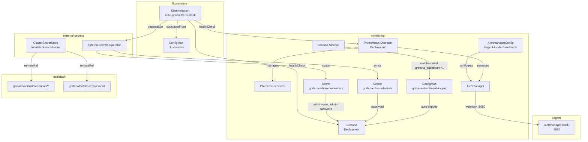
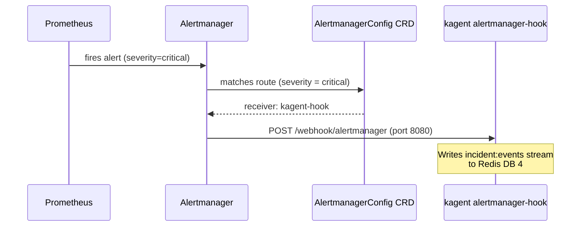

# Kube Prometheus Stack

[kube-prometheus-stack](https://github.com/prometheus-community/helm-charts/tree/main/charts/kube-prometheus-stack) is an opinionated Helm chart that deploys the full Prometheus monitoring pipeline in a single release: Prometheus server, Alertmanager, Grafana, node-exporter, kube-state-metrics, and — critically — the **Prometheus Operator**. The Operator is what distinguishes this from a raw Prometheus install: it introduces Custom Resource Definitions (ServiceMonitor, PodMonitor, PrometheusRule, AlertmanagerConfig) that let monitoring configuration live alongside application manifests in Git, making the entire observability stack declaratively managed through GitOps.

What sets this chart apart from assembling the components individually is the pre-wired integration: Grafana ships with datasource auto-discovery, Alertmanager routes are configured via CRDs rather than hand-edited ConfigMaps, and Prometheus scrape targets are declared per-service without touching a central `prometheus.yml`. For a platform running dozens of services with independent release cycles, this CRD-driven model eliminates the central bottleneck of a shared monitoring config file.

The chart also bundles recording rules and alerts for Kubernetes internals (kubelet, apiserver, etcd, scheduler), providing cluster health observability out of the box without any additional configuration beyond the Helm values.

## Overview

| Property | Value |
|---|---|
| **Namespace** | `monitoring` |
| **Type** | HelmRelease (chart: `kube-prometheus-stack` v65.8.1) |
| **Layer** | Foundation services |
| **Chart** | [`kube-prometheus-stack`](https://prometheus-community.github.io/helm-charts) v65.8.1 |
| **Status** | Enabled |
| **Source** | [`apps/base/kube-prometheus-stack/`](https://github.com/JiwooL0920/flux-infra/tree/develop/apps/base/kube-prometheus-stack/) |

## Dependencies

### Upstream — required before Kube Prometheus Stack starts

| Service | Reason | Status |
|---|---|---|
| `external-secrets-config` | Flux `dependsOn` | Active |

### Downstream — services that depend on Kube Prometheus Stack

| Service | Dependency type | Reason |
|---|---|---|
| `grafana-sa-setup` | Flux `dependsOn` | Requires Kube Prometheus Stack |
| `loki` | Flux `dependsOn` | Requires Kube Prometheus Stack |
| `opentelemetry-collector` | Flux `dependsOn` | Requires Kube Prometheus Stack |
| `grafana-operator` | Flux `dependsOn` | Requires Kube Prometheus Stack |
| `kubescape` | Flux `dependsOn` | Requires Kube Prometheus Stack |
| `opencost` | Flux `dependsOn` | Requires Kube Prometheus Stack |

## Purpose

kube-prometheus-stack is the platform's foundational observability layer. It collects metrics from every instrumented service, stores time-series data with configurable retention, and provides Grafana as the unified visualization frontend. In this cluster, it is specifically configured to monitor the **kagent multi-agent AI platform** — tracking agent invocation rates, per-agent latency distributions, token consumption against budgets, A2A delegation counts, and tool usage patterns that detect God-Agent drift.

Alertmanager is wired to route critical severity alerts directly to the kagent incident webhook (`alertmanager-hook.kagent.svc.cluster.local:8080`), enabling the AI agent platform to self-heal or escalate based on cluster state. Grafana uses a PostgreSQL backend for session and dashboard storage persistence, with credentials managed entirely through ExternalSecrets pulling from LocalStack — no secrets in Git.

**Why kube-prometheus-stack over individual Prometheus + Grafana deploys or managed alternatives (e.g., Grafana Cloud, AWS Managed Prometheus):** The CRD-driven configuration model is essential for this GitOps platform. Each service can declare its own ServiceMonitors and AlertmanagerConfigs in its own directory, reviewed and merged through the normal PR workflow. Managed services would require a separate Terraform/API layer for configuration, breaking the single-pane-of-glass Git model. The trade-off is self-managed storage, retention tuning, and capacity planning — accepted because this platform needs full control over scrape intervals, relabeling rules, and alert routing topology that managed services often constrain.


## Features

| Feature | Detail |
|---|---|
| **CRD-driven alert routing** | AlertmanagerConfig CRD routes critical-severity alerts to the kagent incident webhook without editing a global Alertmanager config file. |
| **ExternalSecrets-managed credentials** | Both Grafana admin credentials and database passwords are synced from LocalStack via ClusterSecretStore — no secrets committed to Git. |
| **PostgreSQL-backed Grafana** | Grafana uses an external PostgreSQL database for dashboard and session storage, with credentials delivered via the grafana-db-credentials ExternalSecret. |
| **Sidecar dashboard provisioning** | Grafana's sidecar container watches for ConfigMaps labeled `grafana_dashboard=1` and auto-imports dashboards without restart or manual upload. |
| **Multi-datasource dashboards** | The kagent telemetry dashboard queries Prometheus for metrics, Loki for log-based refusal/rejection events, and links to Jaeger for distributed trace exploration. |
| **PostBuild variable substitution** | Resource limits, retention settings, and storage sizes are injected at reconcile time from the cluster-vars ConfigMap, enabling per-environment tuning without manifest duplication. |
| **Deployment health gating** | Flux healthChecks block downstream dependents until both the Prometheus Operator and Grafana deployments report ready in the monitoring namespace. |

## Architecture

### Deployment Topology and Credential Flow



### Alert-to-Incident Flow




## Configuration

All values sourced from [`base/services/environment.env`](https://github.com/JiwooL0920/flux-infra/blob/develop/base/services/environment.env)
(base); per-environment overrides in [`clusters/stages/dev/.../environment.env`](https://github.com/JiwooL0920/flux-infra/blob/develop/clusters/stages/dev/clusters/services-amer/environment.env).

| Parameter | Dev | Prod |
|---|---|---|
| `ALERTMANAGER_MEMORY_LIMIT` | `128Mi` | `512Mi` |
| `ALERTMANAGER_MEMORY_REQUEST` | `128Mi` | `256Mi` |
| `GRAFANA_CPU_LIMIT` | `250m` | `1000m` |
| `GRAFANA_CPU_REQUEST` | `250m` | `200m` |
| `GRAFANA_MEMORY_LIMIT` | `256Mi` | `1Gi` |
| `GRAFANA_MEMORY_REQUEST` | `256Mi` | `512Mi` |
| `PROMETHEUS_CHART_VERSION` | `65.8.1` | `65.8.1` |
| `PROMETHEUS_CPU_LIMIT` | `1000m` | `4000m` |
| `PROMETHEUS_CPU_REQUEST` | `1000m` | `1000m` |
| `PROMETHEUS_MEMORY_LIMIT` | `1Gi` | `4Gi` |
| `PROMETHEUS_MEMORY_REQUEST` | `1Gi` | `2Gi` |
| `PROMETHEUS_RETENTION_SIZE` | `5GiB` | `20GiB` |
| `PROMETHEUS_RETENTION_TIME` | `7d` | `30d` |
| `PROMETHEUS_STORAGE_SIZE` | `20Gi` | `100Gi` |


## Operations

### Grafana pod CrashLoopBackOff due to missing admin credentials

**Symptoms:** Grafana pod in `CrashLoopBackOff` with logs showing `error: secret grafana-admin-credentials not found` or `key admin-password not found in secret`. The ExternalSecret may show `SecretSyncedError` status.

```bash
kubectl get externalsecret grafana-admin-credentials -n monitoring -o yaml | grep -A5 status
kubectl get secret grafana-admin-credentials -n monitoring -o jsonpath='{.data}' | base64 -d
kubectl get clustersecretstore localstack-secretstore -o yaml | grep -A5 status
kubectl logs -n external-secrets -l app.kubernetes.io/name=external-secrets --tail=50 | grep -i grafana
kubectl delete externalsecret grafana-admin-credentials -n monitoring && kubectl apply -k apps/base/kube-prometheus-stack
```

---

### Alertmanager not forwarding critical alerts to kagent webhook

**Symptoms:** Critical alerts visible in Alertmanager UI (`amtool alert --alertmanager.url=http://localhost:9093`) but kagent alertmanager-hook receives no POST requests. No entries in alertmanager-hook logs for incoming webhooks.

```bash
kubectl get alertmanagerconfig kagent-incident-webhook -n monitoring -o yaml
kubectl port-forward -n monitoring svc/kube-prometheus-stack-alertmanager 9093:9093 &
curl -s http://localhost:9093/api/v2/alerts | jq '.[].labels.severity'
kubectl exec -n monitoring -it $(kubectl get pod -n monitoring -l app.kubernetes.io/name=alertmanager -o name | head -1) -- amtool config routes show --config.file=/etc/alertmanager/config_out/alertmanager.env.yaml
kubectl logs -n kagent -l app=alertmanager-hook --tail=100
kubectl run curl-test --rm -it --image=curlimages/curl --restart=Never -- curl -v http://alertmanager-hook.kagent.svc.cluster.local:8080/webhook/alertmanager -d '{"alerts":[{"labels":{"severity":"critical"}}]}' -H 'Content-Type: application/json'
```

---

### Prometheus storage exhaustion causing sample ingestion failures

**Symptoms:** PrometheusStorageExhausted or PrometheusTSDBCompactionsFailing alerts firing. Prometheus logs show `storage: no space left on device` or `WAL corruption`. `kubectl top pod` shows Prometheus near memory limit.

```bash
kubectl exec -n monitoring -it $(kubectl get pod -n monitoring -l app.kubernetes.io/name=prometheus -o name | head -1) -- df -h /prometheus
kubectl exec -n monitoring -it $(kubectl get pod -n monitoring -l app.kubernetes.io/name=prometheus -o name | head -1) -- promtool tsdb list /prometheus
kubectl get pvc -n monitoring -l app.kubernetes.io/name=prometheus -o custom-columns=NAME:.metadata.name,CAPACITY:.spec.resources.requests.storage,USED:.status.capacity.storage
kubectl exec -n monitoring -it $(kubectl get pod -n monitoring -l app.kubernetes.io/name=prometheus -o name | head -1) -- curl -s http://localhost:9090/api/v1/status/tsdb | jq '.data.headStats'
kubectl exec -n monitoring -it $(kubectl get pod -n monitoring -l app.kubernetes.io/name=prometheus -o name | head -1) -- curl -XPOST http://localhost:9090/-/reload
```

---

### Grafana dashboard not appearing after ConfigMap apply

**Symptoms:** ConfigMap `grafana-dashboard-kagent` exists in monitoring namespace with correct label, but the dashboard does not appear in Grafana's dashboard list. No errors in Grafana UI.

```bash
kubectl get configmap grafana-dashboard-kagent -n monitoring --show-labels | grep grafana_dashboard
kubectl logs -n monitoring $(kubectl get pod -n monitoring -l app.kubernetes.io/name=grafana -o name | head -1) -c grafana-sc-dashboard --tail=50
kubectl get configmap grafana-dashboard-kagent -n monitoring -o jsonpath='{.data}' | python3 -c 'import sys,json; json.loads(list(json.loads(sys.stdin.read()).values())[0]); print("valid JSON")'
kubectl rollout restart deployment kube-prometheus-stack-grafana -n monitoring
kubectl wait --for=condition=available deployment/kube-prometheus-stack-grafana -n monitoring --timeout=120s
```

---

### Flux Kustomization stuck due to health check timeout

**Symptoms:** `kubectl get kustomization kube-prometheus-stack -n flux-system` shows `Health check failed after 5m0s timeout`. Downstream services (loki, opentelemetry-collector, grafana-operator) remain in `dependency not ready` state.

```bash
kubectl get kustomization kube-prometheus-stack -n flux-system -o yaml | grep -A10 'status:'
kubectl get deployment kube-prometheus-stack-operator -n monitoring -o jsonpath='{.status.conditions[*].message}'
kubectl get deployment kube-prometheus-stack-grafana -n monitoring -o jsonpath='{.status.conditions[*].message}'
kubectl get pods -n monitoring -l app.kubernetes.io/managed-by=Helm --field-selector=status.phase!=Running
kubectl describe pod -n monitoring $(kubectl get pod -n monitoring -l app.kubernetes.io/name=kube-prometheus-stack -o name --field-selector=status.phase!=Running | head -1)
flux reconcile kustomization kube-prometheus-stack --with-source
```
**See also:** docs/adr/001-fine-grained-service-dependencies.md

---

### Grafana database connection failure after secret rotation

**Symptoms:** Grafana logs show `failed to connect to database` or `pq: password authentication failed`. Pod is running but Grafana UI returns 502. ExternalSecret `grafana-db-credentials` shows `SecretSynced` but Grafana uses stale credentials from prior mount.

```bash
kubectl get externalsecret grafana-db-credentials -n monitoring -o jsonpath='{.status.conditions[*].message}'
kubectl get secret grafana-db-credentials -n monitoring -o jsonpath='{.data.password}' | base64 -d
kubectl logs -n monitoring $(kubectl get pod -n monitoring -l app.kubernetes.io/name=grafana -o name | head -1) -c grafana --tail=30 | grep -i 'database\|pq:\|connect'
kubectl rollout restart deployment kube-prometheus-stack-grafana -n monitoring
kubectl wait --for=condition=available deployment/kube-prometheus-stack-grafana -n monitoring --timeout=120s
```

---


## Related


- [`apps/base/kube-prometheus-stack/`](https://github.com/JiwooL0920/flux-infra/tree/develop/apps/base/kube-prometheus-stack/) — Kubernetes manifests
- [`base/services/kube-prometheus-stack.yaml`](https://github.com/JiwooL0920/flux-infra/blob/develop/base/services/kube-prometheus-stack.yaml) — Flux Kustomization
- [`base/services/environment.env`](https://github.com/JiwooL0920/flux-infra/blob/develop/base/services/environment.env) — environment variables

---
*Generated from [service-catalog.json](https://github.com/JiwooL0920/flux-infra/blob/develop/service-catalog.json) at commit `20dba34` · catalog sha `9be0573fcf582c2a`*