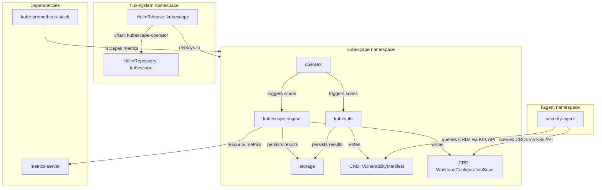
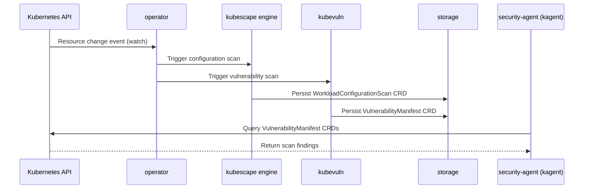

# Kubescape

[Kubescape](https://kubescape.io) ([GitHub](https://github.com/kubescape/kubescape)) is a CNCF Sandbox Kubernetes security platform that performs continuous posture assessment across configuration, vulnerabilities, and runtime behavior. Unlike one-shot CLI scanners (Trivy, kube-bench) that produce ephemeral reports, Kubescape operates as an in-cluster operator that writes findings back as Kubernetes Custom Resources — `VulnerabilityManifest` and `WorkloadConfigurationScan` CRDs — making security posture queryable through the standard Kubernetes API.

The operator architecture deploys four cooperating components: the **kubescape** engine (configuration scanning against NSA/MITRE frameworks), **kubevuln** (container image vulnerability analysis), a central **operator** (orchestrates scan scheduling and reacts to resource changes), and a **storage** backend (persists scan results as CRDs). This separation allows each component to scale and fail independently while sharing a common CRD-based data plane.

What distinguishes Kubescape from purely external scanning tools (Snyk Container, Prisma Cloud) is that it runs entirely in-cluster with no external SaaS dependency, publishes machine-readable CRDs rather than proprietary dashboards, and supports event-driven continuous scanning — rescanning workloads as they change rather than on a fixed schedule.

## Overview

| Property | Value |
|---|---|
| **Namespace** | `kubescape` |
| **Type** | HelmRelease (chart: `kubescape-operator` v1.30.4) |
| **Layer** | Security and cost observability |
| **Chart** | [`kubescape-operator`](https://kubescape.github.io/helm-charts/) v1.30.4 |
| **Status** | Enabled |
| **Source** | [`apps/base/kubescape/`](https://github.com/JiwooL0920/fleet-infra/tree/develop/apps/base/kubescape/) |

## Dependencies

### Upstream — required before Kubescape starts

| Service | Reason | Status |
|---|---|---|
| `metrics-server` | Flux `dependsOn` | Active |
| `kube-prometheus-stack` | Flux `dependsOn` | Active |

### Downstream — services that depend on Kubescape

_No known downstream Flux dependencies._

## Purpose

Kubescape is the platform's security data producer. It continuously scans all workloads for configuration drift (against NSA and MITRE ATT&CK frameworks) and known CVEs, publishing structured findings as CRDs in the `kubescape` namespace. The **security-agent** in the `kagent` namespace queries these CRDs via Kubernetes API tools to answer questions about cluster security posture, surface critical vulnerabilities, and recommend remediations — without needing direct access to container registries or scan engines.

The continuous scanning mode means findings are always current: when a new Deployment is created or an image tag changes, Kubescape rescans automatically rather than waiting for a scheduled interval. This keeps the security-agent's responses accurate to the live cluster state.

**Why Kubescape over Trivy Operator or external SaaS scanners:** The primary selection criterion was CRD-based output that the kagent security-agent can query through standard `kubectl`-style tools. Trivy Operator also publishes CRDs (`VulnerabilityReport`), but Kubescape adds configuration scanning (NSA/MITRE frameworks) alongside vulnerability scanning in a single operator — reducing operational surface area. External SaaS scanners (Snyk, Prisma) would require API credentials, egress network policies, and introduce a dependency on external availability for what should be a cluster-internal capability. Kubescape's CNCF Sandbox status and active community governance reduce vendor lock-in risk.

## Features

| Feature | Detail |
|---|---|
| **Continuous scanning** | Operator watches for resource changes (create/update/delete) and triggers immediate rescan rather than relying solely on periodic intervals |
| **Vulnerability scanning (kubevuln)** | Dedicated kubevuln component analyzes container images for known CVEs and publishes VulnerabilityManifest CRDs queryable by downstream agents |
| **Configuration scanning** | Evaluates workload configurations against NSA and MITRE ATT&CK frameworks, producing WorkloadConfigurationScan CRDs with per-control pass/fail results |
| **Node scanning** | Assesses node-level security posture using resource metrics from the metrics-server dependency |
| **CRD-based data plane** | All findings persisted as native Kubernetes Custom Resources, enabling standard RBAC-gated access from any in-cluster consumer without proprietary APIs |
| **Install/upgrade remediation** | Helm release configured with 3 retries on both install and upgrade failures, with 10-minute timeout per attempt to handle CRD registration delays |

## Architecture

### Kubescape Operator Deployment Topology

### Continuous Scan Flow

## Configuration

All values sourced from [`base/services/environment.env`](https://github.com/JiwooL0920/fleet-infra/blob/develop/base/services/environment.env)
(base); per-environment overrides in [`clusters/stages/dev/.../environment.env`](https://github.com/JiwooL0920/fleet-infra/blob/develop/clusters/stages/dev/clusters/services-amer/environment.env).

| Parameter | Dev | Prod |
|---|---|---|
| `KUBESCAPE_CHART_VERSION` | `1.30.4` | `1.30.4` |
| `KUBESCAPE_CPU_LIMIT` | `500m` | `500m` |
| `KUBESCAPE_CPU_REQUEST` | `100m` | `100m` |
| `KUBESCAPE_MEMORY_LIMIT` | `512Mi` | `512Mi` |
| `KUBESCAPE_MEMORY_REQUEST` | `128Mi` | `128Mi` |
| `KUBEVULN_MEMORY_LIMIT` | `1Gi` | `1Gi` |

## Operations

<!-- TODO: Add operations in service-insights/kubescape.yaml → operations field -->

## Related

- [`apps/base/kubescape/`](https://github.com/JiwooL0920/fleet-infra/tree/develop/apps/base/kubescape/) — Kubernetes manifests
- [`base/services/kubescape.yaml`](https://github.com/JiwooL0920/fleet-infra/blob/develop/base/services/kubescape.yaml) — Flux Kustomization
- [`base/services/environment.env`](https://github.com/JiwooL0920/fleet-infra/blob/develop/base/services/environment.env) — environment variables

---
*Generated from [service-catalog.json](https://github.com/JiwooL0920/fleet-infra/blob/develop/service-catalog.json) at commit `2d36e22` · catalog sha `4d088b0b3a67b4c4`*