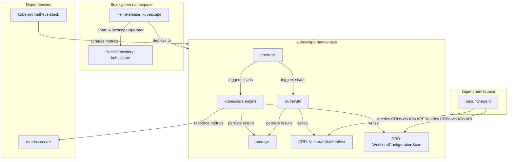
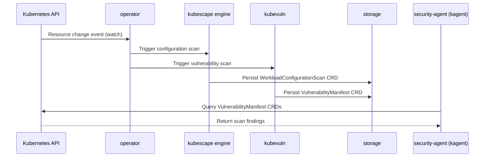

# Kubescape

[Kubescape](https://kubescape.io) ([GitHub](https://github.com/kubescape/kubescape)) is a CNCF Sandbox Kubernetes security platform that performs continuous posture assessment across configuration, vulnerabilities, and runtime behavior. Unlike one-shot CLI scanners (Trivy, kube-bench) that produce ephemeral reports, Kubescape operates as an in-cluster operator that writes findings back as Kubernetes Custom Resources — `VulnerabilityManifest` and `WorkloadConfigurationScan` CRDs — making security posture queryable through the standard Kubernetes API.

The operator architecture deploys four cooperating components: the **kubescape** engine (configuration scanning against NSA/MITRE frameworks), **kubevuln** (container image vulnerability analysis), a central **operator** (orchestrates scan scheduling and reacts to resource changes), and a **storage** backend (persists scan results as CRDs). This separation allows each component to scale and fail independently while sharing a common CRD-based data plane.

What distinguishes Kubescape from purely external scanning tools (Snyk Container, Prisma Cloud) is that it runs entirely in-cluster with no external SaaS dependency, publishes machine-readable CRDs rather than proprietary dashboards, and supports event-driven continuous scanning — rescanning workloads as they change rather than on a fixed schedule.

## Overview

| Property | Value |
|---|---|
| **Namespace** | `kubescape` |
| **Type** | HelmRelease (chart: `kubescape-operator` v1.30.4) |
| **Layer** | Security and cost observability |
| **Chart** | [`kubescape-operator`](https://kubescape.github.io/helm-charts/) v1.30.4 |
| **Status** | Enabled |
| **Source** | [`apps/base/kubescape/`](https://github.com/JiwooL0920/flux-infra/tree/develop/apps/base/kubescape/) |

## Dependencies

### Upstream — required before Kubescape starts

| Service | Reason | Status |
|---|---|---|
| `metrics-server` | Flux `dependsOn` | Active |
| `kube-prometheus-stack` | Flux `dependsOn` | Active |

### Downstream — services that depend on Kubescape

_No known downstream Flux dependencies._

## Purpose

Kubescape is the platform's security data producer. It continuously scans all workloads for configuration drift (against NSA and MITRE ATT&CK frameworks) and known CVEs, publishing structured findings as CRDs in the `kubescape` namespace. The **security-agent** in the `kagent` namespace queries these CRDs via Kubernetes API tools to answer questions about cluster security posture, surface critical vulnerabilities, and recommend remediations — without needing direct access to container registries or scan engines.

The continuous scanning mode means findings are always current: when a new Deployment is created or an image tag changes, Kubescape rescans automatically rather than waiting for a scheduled interval. This keeps the security-agent's responses accurate to the live cluster state.

**Why Kubescape over Trivy Operator or external SaaS scanners:** The primary selection criterion was CRD-based output that the kagent security-agent can query through standard `kubectl`-style tools. Trivy Operator also publishes CRDs (`VulnerabilityReport`), but Kubescape adds configuration scanning (NSA/MITRE frameworks) alongside vulnerability scanning in a single operator — reducing operational surface area. External SaaS scanners (Snyk, Prisma) would require API credentials, egress network policies, and introduce a dependency on external availability for what should be a cluster-internal capability. Kubescape's CNCF Sandbox status and active community governance reduce vendor lock-in risk.


## Features

| Feature | Detail |
|---|---|
| **Continuous scanning** | Operator watches for resource changes (create/update/delete) and triggers immediate rescan rather than relying solely on periodic intervals |
| **Vulnerability scanning (kubevuln)** | Dedicated kubevuln component analyzes container images for known CVEs and publishes VulnerabilityManifest CRDs queryable by downstream agents |
| **Configuration scanning** | Evaluates workload configurations against NSA and MITRE ATT&CK frameworks, producing WorkloadConfigurationScan CRDs with per-control pass/fail results |
| **Node scanning** | Assesses node-level security posture using resource metrics from the metrics-server dependency |
| **CRD-based data plane** | All findings persisted as native Kubernetes Custom Resources, enabling standard RBAC-gated access from any in-cluster consumer without proprietary APIs |
| **Install/upgrade remediation** | Helm release configured with 3 retries on both install and upgrade failures, with 10-minute timeout per attempt to handle CRD registration delays |

## Architecture

### Kubescape Operator Deployment Topology



### Continuous Scan Flow




## Configuration

All values sourced from [`base/services/environment.env`](https://github.com/JiwooL0920/flux-infra/blob/develop/base/services/environment.env)
(base); per-environment overrides in [`clusters/stages/dev/.../environment.env`](https://github.com/JiwooL0920/flux-infra/blob/develop/clusters/stages/dev/clusters/services-amer/environment.env).

| Parameter | Dev | Prod |
|---|---|---|
| `KUBESCAPE_CHART_VERSION` | `1.30.4` | `1.30.4` |
| `KUBESCAPE_CPU_LIMIT` | `500m` | `500m` |
| `KUBESCAPE_CPU_REQUEST` | `100m` | `100m` |
| `KUBESCAPE_MEMORY_LIMIT` | `512Mi` | `512Mi` |
| `KUBESCAPE_MEMORY_REQUEST` | `128Mi` | `128Mi` |
| `KUBEVULN_MEMORY_LIMIT` | `1Gi` | `1Gi` |


## Operations

### kubevuln OOMKilled during large image scan

**Symptoms:** `kubectl get pods -n kubescape` shows kubevuln pod in CrashLoopBackOff with reason OOMKilled. `VulnerabilityManifest` CRDs stop updating for newly deployed images. Prometheus alert `KubePodCrashLooping` fires for kubevuln.

```bash
kubectl describe pod -n kubescape -l app.kubernetes.io/component=kubevuln | grep -A5 'Last State'
kubectl top pod -n kubescape -l app.kubernetes.io/component=kubevuln
kubectl get vulnerabilitymanifests -A --sort-by=.metadata.creationTimestamp | tail -5
kubectl logs -n kubescape -l app.kubernetes.io/component=kubevuln --previous --tail=100 | grep -i 'memory\|oom\|killed'
# If OOM on specific large images, check which image triggered it:
kubectl get vulnerabilitymanifestsummaries -A -o json | jq '.items[] | select(.spec.vulnerabilitiesRef.all.status=="incomplete") | .metadata.name'
```

---

### Continuous scan not triggering on resource changes

**Symptoms:** New deployments or image updates do not produce updated `WorkloadConfigurationScan` CRDs. `kubectl get workloadconfigurationscans -A` shows stale timestamps. No errors visible in operator logs.

```bash
kubectl get pods -n kubescape -l app.kubernetes.io/component=operator -o wide
kubectl logs -n kubescape -l app.kubernetes.io/component=operator --tail=200 | grep -i 'watch\|trigger\|scan'
# Verify the operator has RBAC to watch resources across namespaces:
kubectl auth can-i watch deployments --as=system:serviceaccount:kubescape:kubescape-operator -A
# Check if scan is queued but storage is backlogged:
kubectl logs -n kubescape -l app.kubernetes.io/component=storage --tail=100 | grep -i 'error\|full\|queue'
# Force a manual rescan to test the pipeline:
kubectl annotate workloadconfigurationscan -n default --all kubescape.io/rescan=$(date +%s) --overwrite
```

---

### HelmRelease reconciliation failing

**Symptoms:** `kubectl get helmrelease kubescape -n flux-system` shows status `False` with message about chart fetch or install timeout. Flux kustomization `kubescape` shows `Ready: False`.

```bash
kubectl get helmrelease kubescape -n flux-system -o yaml | grep -A10 'status:'
kubectl get helmrepository kubescape -n flux-system -o yaml | grep -A5 'status:'
# Check if chart registry is reachable from the cluster:
kubectl run curl-test --rm -it --image=curlimages/curl --restart=Never -- curl -s https://kubescape.github.io/helm-charts/index.yaml | head -20
# Check if dependsOn services are ready:
kubectl get kustomization metrics-server kube-prometheus-stack -n flux-system -o custom-columns=NAME:.metadata.name,READY:.status.conditions[0].status
# Force reconciliation:
flux reconcile kustomization kubescape --with-source
```
**See also:** docs/adr/001-fine-grained-service-dependencies.md

---

### Configuration scan results missing for specific namespaces

**Symptoms:** `kubectl get workloadconfigurationscans -n <target-namespace>` returns no resources, but scans exist in other namespaces. No errors in scanner logs.

```bash
# Check if namespace is excluded from scanning:
kubectl get configmap -n kubescape -l app.kubernetes.io/component=kubescape -o yaml | grep -A20 'excludeNamespaces\|includeNamespaces'
# Verify scanner RBAC covers the target namespace:
kubectl auth can-i list pods --as=system:serviceaccount:kubescape:kubescape-scanner --namespace=default
# Check scanner logs for skip reasons:
kubectl logs -n kubescape -l app.kubernetes.io/component=kubescape --tail=200 | grep -i 'skip\|exclude\|namespace'
# List all scanned namespaces to identify the gap:
kubectl get workloadconfigurationscans -A --no-headers | awk '{print $1}' | sort -u
```

---

### Storage component disk pressure or CRD accumulation

**Symptoms:** Storage pod shows high memory usage or restarts. Older `VulnerabilityManifest` CRDs accumulate without garbage collection. `kubectl get vulnerabilitymanifests -A | wc -l` shows thousands of stale entries.

```bash
kubectl top pod -n kubescape -l app.kubernetes.io/component=storage
kubectl get vulnerabilitymanifests -A --no-headers | wc -l
kubectl get workloadconfigurationscans -A --no-headers | wc -l
# Check for orphaned CRDs (workload no longer exists):
kubectl get vulnerabilitymanifests -A -o json | jq '[.items[] | select(.metadata.ownerReferences == null)] | length'
# Check storage pod logs for pressure signals:
kubectl logs -n kubescape -l app.kubernetes.io/component=storage --tail=100 | grep -i 'pressure\|evict\|memory\|full'
```

---


## Related


- [`apps/base/kubescape/`](https://github.com/JiwooL0920/flux-infra/tree/develop/apps/base/kubescape/) — Kubernetes manifests
- [`base/services/kubescape.yaml`](https://github.com/JiwooL0920/flux-infra/blob/develop/base/services/kubescape.yaml) — Flux Kustomization
- [`base/services/environment.env`](https://github.com/JiwooL0920/flux-infra/blob/develop/base/services/environment.env) — environment variables

---
*Generated from [service-catalog.json](https://github.com/JiwooL0920/flux-infra/blob/develop/service-catalog.json) at commit `8c38bcd` · catalog sha `e8611a61080e81c8`*